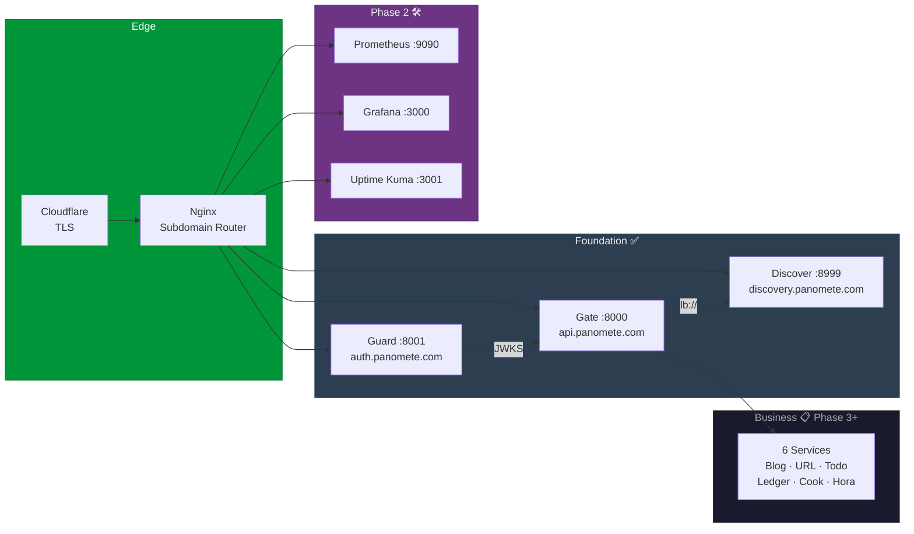

# Panomete Platform

> Production-grade microservice platform for a personal homelab. Built to showcase platform engineering and software architecture skills.
>
> **Phase 1:** ✅ Foundation deployed | **Phase 2:** 🛠️ Foundation Hardening | **Domain:** `*.panomete.com`

---

## Service Catalog

### Foundation Services — ✅ Deployed

| Focus             | Code Name         | Technology               |    Port     | Domain                   | Status | Deploy |
| ----------------- | ----------------- | ------------------------ | :---------: | ------------------------ | :----: | :----: |
| OAuth / IAM       | [[Flowero Guard]] | Keycloak (PostgreSQL 18) |    8001     | `auth.panomete.com`      |   ✅    |   ✅    |
| Service Discovery | Flowero Discover  | Spring Cloud Eureka      | 8999 / 3999 | `discovery.panomete.com` |   ✅    |   ✅    |
| API Gateway       | [[Flowero Gate]]  | Spring Cloud Gateway     |    8000     | `api.panomete.com`       |   ✅    |   ✅    |

### Business Services — Phase 3+

| Focus | Code Name | Animal | Language | Auth | Port BE | Port FE | Domain | Status | Deploy |
|-------|-----------|--------|----------|------|:-------:|:-------:|--------|:------:|:------:|
| Blog | Cute Gufo | 🦉 Owl | Go | 🌏 | 8005 | 3005 | `blog.panomete.com` | 📋 | ❌ |
| URL Shortener | [[Fluffy Mouton]] | 🐑 Sheep | TypeScript | 🌏 | 8002 | 3002 | `short.panomete.com` | 📋 | ❌ |
| Todo List | Tiny Mchwa | 🐜 Ant | TypeScript | 🌏 | 8003 | 3003 | `todo.panomete.com` | ✅ Spec | ❌ |
| Ledger | [[Big Schwein]] | 🐷 Pig | TypeScript | 🌏 | 8004 | 3004 | `ledger.panomete.com` | ❌ | ❌ |
| Cook Book | Shy Ardilla | 🐿️ Squirrel | TypeScript | 🌏 | 8006 | 3006 | `recipe.panomete.com` | ❌ | ❌ |
| Hora | White Jelen | 🦌 Deer | TypeScript | 🌏 | 8007 | 3007 | `hora.panomete.com` | ❌ | ❌ |

### Phase 2 — Foundation Hardening (🛠️ In Progress)

| Focus | Technology | Port | Domain | Status |
|-------|-----------|:----:|--------|:------:|
| CI/CD | GitHub Actions + GHCR | — | — | 📋 Planned |
| Metrics | Prometheus | 9090 | `metrics.panomete.com` | 📋 Planned |
| Dashboards | Grafana | 3000 | `grafana.panomete.com` | 📋 Planned |
| Log Aggregation | Loki + Promtail | 3100 | — (internal) | 📋 Planned |
| Alerting | Grafana → Discord | — | — | 📋 Planned |
| Uptime Monitor | Uptime Kuma | 3001 | `status.panomete.com` | 📋 Planned |
| Backups | pg_dumpall + rclone → OneDrive | — | — | 📋 Planned |

---

## Infrastructure (Already Live)

| Component | Status | Notes |
|-----------|:------:|-------|
| Docker + Compose | ✅ | All services run as containers |
| Cloudflare Tunnel | ✅ | TLS termination + external ingress |
| Nginx Reverse Proxy | ✅ | Subdomain-based routing |
| PostgreSQL 18 | ✅ | Shared — Guard + future business services |
| Valkey 9 | ✅ | Shared — Gate rate limiting |
| MongoDB 8 | ✅ | Available for document-oriented services |
| SeaweedFS S3 | ✅ | Object storage |
| Tailscale | ✅ | Secure remote access |
| UFW + Fail2ban | ✅ | Host-level security |

---

## Architecture



---

## Project Structure

```
  project_spec/
  ├── README.md  → This file
  ├── spec/
  │   ├── panomete_platform/  → Platform-Level Docs
  │   │   ├── README.md  → Full Architecture Overview
  │   │   ├── 01_requirement/  → Objectives, Stories, Stakeholders
  │   │   └── 03_construction/  → Platform Dev Guide
  │   ├── flowero_guard/  → Keycloak IAM · ✅ Deployed
  │   ├── flowero_discover/  → Eureka Registry · ✅ Deployed
  │   ├── flowero_gate/  → API Gateway · ✅ Deployed
  │   ├── tiny_mchwa/  → Todo List · ✅ Spec Complete
  │   ├── fluffy_mouton/  → URL Shortener · Migration notes
  │   ├── cute_gufo/  → Blog · TBD
  │   ├── big_schwein/  → Ledger · TBD
  │   └── meeting-minute/  → Cross-persona handoff records
  ├── plan/
  │   └── phase2-foundation-hardening.md  → 5 Initiatives · 14 Action Items
  ├── template/  → Document templates (7 phases)
  └── overview/  → Legacy design notes
```

---

## Status Legend

| Icon | Status | Icon | Deploy |
|------|--------|------|--------|
| ❌ | Not started | ❌ | Not deployed |
| 📋 | Spec ready | 🛠️ | CI/CD in progress |
| 🛠️ | In progress | ✅ | Deployed |
| ✅ | Completed / deployed | | |

### Authentication Types

| Icon | Type |
|------|------|
| 🎯 | Simple JWT Authentication |
| 🎭 | Role-based JWT Authentication |
| 🌏 | OAuth (Keycloak via Flowero Guard) |

---

## Quick Links

- [[spec/panomete_platform/README | 📋 Full Architecture Overview]]
- [[plan/phase2-foundation-hardening | 🛠️ Phase 2 Plan]]
- [[spec/meeting-minute/MM07_phase2-planning_20260724 | 📝 Phase 2 Proposal]]

---

> **Built for:** Portfolio demonstration | **Stack:** Java 25 / Spring Boot 4.1.x / Keycloak / Eureka / Spring Cloud Gateway | **Edge:** Cloudflare Tunnel → Nginx | **Domain:** `*.panomete.com`
