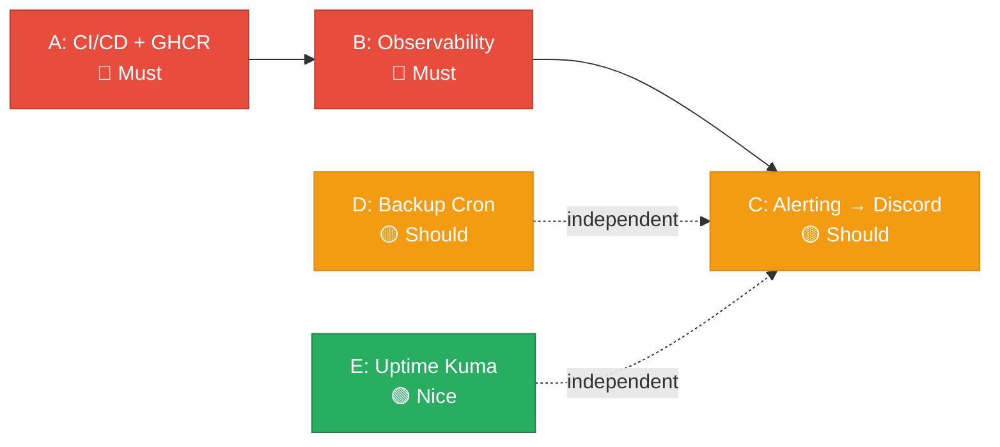

# Phase 2 — Foundation Hardening Plan

> **Status:** ✅ Approved by PO
> **Date:** 2026-07-24
> **Based on:** MM07 Phase 2 Proposal from DevOps Persona
> **Predecessor:** Phase 1 (Foundation) — ✅ Complete, all 3 services live

---

## 1. Phase Objective

> Harden the Panomete Platform foundation with CI/CD automation, observability, alerting, backups, and uptime monitoring — BEFORE onboarding any business service. This makes the platform production-grade and demonstrates DevOps maturity for the portfolio.

---

## 2. Scope — 5 Initiatives

| Initiative | Name | Priority | Depends On |
|-----------|------|----------|------------|
| **A** | CI/CD Pipeline + GHCR | 🔴 Must Have | Nothing |
| **B** | Observability Stack (Prometheus + Grafana + Loki) | 🔴 Must Have | Ideally A |
| **C** | Alerting (Grafana → Discord) | 🟡 Should Have | B |
| **D** | Backup Automation | 🟡 Should Have | Nothing |
| **E** | Uptime Monitoring (Uptime Kuma) | 🟢 Nice to Have | Nothing |

**Explicitly OUT of scope for Phase 2:**
- Initiative F (First Business Service) → deferred to Phase 3
- k3s migration → Phase 3+
- Security scanning (Trivy) → can be added during Phase 2 as CI enhancement

---

## 3. PO Decisions

| Decision | ID | Choice | Rationale |
|----------|-----|--------|-----------|
| Phase scope | DEC-005 | A + B + C + D + E (all infra hardening) | Business service deferred to Phase 3. Harden first, then prove. |
| Notification channel | DEC-006 | **Discord** webhook | User has existing Discord server. Richer formatting than Telegram. |
| CI/CD deploy trigger | DEC-007 | **Manual approval** | Push to `main` builds + tests + pushes to GHCR. Deploy to homelab requires manual trigger (GitHub Actions `workflow_dispatch` or environment protection rule). Safety-first for a single-developer homelab. |
| First business service | DEC-008 | **Deferred** | Not in Phase 2. Will decide in Phase 3 planning. |

---

## 4. Execution Order



| Sprint | Initiative | What Ships | Owner |
|--------|-----------|------------|-------|
| **Sprint 2** | A — CI/CD + GHCR | GitHub Actions for Guard, Discover, Gate. Build + test + push to GHCR. Manual deploy workflow. SSH key configured. | DevOps |
| **Sprint 2** | D — Backup | `pg_dumpall` cron at 3 AM daily. 7-day local retention. rclone to OneDrive. | DevOps |
| **Sprint 3** | B — Observability | Prometheus (:9090), Grafana (:3000), Loki (:3100). Scrape configs for all 3 services. Dashboards for JVM, request rate, error rate, latency. | DevOps |
| **Sprint 3** | C — Alerting | Grafana alert rules. Discord webhook. Alerts for: service down, high error rate, high memory, disk space, Valkey down, Eureka empty. | DevOps |
| **Sprint 3** | E — Uptime Kuma | Single container. Pings all `*.panomete.com` URLs every 30s. Status page. | DevOps |

---

## 5. Initiative Details

### Initiative A: CI/CD Pipeline + GHCR

> **Priority:** 🔴 Must Have — unblocks all subsequent deployments

**Current state:** Per-service CI/CD docs exist (`051_CICD_pipeline_configuration.md` in each service) but show **auto-deploy on push to main**. Must be updated to **manual deploy approval**.

**Changes needed to existing CI/CD docs:**

1. **Split the deploy job** from the build job into a separate workflow (`*-deploy.yml`) triggered by `workflow_dispatch` — NOT on push.
2. Push to `main` triggers: compile → test → lint → build Docker image → push to GHCR. Stops there.
3. Deploy is a separate manual action: PO clicks "Run workflow" in GitHub Actions → SSH deploy → smoke test → auto-rollback on failure.
4. Add GitHub Actions environment protection rule on `homelab` environment — requires manual approval before deploy job runs.

**Deliverables:**

| Deliverable | Description |
|------------|-------------|
| GitHub Actions CI workflow per service | `guard-ci.yml`, `discover-ci.yml`, `gate-ci.yml` — compile/test/lint/build/push |
| GitHub Actions deploy workflow per service | `guard-deploy.yml`, `discover-deploy.yml`, `gate-deploy.yml` — `workflow_dispatch` only |
| GHCR images | `ghcr.io/oat431/flowero-guard`, `ghcr.io/oat431/flowero-discover`, `ghcr.io/oat431/flowero-gate` |
| SSH deploy key | `HOMELAB_SSH_KEY` in GitHub Actions secrets |
| Smoke tests | Health endpoint + service-specific checks (JWKS for Guard, registry for Discover, 401 for Gate) |
| Auto-rollback | If smoke test fails, revert to previous image tag |

**Ports & domains for observability services:**

| Service | Port | Domain |
|---------|------|--------|
| GHCR | — | `ghcr.io/oat431/...` |

---

### Initiative B: Observability Stack

> **Priority:** 🔴 Must Have — see what's happening across all services

**Deliverables:**

| Component | Port | Domain | Purpose |
|-----------|------|--------|---------|
| **Prometheus** | 9090 | `metrics.panomete.com` | Scrape `/actuator/prometheus` from all 3 foundation services |
| **Grafana** | 3000 | `grafana.panomete.com` | Dashboards — JVM health, request rate, error rate, latency, Eureka registry |
| **Loki** | 3100 | — (internal) | Centralized log aggregation via Promtail (all container logs) |

**Dashboards required:**

| Dashboard | Panels |
|-----------|--------|
| Platform Overview | All 3 services status (UP/DOWN), request rate, error rate, p95 latency |
| JVM Health (per service) | Heap memory, GC pauses, thread count, CPU usage |
| Eureka Registry | Registered services, instance count, health status |
| Gate Traffic | Requests per route, 401/403/429/500 counts, rate limiter hits |

**Scrape targets:**

```yaml
scrape_configs:
  - job_name: 'flowero-gate'
    metrics_path: '/actuator/prometheus'
    static_configs:
      - targets: ['flowero-gate:8000']
  - job_name: 'flowero-discover'
    metrics_path: '/actuator/prometheus'
    static_configs:
      - targets: ['flowero-discover:8999']
  - job_name: 'flowero-guard'
    metrics_path: '/metrics'  # Keycloak native metrics endpoint
    static_configs:
      - targets: ['flowero-guard:8001']
```

---

### Initiative C: Alerting (Discord)

> **Priority:** 🟡 Should Have — know when things break

**Notification channel:** Discord webhook (user has existing server)

**Alert rules:**

| Alert | Trigger | Severity | Discord Notification |
|-------|---------|----------|---------------------|
| Service Down | Health check fails for 1 min | 🔴 Critical | @here ping + red embed |
| High Error Rate | 5xx responses > 5% for 5 min | 🟠 High | Red embed, no ping |
| High Memory | Container memory > 80% for 5 min | 🟡 Medium | Orange embed |
| Disk Space Low | Disk usage > 80% | 🟠 High | Red embed |
| Valkey Down | Valkey ping fails | 🟠 High | Red embed |
| Eureka Empty | Zero registered services for 2 min | 🔴 Critical | @here ping + red embed |

**Deliverable:** Grafana contact point (Discord webhook URL) + alert rules in provisioning format.

---

### Initiative D: Backup Automation

> **Priority:** 🟡 Should Have — protect the data

**Schedule:**

| Data | Method | Frequency | Retention | Destination |
|------|--------|-----------|-----------|-------------|
| PostgreSQL (all DBs) | `pg_dumpall` script | Daily 3:00 AM | 7 days local | `~/backups/db/` → rclone → OneDrive |
| Docker volumes | `tar` script | Weekly (Sunday 4:00 AM) | 4 weeks local | `~/backups/volumes/` → rclone → OneDrive |

**Deliverable:** Bash script + cron entries + rclone config verification.

---

### Initiative E: Uptime Monitoring (Uptime Kuma)

> **Priority:** 🟢 Nice to Have — visual status page

**Deliverables:**

| Component | Port | Domain | Purpose |
|-----------|------|--------|---------|
| Uptime Kuma | 3001 | `status.panomete.com` | Pings all `*.panomete.com` URLs every 30s |

**Monitored URLs:**

| URL | Expected | Check Type |
|-----|----------|------------|
| `https://auth.panomete.com` | 200 | HTTP |
| `https://auth.panomete.com/realms/panomete/.well-known/openid-configuration` | 200 + valid JSON | HTTP + keyword |
| `https://discovery.panomete.com` | 200 | HTTP |
| `https://api.panomete.com/actuator/health` | 200 + `"status":"UP"` | HTTP + keyword |
| `https://api.panomete.com/api/blog/posts` | 401 (expected — no token) | HTTP status code |
| `https://metrics.panomete.com` | 200 | HTTP |
| `https://grafana.panomete.com` | 200 | HTTP |

---

## 6. New Ports & Domains (Phase 2)

| Service | Port | Domain | Initiative |
|---------|------|--------|------------|
| Prometheus | 9090 | `metrics.panomete.com` | B |
| Grafana | 3000 | `grafana.panomete.com` | B |
| Loki | 3100 | — (internal) | B |
| Promtail | — (sidecar/agent) | — | B |
| Uptime Kuma | 3001 | `status.panomete.com` | E |

> **Port range note:** These use the self-hosted app range (3000-4000 FE) per the Home Lab App plan. Prometheus 9090 is the exception (standard Prometheus port).

---

## 7. Action Items

| ID | Action | Owner | Priority | Depends On |
|----|--------|-------|----------|------------|
| P2-001 | Update CI/CD docs: split deploy job to `workflow_dispatch` (manual approval) | PO → DevOps | 🔴 | — |
| P2-002 | Create GitHub Actions CI workflows (guard, discover, gate) | DevOps | 🔴 | P2-001 |
| P2-003 | Create GitHub Actions deploy workflows (`workflow_dispatch`) | DevOps | 🔴 | P2-002 |
| P2-004 | Set up GHCR + SSH deploy key | DevOps | 🔴 | — |
| P2-005 | Write backup script (`pg_dumpall` + rclone) | DevOps | 🟡 | — |
| P2-006 | Configure cron (daily 3AM db, weekly volumes) | DevOps | 🟡 | P2-005 |
| P2-007 | Deploy Prometheus + scrape config | DevOps | 🔴 | P2-004 |
| P2-008 | Deploy Grafana + import dashboards | DevOps | 🔴 | P2-007 |
| P2-009 | Deploy Loki + Promtail | DevOps | 🔴 | P2-007 |
| P2-010 | Configure Grafana Discord webhook | DevOps | 🟡 | P2-008 |
| P2-011 | Create alert rules (6 alerts) | DevOps | 🟡 | P2-010 |
| P2-012 | Deploy Uptime Kuma + configure monitors | DevOps | 🟢 | — |
| P2-013 | Configure Nginx routes for new subdomains | DevOps | 🔴 | P2-007, P2-008, P2-012 |
| P2-014 | Configure Cloudflare Tunnel for new subdomains | DevOps | 🔴 | P2-013 |

---

## 8. Definition of Done — Phase 2

Phase 2 is complete when ALL of the following are true:

- [ ] CI/CD pipeline builds, tests, and pushes images to GHCR for all 3 foundation services
- [ ] Deploy requires manual approval (not auto-deploy)
- [ ] Smoke tests run after deploy and auto-rollback on failure
- [ ] Prometheus scrapes metrics from all 3 foundation services
- [ ] Grafana dashboards show JVM health, request rate, error rate, latency
- [ ] Loki aggregates logs from all containers
- [ ] Grafana alerts send to Discord webhook when triggered
- [ ] Backup cron runs daily at 3 AM, pushes to OneDrive
- [ ] Uptime Kuma monitors all `*.panomete.com` URLs
- [ ] All new services deployed through CI/CD (not manual scp)

---

## 9. Phase 2 → Phase 3 Transition Criteria

Before starting Phase 3 (Business Service Onboarding):

1. CI/CD is the only deployment path (no manual scp)
2. Observability dashboards are green for 7 consecutive days
3. Alerting is tested (at least 1 alert fired and received in Discord)
4. Backup restore has been verified (restore from backup, confirm data integrity)
5. PO decides on first business service (DEC-008)

---

## Related Documents

| Document | Relationship |
|----------|-------------|
| [[../spec/meeting-minute/MM07_phase2-planning_20260724]] | DevOps Phase 2 proposal |
| [[../spec/panomete_platform/README]] | Platform architecture overview |
| [[../spec/flowero_guard/05_devops/051_CICD_pipeline_configuration]] | Guard CI/CD (needs manual deploy update) |
| [[../spec/flowero_discover/05_devops/051_CICD_pipeline_configuration]] | Discover CI/CD (needs manual deploy update) |
| [[../spec/flowero_gate/05_devops/051_CICD_pipeline_configuration]] | Gate CI/CD (needs manual deploy update) |

---

> **Next Step:** PO hands this plan to DevOps persona. DevOps creates detailed execution plan and begins Sprint 2 (Initiative A + D).
