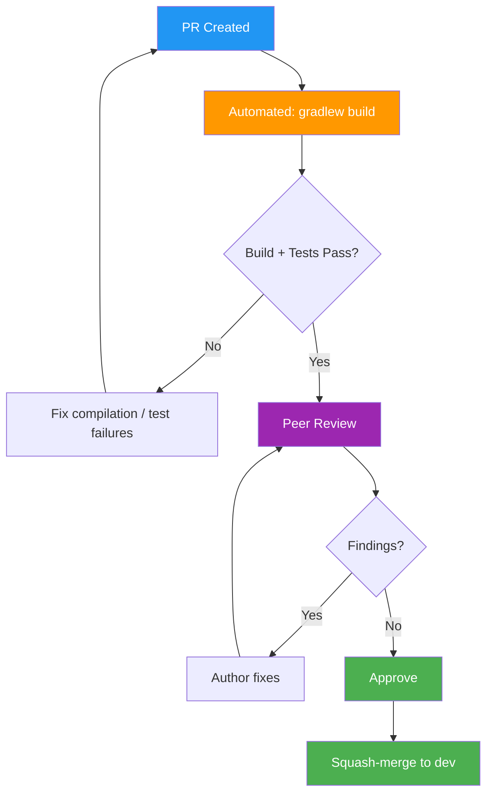

# Code Review Records — Flowero Discover

> **Service:** Flowero Discover (Spring Cloud Netflix Eureka)
> **Platform:** Panomete Platform
> **Version:** 0.1 | **Status:** Active
> **Last Updated:** 2026-07-23

---

## 1. Purpose

> Records of code reviews for Flowero Discover. Track findings, patterns, and decisions to improve quality over time. Code review is **quality gate #1**.

## 2. Review Process

## 3. Review Standards

| Aspect | Standard |
|--------|---------|
| PR Size | < 400 lines changed |
| Reviewers | User (oat431) reviews all PRs from Dev persona |
| Response Time | < 24 hours (async) |
| Tests Required | For all feature/fix changes |
| Documentation Required | For config changes and public API changes |
| Automated Checks | `./gradlew build` must pass before review |

## 4. Review Checklist

| # | Check | Category |
|---|-------|---------|
| 1 | Code follows [[035_coding_standards_development]] (Google Java Style, naming, structure) | Style |
| 2 | No hardcoded secrets or credentials | Security |
| 3 | Error handling is appropriate — not swallowing exceptions | Reliability |
| 4 | Tests cover happy path + edge cases + error paths | Testing |
| 5 | No dead code, commented-out blocks, or TODO without issue reference | Maintainability |
| 6 | Configuration changes documented with rationale | Documentation |
| 7 | Eureka settings match ADRs (ports, standalone, self-preservation) | Architecture |
| 8 | Dependencies are justified — no unnecessary libraries | Simplicity |
| 9 | Docker healthcheck and JVM flags match SAD resource allocation | Operations |
| 10 | Commit messages follow [[034_commit_messages_changelog]] | History |

## 5. Review Records

### Review #001 — Initial Implementation

| Field | Detail |
|-------|--------|
| **PR** | N/A (direct push to `dev`, solo developer workflow) |
| **Author** | Dev Persona |
| **Reviewer** | User (oat431) |
| **Date** | 2026-07-23 |
| **Service** | flowero-discover |
| **Type** | feat — initial Eureka server implementation |
| **Lines Changed** | ~12 files created |

**Scope:**
- `@EnableEurekaServer` + standalone configuration
- Dual-port Docker setup (8999 API + 3999 dashboard)
- 6 integration tests (context, dashboard, health, apps endpoint, JSON, self-registration)
- Multi-stage Dockerfile with ZGC flags
- Docker Compose fragment with healthcheck
- Full README rewrite

**Findings:**

| # | Severity | Category | Description | Resolution |
|---|:---:|---------|-------------|-----------|
| 1 | 🟢 | Style | `TestRestTemplate` import doesn't resolve in Boot 4.1 — switched to plain `RestTemplate` | Fixed in same session |
| 2 | 🟢 | Testing | `doesNotRegisterWithItself()` was checking wrong app name (`FLOWERODISCOVERY` → `FLOWERO-DISCOVER`) | Fixed in same session |

**Outcome:** ✅ Approved (self-review, solo developer)

**Lessons Learned:**
- Spring Boot 4.1's `TestRestTemplate` may require `spring-boot-starter-web` in test scope. Prefer plain `RestTemplate` for Eureka Server integration tests — the embedded Tomcat is already provided by the Eureka starter.
- Eureka uppercases `spring.application.name` and replaces underscores with hyphens: `flowero-discover` → `FLOWERO-DISCOVER`.

### Review Queue

| # | Date | PR | Status |
|---|------|----|--------|
| — | — | — | No pending reviews |

## 6. Review Metrics

| Metric | Target | Current |
|--------|--------|---------|
| PRs reviewed | — | 1 (initial implementation) |
| Findings per PR | < 5 | 2 |
| Critical findings | 0 | 0 |
| Rework rate | — | 0% (both findings fixed in same session) |

---

## Related Documents

| Document | Relationship |
|----------|-------------|
| [[035_coding_standards_development]] | Standards enforced during review |
| [[034_commit_messages_changelog]] | Commit format for PRs |
| [[031_README_developer_guide]] | Developer onboarding |

---

> **Template Standard:** Based on SWEBOK v4, ISO/IEC 20246
> **Usage:** Single review so far (solo developer workflow). Records capture findings and lessons learned. The checklist will be used for future PRs and other Panomete Java services.
