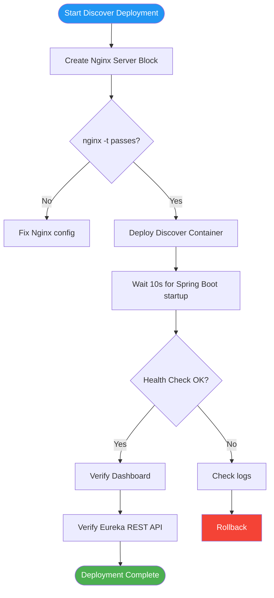

# Deployment Plan — Flowero Discover

> **Service:** Flowero Discover (Spring Cloud Netflix Eureka)
> **Platform:** Panomete Platform
> **Version:** 0.1 | **Status:** Draft — Awaiting PO Review
> **Last Updated:** 2026-07-23

---

## 1. Purpose

> Step-by-step procedure for deploying Flowero Discover (Eureka Server) to the homelab server. Covers Nginx configuration for the dashboard, Docker deployment, and verification.

---

## 2. Deployment Overview

| Field | Detail |
|-------|--------|
| Service | Flowero Discover — Eureka Service Registry |
| Image | `ghcr.io/panomete/flowero-discover:latest` |
| Container | `flowero-discover` |
| Ports (host bind) | `127.0.0.1:8999` (REST API), `127.0.0.1:3999` (Dashboard) |
| Domain | `discovery.panomete.com` → Dashboard (:3999) |
| Database | None — fully in-memory |
| Dependencies | None (standalone Eureka) |
| Deployment Method | Docker Compose |
| Downtime | Zero for existing services. Discover starts fresh. |

---

## 3. Pre-Deployment Checklist

| # | Check | Command | Status |
|---|-------|---------|--------|
| 1 | Port 8999 free | `ss -tlnp \| grep 8999` (should be empty) | ✅ Verified |
| 2 | Port 3999 free | `ss -tlnp \| grep 3999` (should be empty) | ✅ Verified |
| 3 | `db-network` exists | `docker network ls \| grep db-network` | ✅ Verified |
| 4 | Nginx running | `sudo systemctl is-active nginx` | ✅ Verified |
| 5 | Cloudflare tunnel active | `sudo systemctl is-active cloudflared` | ✅ Verified |
| 6 | Docker image available | `docker pull ghcr.io/panomete/flowero-discover:latest` | ☐ |

---

## 4. Deployment Steps



### Step 1: Create Nginx server block for `discovery.panomete.com`

```bash
ssh flowero@remote.panomete.com

sudo tee /etc/nginx/sites-available/discovery.panomete.com > /dev/null << 'NGINX'
server {
    server_name discovery.panomete.com;

    location / {
        proxy_pass http://127.0.0.1:3999;
        proxy_set_header Host $host;
        proxy_set_header X-Real-IP $remote_addr;
        proxy_set_header X-Forwarded-For $proxy_add_x_forwarded_for;
        proxy_set_header X-Forwarded-Proto $scheme;
    }
}
NGINX

# Enable site
sudo ln -s /etc/nginx/sites-available/discovery.panomete.com /etc/nginx/sites-enabled/

# Test and reload
sudo nginx -t && sudo systemctl reload nginx
```

### Step 2: Deploy Discover container

```bash
cd ~/platform

# Deploy using platform compose file
docker compose -f docker-compose.platform.yml up -d flowero-discover

# Monitor startup
docker logs -f flowero-discover
# Wait until you see: "Started FloweroDiscoverApplication in X seconds"
```

### Discover's Compose Service Definition

```yaml
# Excerpt from docker-compose.platform.yml
services:
  flowero-discover:
    image: ghcr.io/panomete/flowero-discover:latest
    container_name: flowero-discover
    ports:
      - "127.0.0.1:8999:8999"    # REST API
      - "127.0.0.1:3999:3999"    # Dashboard
    environment:
      SERVER_PORT: "8999"
    networks:
      - shared-network
    restart: unless-stopped
    deploy:
      resources:
        limits:
          memory: 384M
```

> **Note on dual-port design (ADR-D005):** Standard Eureka serves both API and dashboard on the same port. The design calls for separate ports (8999 API, 3999 dashboard). If this proves infeasible during Sprint 1 (US-101), fall back to single-port (e.g., 8999 for both) and update Nginx to proxy to `127.0.0.1:8999`. See MM04 §6 concern #1.

---

## 5. Post-Deployment Verification

| # | Check | Command | Expected | Status |
|---|-------|---------|----------|--------|
| 1 | Discover container running | `docker ps \| grep flowero-discover` | Up | ☐ |
| 2 | Health endpoint (internal) | `curl -sf http://localhost:8999/actuator/health` | `{"status":"UP"}` | ☐ |
| 3 | Eureka REST API (internal) | `curl -sf -H 'Accept: application/json' http://localhost:8999/eureka/apps \| jq .` | JSON with `applications` | ☐ |
| 4 | Dashboard via Nginx | `curl -sf -o /dev/null -w '%{http_code}' https://discovery.panomete.com/` | 200 | ☐ |
| 5 | Dashboard shows "Instances" | `curl -sf https://discovery.panomete.com/ \| grep -ci 'instance'` | > 0 | ☐ |
| 6 | No services registered (expected initially) | `curl -sf -H 'Accept: application/json' http://localhost:8999/eureka/apps \| jq '.applications.application \| length'` | 0 (until Guard/Gate register) | ☐ |
| 7 | Self-preservation mode | Dashboard shows "DS replicas: 0" (standalone) | Visible on dashboard | ☐ |

---

## 6. Rollback Procedure

### Scenario A: Discover container fails to start

```bash
cd ~/platform

# Stop container
docker compose -f docker-compose.platform.yml stop flowero-discover

# Check logs
docker logs flowero-discover 2>&1 | tail -50

# Common causes:
# - Port conflict → ss -tlnp | grep -E '8999|3999'
# - JVM OOM → increase memory limit in compose
# - Spring Boot config error → check application.yml
```

### Scenario B: Dashboard not accessible via Nginx

```bash
# Check internal dashboard first
curl -sf http://localhost:3999/ -o /dev/null -w '%{http_code}'

# If internal OK but external fails, check Nginx
sudo nginx -t
curl -sf -H 'Host: discovery.panomete.com' http://localhost -o /dev/null -w '%{http_code}'

# If Nginx config broken, disable and reload
sudo rm /etc/nginx/sites-enabled/discovery.panomete.com
sudo nginx -t && sudo systemctl reload nginx
```

### Scenario C: Discover registered stale services after restart

```bash
# Discover is in-memory — restart clears all registrations
cd ~/platform
docker compose -f docker-compose.platform.yml restart flowero-discover

# Services (Guard, Gate) will re-register automatically within 30s
# Verify: curl -H 'Accept: application/json' http://localhost:8999/eureka/apps | jq .
```

---

## 7. Communication Plan

| When | Who | Channel | Message |
|------|-----|---------|---------|
| Before deployment | PO | Chat | "Deploying Discover (Eureka) to homelab" |
| Discover healthy | PO | Chat | "Discover deployed. Dashboard at discovery.panomete.com" |
| Deployment failed | PO | Chat | "Discover deployment failed. Rolling back." |

---

## Related Documents

| Document | Relationship |
|----------|-------------|
| [[051_CICD_pipeline_configuration]] | Discover-specific pipeline |
| [[053_release_notes]] | Discover release history |
| `flowero_discover/02_design/022_API_specification` | Eureka REST API reference |
| `flowero_discover/02_design/021_architecture_decision_records` | Discover ADRs (ADR-D005 dual-port) |
| `panomete_platform/05_devops/052_deployment_plan` | Platform-level deployment |

---

> **Template Standard:** Based on SWEBOK v4, SEBoK v2
> **Usage:** Never deploy without verifying the health endpoint and dashboard.
