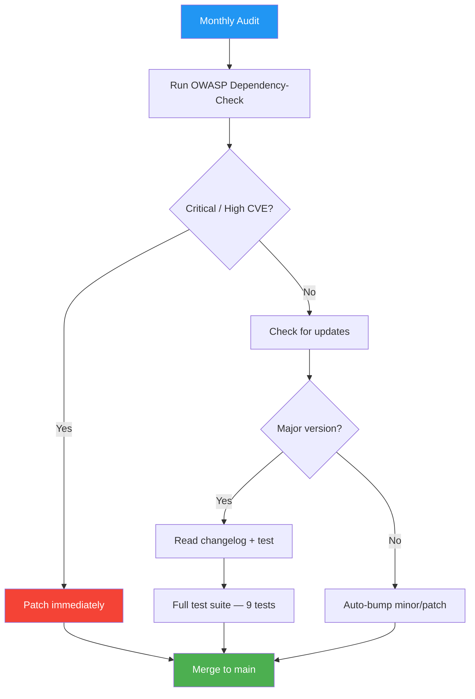

# Dependency Manifest — Flowero Gate

> **Service:** Flowero Gate (Spring Cloud Gateway)
> **Platform:** Panomete Platform
> **Version:** 0.1 | **Status:** Active
> **Last Updated:** 2026-07-24

---

## 1. Purpose

> Complete inventory of all Flowero Gate dependencies — direct, transitive, and platform-level. Know what you depend on. Audit regularly.

## 2. Dependency Overview

| Metric | Count |
|--------|-------|
| Direct Dependencies (implementation) | 11 |
| Runtime-Only Dependencies | 3 |
| Test Dependencies | 5 |
| Transitive Dependencies (approx.) | ~80+ |
| Known Vulnerabilities | 0 |
| License Issues | 0 |

## 3. Production Dependencies

### Direct (declared in `build.gradle`)

| # | Dependency | Group:Artifact | Version | License | Purpose |
|---|-----------|---------------|---------|---------|---------|
| 1 | Gateway Core | `org.springframework.cloud:spring-cloud-gateway-server-webflux` | 5.0.2 | Apache-2.0 | Reactive API gateway — routing, filters, predicates |
| 2 | WebFlux | `org.springframework.boot:spring-boot-starter-webflux` | 4.1.0 | Apache-2.0 | Reactive web stack (Netty) |
| 3 | Security | `org.springframework.boot:spring-boot-starter-security` | 4.1.0 | Apache-2.0 | WebFlux security filter chain |
| 4 | OAuth2 Resource Server | `org.springframework.boot:spring-boot-starter-oauth2-resource-server` | 4.1.0 | Apache-2.0 | JWT validation via JWKS |
| 5 | OAuth2 Client | `org.springframework.boot:spring-boot-starter-oauth2-client` | 4.1.0 | Apache-2.0 | Browser OAuth2 login redirect flow |
| 6 | Redis Reactive | `org.springframework.boot:spring-boot-starter-data-redis-reactive` | 4.1.0 | Apache-2.0 | Reactive Valkey client (Lettuce) |
| 7 | Actuator | `org.springframework.boot:spring-boot-starter-actuator` | 4.1.0 | Apache-2.0 | Health checks, metrics, gateway routes endpoint |
| 8 | Circuit Breaker | `org.springframework.cloud:spring-cloud-starter-circuitbreaker-reactor-resilience4j` | 3.0.2 | Apache-2.0 | Resilience4j circuit breaker for downstream services |
| 9 | LoadBalancer | `org.springframework.cloud:spring-cloud-starter-loadbalancer` | 4.2.1 | Apache-2.0 | Client-side `lb://` URI resolution |
| 10 | Eureka Client | `org.springframework.cloud:spring-cloud-starter-netflix-eureka-client` | 4.2.1 | Apache-2.0 | Service registration + discovery |
| 11 | OpenTelemetry | `org.springframework.boot:spring-boot-starter-opentelemetry` | 4.1.0 | Apache-2.0 | Distributed tracing (OTLP export) |

### Runtime-Only

| # | Dependency | Group:Artifact | Version | License | Purpose |
|---|-----------|---------------|---------|---------|---------|
| 12 | Prometheus Registry | `io.micrometer:micrometer-registry-prometheus` | 1.17.0 | Apache-2.0 | Prometheus metrics scrape endpoint |
| 13 | OTLP Registry | `io.micrometer:micrometer-registry-otlp` | 1.17.0 | Apache-2.0 | OTLP metrics export |
| 14 | Resilience4j Micrometer | `io.github.resilience4j:resilience4j-micrometer` | 2.3.0 | Apache-2.0 | Circuit breaker metrics |

### Key Transitive Dependencies (managed by Spring Cloud BOM `2025.1.2`)

| Dependency | Purpose | Managed By |
|-----------|---------|-----------|
| `reactor-netty-http` | Reactive HTTP client/server | Spring Boot BOM |
| `netty-codec-http` / `netty-handler` | HTTP protocol implementation | Spring Boot BOM |
| `spring-security-oauth2-resource-server` | JWT decoder + JWKS cache | Spring Boot BOM |
| `spring-security-oauth2-client` | OAuth2 login flow | Spring Boot BOM |
| `lettuce-core` (reactive) | Redis/Valkey client | Spring Boot BOM |
| `eureka-client` | Service registration + heartbeat | Spring Cloud BOM |
| `resilience4j-reactor` / `resilience4j-circuitbreaker` | Circuit breaker core | Spring Cloud BOM |
| `jackson-databind` (Jackson 3.x) | JSON serialization | Spring Boot BOM |
| `micrometer-core` / `micrometer-observation` | Metrics + tracing | Spring Boot BOM |
| `opentelemetry-sdk` | OTel tracing SDK | Spring Boot BOM |
| `reactor-core` | Reactive streams | Spring Boot BOM |

## 4. Test Dependencies

| # | Dependency | Group:Artifact | Version | License | Purpose |
|---|-----------|---------------|---------|---------|---------|
| 1 | Spring Boot Test | `org.springframework.boot:spring-boot-starter-test` | 4.1.0 | Apache-2.0 | JUnit 5 + AssertJ + Mockito |
| 2 | Security Test | `org.springframework.security:spring-security-test` | 7.1.0 | Apache-2.0 | WebTestClient with JWT support |
| 3 | Reactor Test | `io.projectreactor:reactor-test` | 3.8.6 | Apache-2.0 | StepVerifier for reactive streams |
| 4 | Stub Runner | `org.springframework.cloud:spring-cloud-starter-contract-stub-runner` | 5.0.3 | Apache-2.0 | WireMock for HTTP stubbing |
| 5 | JUnit Launcher | `org.junit.platform:junit-platform-launcher` | 6.0.3 | EPL-2.0 | JUnit 5 test engine |

## 5. Dependency Management Strategy

### Spring Cloud BOM Pattern

The BOM (`spring-cloud-dependencies:2025.1.2`) manages ALL transitive Spring Cloud versions. We only declare top-level starters — the BOM ensures compatibility:

```groovy
ext {
    set('springCloudVersion', "2025.1.2")
}

dependencyManagement {
    imports {
        mavenBom "org.springframework.cloud:spring-cloud-dependencies:${springCloudVersion}"
    }
}
```

### Platform-Level Shared Dependencies

| Dependency | Shared? | Where |
|-----------|:---:|-------|
| PostgreSQL 18 | ✅ Shared | Host-level, per-service databases |
| Valkey 9 | ✅ Shared | `local-valkey:6379` on `db-network` |
| Keycloak (Guard) | ✅ Shared | `auth.panomete.com` — Gate validates JWT locally, no per-request calls |
| Eureka (Discover) | ✅ Shared | `flowero-discover:8999` — Gate resolves `lb://` routes |
| OpenTelemetry Collector | 🟡 Phase 2 | OTLP metrics/traces not yet deployed |

## 6. What's NOT Included (and Why)

| Omission | Why |
|----------|-----|
| **JDBC / JPA driver** | Gate is stateless — no database needed |
| **spring-boot-starter-web (Tomcat)** | Gate uses Netty (WebFlux), not servlet container |
| **Hibernate** | No entities to manage |
| **Spring Session** | Gate doesn't store sessions — Keycloak handles that |
| **Lombok** | Project convention — explicit code > magic |
| **Feign / RestClient** | Gate is a proxy, not a service-to-service caller |

## 7. Dependency Update Process



---

## Related Documents

| Document | Relationship |
|----------|-------------|
| [[032_build_scripts]] | Build pipeline that consumes these deps |
| [[031_README_developer_guide]] | Setup and configuration |
| [[021_architecture_decision_records]] | Why Valkey (ADR-W005), why no TLS (ADR-W007) |
