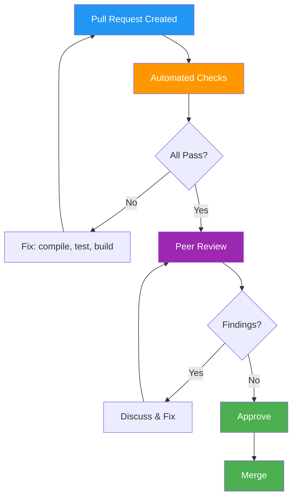

# Code Review Records — Flowero Gate

> **Service:** Flowero Gate (Spring Cloud Gateway)
> **Platform:** Panomete Platform
> **Version:** 0.1 | **Status:** Active
> **Last Updated:** 2026-07-24

---

## 1. Purpose

> Records of code reviews — findings, patterns, and metrics. Code review is **quality gate #1**. Every PR gets reviewed. This document captures significant review decisions for traceability.

## 2. Code Review Process

## 3. Review Standards

| Aspect | Standard |
|--------|---------|
| PR Size | < 400 lines changed (smaller = faster review) |
| Reviewers | Minimum 1 approval |
| Response Time | < 24 hours |
| Tests | Required for all feature/fix changes |
| Documentation | Required for config changes and new endpoints |
| Automated Checks | Must pass: `./gradlew build` (compile + test) |
| Commit Hygiene | Conventional Commits per [[034_commit_messages_changelog\|Commit Messages / Changelog]] |

## 4. Review Checklist

| # | Check | Category |
|---|-------|---------|
| 1 | Code follows [[035_coding_standards_development\|Coding Standards]] | Style |
| 2 | No hardcoded secrets, credentials, or tokens in config files | Security |
| 3 | Error handling is comprehensive — endpoints return proper HTTP status codes | Reliability |
| 4 | Tests cover happy path + edge cases + error paths | Testing |
| 5 | No dead code, commented-out blocks, or TODO without context | Maintainability |
| 6 | Performance implications considered (reactive streams, Netty buffer sizes) | Performance |
| 7 | Route changes are reflected in [[022_API_specification\|API Spec]] | Documentation |
| 8 | Configuration changes are documented with rationale | Documentation |
| 9 | No breaking changes without version bump or `BREAKING CHANGE:` footer | Compatibility |
| 10 | Dependencies are pinned via BOM, no `*` or `latest` versions | Security |

## 5. Review Records

### Review #001 — Panomete Platform Adaptation (7 Fixes)

| Field | Detail |
|-------|--------|
| **PR** | N/A (direct adaptation via Dev Persona per MM06) |
| **Author** | Dev Persona |
| **Reviewer** | DevOps Persona (deployment verification) |
| **Date** | 2026-07-24 |
| **Service** | flowero-gate |
| **Type** | feat + fix (platform adaptation) |
| **Lines Changed** | ~200 lines across 12 files |

**Findings:**

| # | Severity | Category | Description | Resolution |
|---|:---:|---------|-------------|-----------|
| 1 | 🟡 | Config | Test context failed to load — missing `app.post-login-redirect-url` after removing default | Added test property in `src/test/resources/application.yaml` |
| 2 | 🟡 | Config | Test context failed to load — missing OAuth2 client registration for `SecurityTests` | Added mock `keycloak` client registration to test yaml |
| 3 | 🟡 | Config | OAuth2 client `issuer-uri` triggered OIDC metadata fetch in tests — connection refused | Removed `issuer-uri`, used explicit endpoint URIs instead |
| 4 | 🟢 | Style | `CorsConfig` used `setAllowedOrigins()` which doesn't support wildcard `*.panomete.com` | Switched to `addAllowedOriginPattern()` with stream-based parsing |

**Outcome:** ✅ Approved — all 9 tests pass, Docker image builds successfully.

**Lessons Learned:**
- When removing a `@Value` default, always audit test configs for missing properties.
- Spring Boot's OAuth2 client auto-config uses `issuer-uri` to fetch OIDC metadata — provide explicit endpoint URIs in test configs to avoid network calls.
- `setAllowedOrigins()` does not support wildcard domains — use `addAllowedOriginPattern()` for `*.panomete.com` patterns.

---

### Review #000 — Initial Implementation (Sprint 1 Reference)

| Field | Detail |
|-------|--------|
| **PR** | #15 (oauth), #16 (docker), #17 (hotfix) |
| **Author** | oat431 (original developer) |
| **Reviewer** | Dev Persona (adaptation review) |
| **Date** | 2026-07-22 |
| **Service** | flowerogate |
| **Type** | feat (initial implementation) |
| **Lines Changed** | ~3,000+ lines (full codebase) |

**Key Decisions Validated During Adaptation:**

| Decision | Status | Notes |
|----------|:---:|-------|
| Reactive-only (Netty, no Tomcat) | ✅ | Correct for gateway workload |
| JWT validated locally via JWKS cache | ✅ | Zero per-request calls to Keycloak |
| Valkey fail-open rate limiting | ✅ | Gate stays operational if Valkey is down |
| W3C traceparent propagation | ✅ | Ready for Phase 2 distributed tracing |
| Multi-stage Dockerfile with ZGC | ✅ | Low pause GC for reactive workloads |

**Outcome:** ✅ Implementation was ~80% aligned with Panomete specs — 7 fixes applied, no architectural changes needed.

## 6. Review Metrics

| Metric | Target | Current | Status |
|--------|--------|---------|:---:|
| PRs reviewed this sprint | > 1 | 1 (adaptation) | 🟢 |
| Findings per PR | < 5 | 4 | 🟢 |
| Critical/blocking findings | 0 | 0 | 🟢 |
| Review coverage (% of PRs reviewed) | 100% | 100% | 🟢 |
| Rework rate (PRs needing > 2 rounds) | < 20% | 0% | 🟢 |
| Test pass rate post-review | 100% | 9/9 | 🟢 |

## 7. Common Findings (Platform-Wide)

| Finding | Frequency | Prevention |
|---------|:---:|-----------|
| Hardcoded realm/service names in config | Medium | Use env vars with platform-level defaults |
| Missing test properties after config changes | Medium | Run `./gradlew test` before opening PR |
| OAuth2 client auto-config triggers network calls in tests | Low | Provide explicit provider endpoint URIs, skip `issuer-uri` |
| CORS wildcard not supported by `setAllowedOrigins` | Low | Use `addAllowedOriginPattern` for `*.domain.com` patterns |

---

## Related Documents

| Document | Relationship |
|----------|-------------|
| [[035_coding_standards_development]] | Standards being enforced |
| [[034_commit_messages_changelog]] | Commit standards for PRs |
| [[031_README_developer_guide]] | Developer onboarding |
| [[MM06_gateway-handoff_20260724]] | Adaptation briefing that triggered this review |
