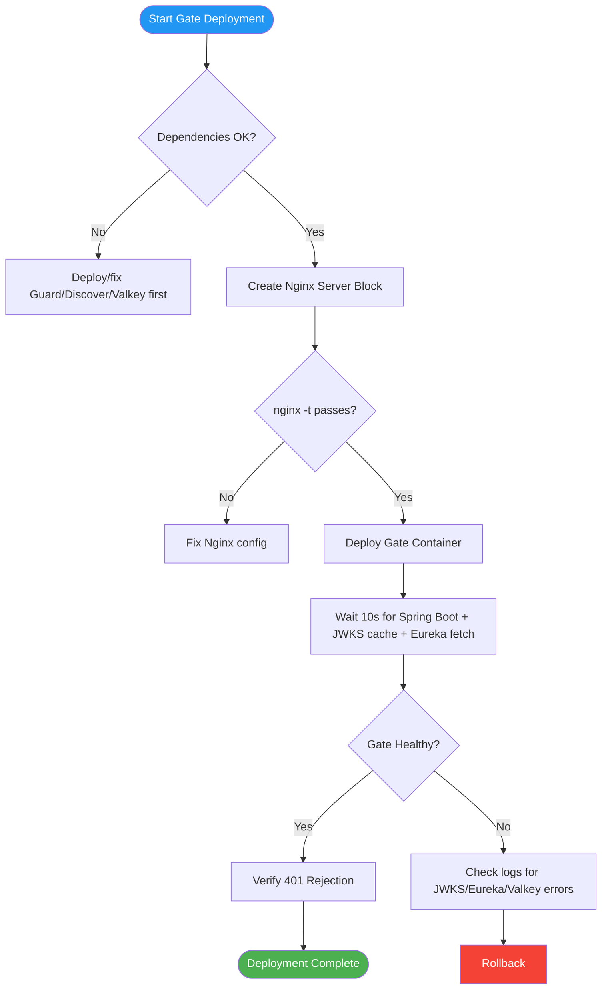

# Deployment Plan — Flowero Gate

> **Service:** Flowero Gate (Spring Cloud Gateway)
> **Platform:** Panomete Platform
> **Version:** 0.1 | **Status:** Draft — Awaiting PO Review
> **Last Updated:** 2026-07-23

---

## 1. Purpose

> Step-by-step procedure for deploying Flowero Gate to the homelab server. Covers Nginx configuration, Docker deployment, dependency verification, and rollback. Gate is the most dependency-heavy service — it requires Guard, Discover, and Valkey to be healthy before deployment.

---

## 2. Deployment Overview

| Field | Detail |
|-------|--------|
| Service | Flowero Gate — Spring Cloud Gateway |
| Image | `ghcr.io/panomete/flowero-gate:latest` |
| Container | `flowero-gate` |
| Port (host bind) | `127.0.0.1:8000` |
| Domain | `api.panomete.com` |
| Database | None — fully stateless |
| Dependencies | Guard (JWKS), Discover (Eureka registry), Valkey (rate limiting) |
| Deployment Method | Docker Compose |
| Downtime | Zero for existing services. Gate starts fresh. |

---

## 3. Pre-Deployment Checklist

| # | Check | Command | Status |
|---|-------|---------|--------|
| 1 | Port 8000 free | `ss -tlnp \| grep 8000` (should be empty) | ✅ Verified |
| 2 | `db-network` exists | `docker network ls \| grep db-network` | ✅ Verified |
| 3 | **Guard healthy** | `curl -sf http://localhost:8001/health/ready` | ☐ (Deploy Guard first) |
| 4 | **Guard JWKS reachable** | `curl -sf https://auth.panomete.com/realms/panomete/protocol/openid-connect/certs \| jq .keys[0].kty` | ☐ |
| 5 | **Discover healthy** | `curl -sf http://localhost:8999/actuator/health` | ☐ (Deploy Discover first) |
| 6 | **Valkey healthy** | `docker exec local-valkey valkey-cli -a *** ping` | ✅ Verified |
| 7 | Nginx running | `sudo systemctl is-active nginx` | ✅ Verified |
| 8 | Cloudflare tunnel active | `sudo systemctl is-active cloudflared` | ✅ Verified |
| 9 | `.env` has Valkey password | `grep VALKEY_PASSWORD ~/platform/.env` | ☐ |
| 10 | Docker image available | `docker pull ghcr.io/panomete/flowero-gate:latest` | ☐ |

> **Gate deploys LAST.** Guard and Discover must be running and healthy first.

---

## 4. Deployment Steps



### Step 1: Create Nginx server block for `api.panomete.com`

```bash
ssh flowero@remote.panomete.com

sudo tee /etc/nginx/sites-available/api.panomete.com > /dev/null << 'NGINX'
server {
    server_name api.panomete.com;

    location / {
        proxy_pass http://127.0.0.1:8000;
        proxy_set_header Host $host;
        proxy_set_header X-Real-IP $remote_addr;
        proxy_set_header X-Forwarded-For $proxy_add_x_forwarded_for;
        proxy_set_header X-Forwarded-Proto $scheme;
    }
}
NGINX

# Enable site
sudo ln -s /etc/nginx/sites-available/api.panomete.com /etc/nginx/sites-enabled/

# Remove stale gateway.panomete.com config (if not already removed)
sudo rm -f /etc/nginx/sites-enabled/gateway.panomete.com
sudo rm -f /etc/nginx/sites-available/gateway.panomete.com

# Test and reload
sudo nginx -t && sudo systemctl reload nginx
```

### Step 2: Verify all dependencies

```bash
echo "=== Checking Gate dependencies ==="

# Guard (JWKS)
echo -n "Guard health: "
curl -sf http://localhost:8001/health/ready > /dev/null && echo "✅" || echo "❌ DEPLOY GUARD FIRST"

echo -n "JWKS reachable: "
curl -sf https://auth.panomete.com/realms/panomete/protocol/openid-connect/certs > /dev/null && echo "✅" || echo "❌"

# Discover
echo -n "Discover health: "
curl -sf http://localhost:8999/actuator/health > /dev/null && echo "✅" || echo "❌ DEPLOY DISCOVER FIRST"

# Valkey
echo -n "Valkey ping: "
docker exec local-valkey valkey-cli -a "$VALKEY_PASSWORD" ping 2>/dev/null && echo "" || echo "❌"
```

### Step 3: Deploy Gate container

```bash
cd ~/platform

docker compose -f docker-compose.platform.yml up -d flowero-gate

# Monitor startup — Gate will:
# 1. Connect to Valkey (rate limiting)
# 2. Fetch JWKS from Guard (JWT validation cache)
# 3. Fetch Eureka registry from Discover (route resolution)
docker logs -f flowero-gate
# Wait until you see: "Started FloweroGateApplication in X seconds"
```

### Gate's Compose Service Definition

```yaml
# Excerpt from docker-compose.platform.yml
services:
  flowero-gate:
    image: ghcr.io/panomete/flowero-gate:latest
    container_name: flowero-gate
    ports:
      - "127.0.0.1:8000:8000"
    environment:
      SPRING_DATA_REDIS_HOST: ${VALKEY_HOST:-local-valkey}
      SPRING_DATA_REDIS_PORT: ${VALKEY_PORT:-6379}
      SPRING_DATA_REDIS_PASSWORD: ${VALKEY_PASSWORD}
      SPRING_SECURITY_OAUTH2_RESOURCESERVER_JWT_ISSUER_URI: https://auth.panomete.com/realms/panomete
      SPRING_SECURITY_OAUTH2_RESOURCESERVER_JWT_JWK_SET_URI: https://auth.panomete.com/realms/panomete/protocol/openid-connect/certs
    networks:
      - shared-network
    depends_on:
      - flowero-discover
    restart: unless-stopped
    deploy:
      resources:
        limits:
          memory: 512M
```

---

## 5. Post-Deployment Verification

| # | Check | Command | Expected | Status |
|---|-------|---------|----------|--------|
| 1 | Gate container running | `docker ps \| grep flowero-gate` | Up | ☐ |
| 2 | Health endpoint (internal) | `curl -sf http://localhost:8000/actuator/health` | `{"status":"UP"}` | ☐ |
| 3 | **Valkey connected** | `curl -sf http://localhost:8000/actuator/health \| jq '.components.redisReactiveHealthIndicator.status'` | `"UP"` | ☐ |
| 4 | **Eureka connected** | `curl -sf http://localhost:8000/actuator/health \| jq '.components.discoveryComposite.status'` | `"UP"` | ☐ |
| 5 | **Rejects no-token** | `curl -sf -o /dev/null -w '%{http_code}' https://api.panomete.com/api/blog/posts` | 401 | ☐ |
| 6 | External access works | `curl -sf -o /dev/null -w '%{http_code}' https://api.panomete.com/actuator/health` | 200 | ☐ |
| 7 | Existing services unaffected | `curl -sf -o /dev/null -w '%{http_code}' https://adguard.panomete.com/` | 200/302 | ☐ |

---

## 6. Rollback Procedure

### Scenario A: Gate fails to start — JWKS fetch failed

```bash
# Most common Gate startup failure
docker logs flowero-gate 2>&1 | grep -i "jwk\|jws\|oauth\|issuer"

# Check if Guard is up and JWKS is reachable
curl -sf https://auth.panomete.com/realms/panomete/protocol/openid-connect/certs | jq .

# If JWKS is down → fix Guard first, then restart Gate
docker compose -f docker-compose.platform.yml restart flowero-gate
```

### Scenario B: Gate fails to start — Valkey connection failed

```bash
docker logs flowero-gate 2>&1 | grep -i "redis\|valkey\|connection"

# Check Valkey
docker exec local-valkey valkey-cli -a "$VALKEY_PASSWORD" ping
# Should return PONG

# If Valkey is password-protected, ensure SPRING_DATA_REDIS_PASSWORD is set
grep VALKEY ~/platform/.env

# Restart Gate
docker compose -f docker-compose.platform.yml restart flowero-gate
```

### Scenario C: Gate fails to start — Eureka connection failed

```bash
docker logs flowero-gate 2>&1 | grep -i "eureka\|discovery\|registry"

# Check Discover
curl -sf http://localhost:8999/actuator/health

# If Discover is down → restart it first
docker compose -f docker-compose.platform.yml restart flowero-discover
sleep 10
docker compose -f docker-compose.platform.yml restart flowero-gate
```

### Scenario D: Nginx routing broken

```bash
# Disable the api server block
sudo rm /etc/nginx/sites-enabled/api.panomete.com
sudo nginx -t && sudo systemctl reload nginx

# Other services remain unaffected
```

---

## 7. Communication Plan

| When | Who | Channel | Message |
|------|-----|---------|---------|
| Before deployment | PO | Chat | "Deploying Gate (Gateway) to homelab" |
| Dependencies verified | PO | Chat | "Guard + Discover + Valkey all healthy. Proceeding." |
| Gate healthy | PO | Chat | "Gate deployed. API at api.panomete.com. Correctly rejecting unauthenticated requests." |
| Deployment failed | PO | Chat | "Gate deployment failed. [JWKS/Eureka/Valkey] issue. Rolling back." |

---

## Related Documents

| Document | Relationship |
|----------|-------------|
| [[051_CICD_pipeline_configuration]] | Gate-specific pipeline |
| [[053_release_notes]] | Gate release history |
| `flowero_gate/02_design/022_API_specification` | Route table, auth behavior |
| `flowero_gate/02_design/021_architecture_decision_records` | Gate ADRs |
| `flowero_guard/05_devops/052_deployment_plan` | Guard must deploy first |
| `flowero_discover/05_devops/052_deployment_plan` | Discover must deploy first |
| `panomete_platform/05_devops/052_deployment_plan` | Platform-level deployment |

---

> **Template Standard:** Based on SWEBOK v4, SEBoK v2
> **Usage:** Gate is the most dependency-heavy service. Verify Guard, Discover, and Valkey are all healthy before deploying Gate.
