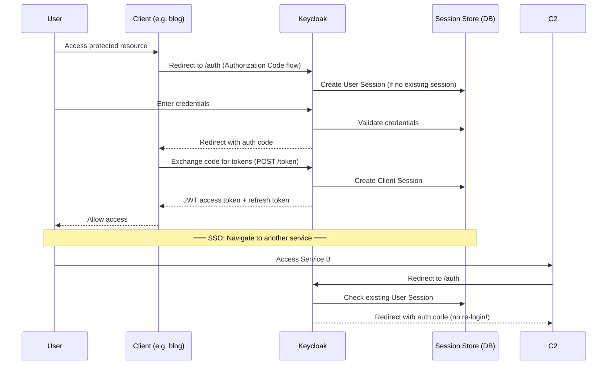

# ERD (Entity-Relationship Diagram) — Flowero Guard

> **Service:** Flowero Guard (Keycloak IAM)
> **Platform:** Panomete Platform
> **Version:** 0.1 | **Status:** Draft
> **Last Updated:** 2026-07-22

---

## 1. Purpose

> This ERD shows the **logical domain model** of the `panomete` Keycloak realm. It describes the entities we configure and their relationships — NOT the physical Keycloak database schema (which Keycloak manages itself). Use this to understand the IAM structure when configuring clients, users, and roles.

---

## 2. Logical Realm Model

```mermaid
erDiagram
    REALM ||--o{ CLIENT : "contains"
    REALM ||--o{ USER : "has"
    REALM ||--o{ REALM_ROLE : "defines"
    USER ||--o{ USER_ROLE : "assigned"
    REALM_ROLE ||--o{ USER_ROLE : "grants"
    CLIENT ||--o{ CLIENT_ROLE : "defines"
    CLIENT ||--o{ CLIENT_SCOPE : "has scopes"
    USER ||--o{ USER_SESSION : "active sessions"

    REALM {
        string id PK "panomete"
        string name "panomete"
        boolean enabled true
        int access_token_lifespan 300
        int sso_session_idle_timeout 1800
    }

    CLIENT {
        string id PK
        string client_id "e.g. fluffy-mouton"
        string secret "hashed"
        boolean enabled true
        boolean public_client false
        boolean service_accounts_enabled true
        boolean standard_flow_enabled true
        string redirect_uris "https://panomete.local/*"
    }

    USER {
        string id PK "Keycloak UUID"
        string username "e.g. alice"
        string email "alice@panomete.local"
        boolean email_verified false
        boolean enabled true
    }

    REALM_ROLE {
        string id PK
        string name "admin | user | viewer"
        string description
        boolean composite false
    }

    CLIENT_ROLE {
        string id PK
        string client_id FK
        string name "e.g. content-reader"
    }

    USER_ROLE {
        string user_id FK
        string role_id FK
    }

    CLIENT_SCOPE {
        string id PK
        string name "e.g. openid, profile, email"
        string protocol "openid-connect"
    }

    USER_SESSION {
        string id PK
        string user_id FK
        string realm_id FK
        timestamp started
        timestamp last_access
    }
```

---

## 3. Entity Definitions

### 3.1 Realm

| Attribute | Type | Description |
|-----------|------|-------------|
| `id` | string | `"panomete"` |
| `name` | string | Display name: `"panomete"` |
| `enabled` | boolean | `true` |
| `access_token_lifespan` | int (seconds) | JWT lifetime: `300` (5 min) |
| `sso_session_idle_timeout` | int (seconds) | Idle session timeout: `1800` (30 min) |

### 3.2 Client (OAuth2 Client)

| Attribute | Type | Description |
|-----------|------|-------------|
| `id` | UUID | Internal Keycloak ID |
| `client_id` | string | Public identifier (e.g., `"fluffy-mouton"`) |
| `secret` | string | Hashed client secret — never exposed after creation |
| `enabled` | boolean | `true` |
| `public_client` | boolean | `false` — all clients are confidential |
| `service_accounts_enabled` | boolean | `true` — enables Client Credentials grant |
| `standard_flow_enabled` | boolean | `true` — enables Authorization Code flow |
| `redirect_uris` | string | Valid post-login redirect patterns |

**Panomete Realm Clients (Planned):**

| Client ID | Service | Type |
|-----------|---------|------|
| `flowero-gate` | API Gateway | Bearer-only (no login, validates tokens) |
| `cute-gufo` | Blog | Confidential |
| `fluffy-mouton` | URL Shortener | Confidential |
| `tiny-mchwa` | Todo List | Confidential |
| `big-schwein` | Ledger | Confidential |
| `shy-ardilla` | Cook Book | Confidential |
| `white-jelen` | Hora | Confidential |

### 3.3 User

| Attribute | Type | Description |
|-----------|------|-------------|
| `id` | UUID | Keycloak internal UUID |
| `username` | string | Login username |
| `email` | string | Email address |
| `email_verified` | boolean | MVP: `false` (admin-created, no verification flow) |
| `enabled` | boolean | `true` |

### 3.4 Realm Role

| Role | Description | Assigned To |
|------|-------------|------------|
| `admin` | Full platform access — manage users, view dashboards, configure services | Self (platform owner) |
| `user` | Standard user — access business services, create/edit own data | Family members |
| `viewer` | Read-only access — view content, no modifications | Guests |

### 3.5 Client Role (Per-Service Roles)

> Client roles are defined per service for fine-grained authorization. Not used in MVP — realm roles (`admin`, `user`, `viewer`) are sufficient for basic access control.

**Future examples:**
- `blog-writer` — can create blog posts
- `blog-editor` — can edit and publish
- `ledger-admin` — can manage financial records

---

## 4. Relationship Rules

| Relationship | Cardinality | Description |
|-------------|:---:|-------------|
| Realm → Client | 1:N | One realm contains multiple OAuth2 clients |
| Realm → User | 1:N | One realm has multiple users |
| Realm → Realm Role | 1:N | Realm defines roles (`admin`, `user`, `viewer`) |
| User → User Role | N:M | User is assigned multiple roles |
| Realm Role → User Role | N:M | Role is granted to multiple users |
| Client → Client Role | 1:N | Each service defines its own roles |
| Client → Client Scope | 1:N | Each client requests specific scopes |
| User → User Session | 1:N | User can have multiple active sessions |

---

## 5. SSO Session Flow (Entity Interaction)



---

## 6. Key Design Decisions Embedded in This Model

| Decision | Rationale | See |
|----------|-----------|-----|
| Single realm for all services | Enables SSO; simpler admin | ADR-G002 |
| Confidential clients only | S2S auth via client credentials | ADR-G003 |
| Admin-created users (no self-registration) | Personal homelab; minimal user base | ADR-G004 |
| Realm roles for authorization (not client roles) | Simpler RBAC; client roles are future refinement | ADR-G001 |
| Short access token lifespan (5 min) | Limits window for token misuse; refresh tokens handle renewal | [[panomete_platform/021_architecture_decision_records#ADR-007\|ADR-007]] |

---

## Related Documents

| Document | Relationship |
|----------|-------------|
| [[flowero_guard/023_database_schema_DDL]] | Physical database that stores this model |
| [[flowero_guard/022_API_specification]] | OAuth2 endpoints that operate on this model |
| [[flowero_guard/021_architecture_decision_records]] | Decisions that shaped this model |
| [[flowero_guard/012_user_stories]] | Stories this model supports |

---

> **Template Standard:** Based on SWEBOK v4, DMBOK v2
> **Usage:** This is the *logical* data model. It shows what we configure in Keycloak, not how Keycloak stores it internally. Use this to understand the IAM structure before creating clients and users.
