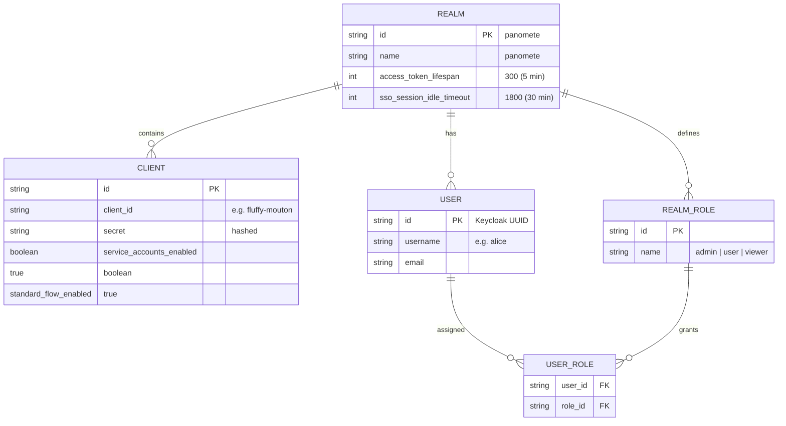

# ERD — Flowero Guard (Keycloak Realm Model)

> **Service:** Flowero Guard (Keycloak IAM)
> **Platform:** Panomete Platform
> **Version:** 0.2 | **Status:** Draft — Updated per Design Review 2026-07-22
> **Last Updated:** 2026-07-22

---

## 1. Purpose

> Logical domain model of the `panomete` Keycloak realm. This describes what we *configure* — not the physical Keycloak schema (which Keycloak manages via Liquibase).

---

## 2. Logical Realm Model

---

## 3. Entity Definitions

### 3.1 Realm

| Attribute | Value | Description |
|-----------|-------|-------------|
| `id` | `panomete` | Realm ID |
| `access_token_lifespan` | `300` | JWT lifetime: 5 minutes |
| `sso_session_idle_timeout` | `1800` | SSO session idle: 30 minutes |

### 3.2 Clients (Planned)

| Client ID | Service | Type |
|-----------|---------|------|
| `flowero-gate` | API Gateway | Bearer-only |
| `cute-gufo` | Blog | Confidential |
| `fluffy-mouton` | URL Shortener | Confidential |
| `tiny-mchwa` | Todo List | Confidential |
| `big-schwein` | Ledger | Confidential |
| `shy-ardilla` | Cook Book | Confidential |
| `white-jelen` | Hora | Confidential |

### 3.3 Realm Roles

| Role | Description | Assigned To |
|------|-------------|------------|
| `admin` | Full platform access | Self (platform owner) |
| `user` | Standard access | Family members |
| `viewer` | Read-only | Guests |

---

## 4. Key Design Decisions

| Decision | Rationale |
|----------|-----------|
| Single realm (`panomete`) | Enables SSO. One tenant. | ADR-G002 |
| Confidential clients only | S2S auth via client credentials | ADR-G003 |
| Admin-created users | Personal homelab | ADR-G004 |
| Short access token (5 min) | Limits misuse window. Local JWT validation at Gate. | ADR-007 |

---

## Related Documents

| Document | Relationship |
|----------|-------------|
| [[flowero_guard/023_database_schema_DDL]] | Database provisioning |
| [[flowero_guard/022_API_specification]] | OAuth2 endpoints |
| [[flowero_guard/021_architecture_decision_records]] | Decisions shaping this model |
