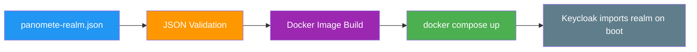

# Build Scripts — Flowero Guard

> **Service:** Flowero Guard (Keycloak IAM)
> **Platform:** Panomete Platform
> **Version:** 0.1 | **Status:** Active
> **Last Updated:** 2026-07-23

---

## 1. Purpose

> Documents the build pipeline for Flowero Guard. Guard is unique — there's no code to compile. The "build" is a Docker image that overlays the realm JSON onto the official Keycloak image.

## 2. Build Pipeline



> **No compilation step.** Guard's "source code" is `panomete-realm.json`. The build validates it and packages it into a Docker image.

## 3. Build Commands

### Realm JSON Validation

```bash
# Syntax check
jq . panomete-realm.json > /dev/null && echo "Valid JSON" || echo "Invalid JSON"

# Verify required fields
jq -r '.realm' panomete-realm.json          # Must be "panomete"
jq -r '.enabled' panomete-realm.json        # Must be true
jq -r '.roles.realm[].name' panomete-realm.json  # Must include admin, user, viewer

# Verify no plaintext secrets
grep -qiE '(password|secret).{0,5}:.{0,5}["\x27][^"\x27]{6,}' panomete-realm.json && echo "WARNING: possible secret" || echo "Clean"
```

### Docker Build

```bash
# Build image
docker build -t flowero-guard .

# Verify image
docker run --rm flowero-guard --help | head -5
```

### Deploy

```bash
# Via platform compose
cd ~/platform
docker compose -f docker-compose.platform.yml up -d flowero-guard

# Monitor startup (Liquibase + realm import)
docker logs -f flowero-guard
```

## 4. Dockerfile

```dockerfile
# flowero-guard/Dockerfile
FROM quay.io/keycloak/keycloak:latest

# Copy realm configuration for import on startup
COPY panomete-realm.json /opt/keycloak/data/import/panomete-realm.json

# Keycloak will use --import-realm flag (set in compose command)
```

> **Minimal.** The official Keycloak image handles everything. We only add the realm JSON.

## 5. Docker Compose Fragment

```yaml
# docker-compose.fragment.yml
services:
  flowero-guard:
    image: quay.io/keycloak/keycloak:latest
    container_name: flowero-guard
    ports:
      - "127.0.0.1:8001:8080"
    environment:
      KC_DB: postgres
      KC_DB_URL: jdbc:postgresql://local-postgres:5432/keycloak
      KC_DB_USERNAME: keycloak
      KC_DB_PASSWORD: ${KC_DB_PASSWORD}
      KC_BOOTSTRAP_ADMIN_USERNAME: ${KC_BOOTSTRAP_ADMIN_USERNAME}
      KC_BOOTSTRAP_ADMIN_PASSWORD: ${KC_BOOTSTRAP_ADMIN_PASSWORD}
      KC_HOSTNAME: auth.panomete.com
      KC_HTTP_ENABLED: "true"
      KC_PROXY_HEADERS: xforwarded
      KC_CACHE: local
    command: ["start", "--import-realm"]
    volumes:
      - ./panomete-realm.json:/opt/keycloak/data/import/panomete-realm.json:ro
    networks:
      - shared-network
    restart: unless-stopped
    deploy:
      resources:
        limits:
          memory: 1G

networks:
  shared-network:
    external: true
    name: db-network
```

## 6. Build Output Verification

### Successful deployment output:

```
KC-SERVICES0050: Initializing master realm
KC-SERVICES0030: Full model import requested. Strategy: IGNORE_EXISTING
KC-SERVICES0032: Import finished successfully
Keycloak 26.7.0 on JVM (powered by Quarkus 3.33.2.1) started in 7.224s.
Listening on: http://0.0.0.0:8080
```

### Verification commands:

```bash
# Health
curl -sf http://localhost:8001/health/ready && echo " ✅"

# OIDC Discovery
curl -sf https://auth.panomete.com/realms/panomete/.well-known/openid-configuration | jq .issuer

# JWKS
curl -sf https://auth.panomete.com/realms/panomete/protocol/openid-connect/certs | jq '.keys | length'

# Admin Console
curl -sf -o /dev/null -w '%{http_code}' https://auth.panomete.com/admin/
```

## 7. Realm Export (After Changes)

> **Critical:** After ANY change in the Admin Console, export the realm JSON and commit it.

```bash
# Via Admin Console
# 1. Go to https://auth.panomete.com/admin
# 2. Select "panomete" realm
# 3. Realm Settings → Action → Partial Export
# 4. Check "Include groups and roles" + "Include clients"
# 5. Download JSON

# Save to project
cp ~/Downloads/panomete-realm-export.json panomete-realm.json

# Validate
jq . panomete-realm.json > /dev/null && echo "Valid"

# Commit
git add panomete-realm.json
git commit -m "chore(guard): export realm config YYYY-MM-DD"
```

---

## Related Documents

| Document | Relationship |
|----------|-------------|
| [[031_README_developer_guide]] | Developer setup instructions |
| [[033_dependency_manifest]] | Dependencies (Keycloak image) |
| [[034_commit_messages_changelog]] | Commit standards |
| [[052_deployment_plan]] | Deployment procedures |

---

> **Template Standard:** Based on SWEBOK v4, 12-Factor App
> **Usage:** Guard has no compiled code. The realm JSON is the build artifact. Validate it before deploying.
