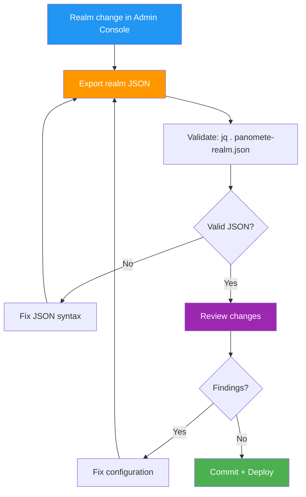

# Code Review Records — Flowero Guard

> **Service:** Flowero Guard (Keycloak IAM)
> **Platform:** Panomete Platform
> **Version:** 0.1 | **Status:** Active
> **Last Updated:** 2026-07-23

---

## 1. Purpose

> Records of configuration reviews for Flowero Guard. Since Guard is config-only, "code review" means reviewing realm JSON changes, Docker configuration, and operational procedures.

## 2. Review Process

## 3. Review Checklist

| # | Check | Category |
|---|-------|---------|
| 1 | Realm JSON is valid (`jq .` passes) | Syntax |
| 2 | Realm name is `panomete` | Consistency |
| 3 | Required roles exist: `admin`, `user`, `viewer` | Completeness |
| 4 | No plaintext passwords in JSON | Security |
| 5 | `optionalClientScopes` reference existing scopes only | Validity |
| 6 | `default-roles-panomete` has no client role references | Validity |
| 7 | Redirect URIs use HTTPS (except localhost for dev) | Security |
| 8 | Clients are `confidential` by default (ADR-G003) | Security |
| 9 | `sslRequired` is `none` (Cloudflare handles TLS) | Consistency |
| 10 | Docker env vars use `.env` for secrets, not hardcoded | Security |

## 4. Review Records

### Review #001 — Initial Deployment

| Field | Detail |
|-------|--------|
| **Date** | 2026-07-23 |
| **Author** | DevOps Persona |
| **Reviewer** | PO Persona |
| **Type** | Initial realm configuration |

**Scope:**
- Created `panomete` realm with `admin`, `user`, `viewer` roles
- Configured `account` and `admin-cli` clients
- Added `web-origins`, `profile`, `email`, `roles` client scopes
- Configured `realm_access.roles` JWT mapper
- Deployed Keycloak 26.7.0 with `KC_CACHE=local` and `KC_PROXY_HEADERS=xforwarded`

**Findings:**

| # | Severity | Category | Description | Resolution |
|---|:---:|---------|-------------|-----------|
| 1 | 🔴 | Import | `panomete-realm.json` was a directory, not a file (Docker auto-created) | Recreated as proper file |
| 2 | 🔴 | Import | `default-roles-panomete` referenced client roles (`view-profile`, `manage-account`) that didn't exist | Removed client role references |
| 3 | 🟡 | Deprecation | `KEYCLOAK_ADMIN` env var deprecated in Keycloak 26+ | Changed to `KC_BOOTSTRAP_ADMIN_USERNAME` |
| 4 | 🟡 | Security | `KC_PROXY=edge` deprecated | Changed to `KC_PROXY_HEADERS=xforwarded` |
| 5 | 🟡 | Startup | JGroups clustering timeout (20+ seconds wasted on single node) | Added `KC_CACHE=local` |
| 6 | 🟡 | Security | `HTTPS required` error on external access | Hardcoded `X-Forwarded-Proto: https` in Nginx |
| 7 | 🟢 | Admin | Temporary admin warning in console | Created permanent admin via Post Install procedure |

**Outcome:** ✅ Approved — all findings resolved

**Lessons Learned:**
- Always create the realm JSON file BEFORE starting the container (Docker creates directories for non-existent bind mount sources)
- Remove `default-roles-panomete` from realm JSON — let Keycloak create it automatically
- Keycloak 26+ renamed admin bootstrap env vars
- `KC_CACHE=local` is essential for single-node deployments
- Nginx must hardcode `X-Forwarded-Proto: https` when behind Cloudflare (Nginx receives HTTP from tunnel)

## 5. Review Metrics

| Metric | Target | Current |
|--------|--------|---------|
| Reviews completed | — | 1 |
| Findings per review | < 5 | 7 |
| Critical findings | 0 | 2 (both resolved) |
| Rework rate | — | 0% (all findings fixed in same session) |

---

## Related Documents

| Document | Relationship |
|----------|-------------|
| [[035_coding_standards_development]] | Standards enforced during review |
| [[034_commit_messages_changelog]] | Commit format for changes |
| [[031_README_developer_guide]] | Developer onboarding |

---

> **Template Standard:** Based on SWEBOK v4, ISO/IEC 20246
> **Usage:** Guard reviews focus on realm JSON validity, security, and operational correctness. Every finding is a lesson for the next deployment.
