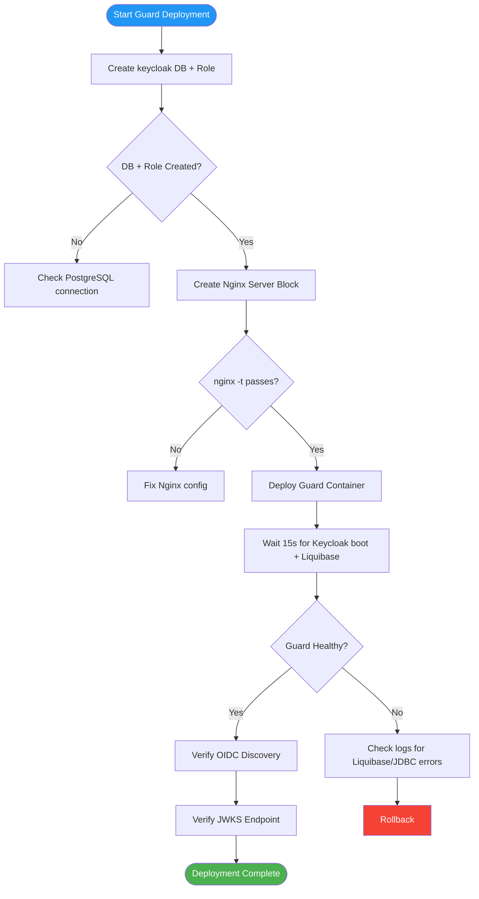

# Deployment Plan — Flowero Guard

> **Service:** Flowero Guard (Keycloak IAM)
> **Platform:** Panomete Platform
> **Version:** 0.1 | **Status:** Draft — Awaiting PO Review
> **Last Updated:** 2026-07-23

---

## 1. Purpose

> Step-by-step procedure for deploying Flowero Guard (Keycloak) to the homelab server. Covers PostgreSQL provisioning, Nginx configuration, Docker deployment, and verification.

---

## 2. Deployment Overview

| Field | Detail |
|-------|--------|
| Service | Flowero Guard — Keycloak IAM |
| Image | `quay.io/keycloak/keycloak:latest` (or `ghcr.io/panomete/flowero-guard:latest`) |
| Container | `flowero-guard` |
| Port (internal) | 8080 (Keycloak default) |
| Port (host bind) | `127.0.0.1:8001` |
| Domain | `auth.panomete.com` |
| Database | `keycloak` on shared PostgreSQL 18 (`local-postgres`) |
| Dependencies | PostgreSQL healthy, `keycloak` DB + role exist |
| Deployment Method | Docker Compose |
| Downtime | Zero for existing services. Guard starts fresh. |

---

## 3. Pre-Deployment Checklist

| # | Check | Command | Status |
|---|-------|---------|--------|
| 1 | PostgreSQL healthy | `docker exec local-postgres pg_isready -U postgres` | ☐ |
| 2 | `keycloak` role exists | `docker exec local-postgres psql -U postgres -c "\du keycloak"` | ☐ |
| 3 | `keycloak` database exists | `docker exec local-postgres psql -U postgres -c "\l keycloak"` | ☐ |
| 4 | Port 8001 free | `ss -tlnp \| grep 8001` (should be empty) | ☐ |
| 5 | `db-network` exists | `docker network ls \| grep db-network` | ✅ Verified |
| 6 | Nginx running | `sudo systemctl is-active nginx` | ✅ Verified |
| 6 | Cloudflare tunnel active | `sudo systemctl is-active cloudflared` | ✅ Verified |
| 7 | `.env` file has Guard secrets | `grep KEYCLOAK_ADMIN ~/platform/.env` | ☐ |
| 8 | Realm JSON validated | `jq . flowero-guard/panomete-realm.json > /dev/null` | ☐ |

---

## 4. Deployment Steps



### Step 1: Create `keycloak` database + role

```bash
ssh flowero@remote.panomete.com

docker exec -it local-postgres psql -U postgres << 'SQL'
-- Create the keycloak role
CREATE ROLE keycloak WITH LOGIN PASSWORD '<KEYCLOAK_DB_PASSWORD>';

-- Create the keycloak database with proper encoding
CREATE DATABASE keycloak
    WITH ENCODING 'UTF8'
    LC_COLLATE = 'en_US.UTF-8'
    LC_CTYPE = 'en_US.UTF-8'
    OWNER keycloak;

-- Grant privileges
GRANT ALL PRIVILEGES ON DATABASE keycloak TO keycloak;
GRANT ALL ON SCHEMA public TO keycloak;
SQL

# Verify
docker exec local-postgres psql -U postgres -c "\l keycloak"
docker exec local-postgres psql -U postgres -c "\du keycloak"
```

### Step 2: Create Nginx server block for `auth.panomete.com`

```bash
sudo tee /etc/nginx/sites-available/auth.panomete.com > /dev/null << 'NGINX'
server {
    server_name auth.panomete.com;
    client_max_body_size 10M;    # Keycloak POST bodies can be large

    location / {
        proxy_pass http://127.0.0.1:8001;
        proxy_set_header Host $host;
        proxy_set_header X-Real-IP $remote_addr;
        proxy_set_header X-Forwarded-For $proxy_add_x_forwarded_for;
        proxy_set_header X-Forwarded-Proto $scheme;
    }
}
NGINX

# Enable site
sudo ln -s /etc/nginx/sites-available/auth.panomete.com /etc/nginx/sites-enabled/

# Test and reload
sudo nginx -t && sudo systemctl reload nginx
```

### Step 3: Configure `.env`

```bash
# Ensure these exist in ~/platform/.env
cat >> ~/platform/.env << 'ENV'
# --- Flowero Guard ---
KEYCLOAK_ADMIN=admin
KEYCLOAK_ADMIN_PASSWORD=<secure-admin-password>
KC_DB=keycloak
KC_DB_USERNAME=keycloak
KC_DB_PASSWORD=<keycloak-db-password>
ENV

chmod 600 ~/platform/.env
```

### Step 4: Deploy Guard container

```bash
cd ~/platform

# Using the platform compose file
docker compose -f docker-compose.platform.yml up -d flowero-guard

# Monitor startup (Keycloak runs Liquibase migrations on first boot)
docker logs -f flowero-guard
# Wait until you see: "Keycloak 25.X.X [...] started in..."
```

### Guard's Compose Service Definition

```yaml
# Excerpt from docker-compose.platform.yml
services:
  flowero-guard:
    image: quay.io/keycloak/keycloak:latest
    container_name: flowero-guard
    ports:
      - "127.0.0.1:8001:8080"       # Keycloak :8080 → host :8001
    environment:
      KC_DB: postgres
      KC_DB_URL: jdbc:postgresql://local-postgres:5432/keycloak
      KC_DB_USERNAME: ${KC_DB_USERNAME}
      KC_DB_PASSWORD: ${KC_DB_PASSWORD}
      KEYCLOAK_ADMIN: ${KEYCLOAK_ADMIN}
      KEYCLOAK_ADMIN_PASSWORD: ${KEYCLOAK_ADMIN_PASSWORD}
      KC_HOSTNAME: auth.panomete.com
      KC_PROXY: edge                  # Trust X-Forwarded-* headers from Nginx/Cloudflare
      KC_HTTP_ENABLED: "true"         # Accept HTTP internally (Cloudflare handles TLS)
    command: ["start", "--import-realm"]
    volumes:
      - ./flowero-guard/panomete-realm.json:/opt/keycloak/data/import/panomete-realm.json:ro
    networks:
      - shared-network
    restart: unless-stopped
    deploy:
      resources:
        limits:
          memory: 1G
```

> **Critical:** `KC_DB_URL` uses `local-postgres` (container name on `db-network`), NOT `host.docker.internal`. See MM04 DEC-001.

---

## 5. Post-Deployment Verification

| # | Check | Command | Expected | Status |
|---|-------|---------|----------|--------|
| 1 | Guard container running | `docker ps \| grep flowero-guard` | Up | ☐ |
| 2 | Guard health endpoint | `curl -sf http://localhost:8001/health/ready` | 200 OK | ☐ |
| 3 | OIDC discovery (internal) | `curl -sf http://localhost:8001/realms/panomete/.well-known/openid-configuration \| jq .issuer` | `"https://auth.panomete.com/realms/panomete"` | ☐ |
| 4 | OIDC discovery (external) | `curl -sf https://auth.panomete.com/realms/panomete/.well-known/openid-configuration \| jq .issuer` | `"https://auth.panomete.com/realms/panomete"` | ☐ |
| 5 | JWKS endpoint | `curl -sf https://auth.panomete.com/realms/panomete/protocol/openid-connect/certs \| jq .keys[0].kty` | `"RSA"` | ☐ |
| 6 | Admin console accessible | `curl -sf -o /dev/null -w '%{http_code}' https://auth.panomete.com/admin/` | 200/302 | ☐ |
| 7 | Keycloak DB tables created | `docker exec local-postgres psql -U postgres -d keycloak -c "\dt" \| wc -l` | > 50 (Liquibase tables) | ☐ |
| 8 | Realm "panomete" exists | Admin Console → realms list | `panomete` present | ☐ |

---

## 6. Rollback Procedure

### Scenario A: Guard container fails to start

```bash
cd ~/platform

# Stop the failed container
docker compose -f docker-compose.platform.yml stop flowero-guard

# Check logs for root cause
docker logs flowero-guard 2>&1 | tail -50

# Common causes:
# - JDBC connection refused → check KC_DB_URL, PostgreSQL running
# - Authentication failed → check KC_DB_USERNAME/KC_DB_PASSWORD
# - Liquibase migration error → see runbook incident #5
```

### Scenario B: Realm import failed

```bash
# If realm JSON is malformed or incompatible:
docker logs flowero-guard 2>&1 | grep -i "import\|realm"

# Fix the realm JSON, rebuild image, redeploy
cd ~/platform
docker compose -f docker-compose.platform.yml build flowero-guard
docker compose -f docker-compose.platform.yml up -d flowero-guard
```

### Scenario C: Database rollback (Liquibase corrupted)

```bash
# ⚠️ DESTRUCTIVE — only if Keycloak's schema is corrupted
docker exec local-postgres psql -U postgres << 'SQL'
DROP DATABASE IF EXISTS keycloak;
CREATE DATABASE keycloak
    WITH ENCODING 'UTF8'
    LC_COLLATE = 'en_US.UTF-8'
    LC_CTYPE = 'en_US.UTF-8'
    OWNER keycloak;
GRANT ALL PRIVILEGES ON DATABASE keycloak TO keycloak;
GRANT ALL ON SCHEMA public TO keycloak;
SQL

# Redeploy Guard — Keycloak re-runs Liquibase from scratch
cd ~/platform
docker compose -f docker-compose.platform.yml up -d flowero-guard --force-recreate
```

### Scenario D: Nginx routing broken

```bash
# Disable the auth server block
sudo rm /etc/nginx/sites-enabled/auth.panomete.com
sudo nginx -t && sudo systemctl reload nginx

# Other services (AdGuard, Portainer) remain unaffected
```

---

## 7. Communication Plan

| When | Who | Channel | Message |
|------|-----|---------|---------|
| Before deployment | PO | Chat | "Deploying Guard (Keycloak) to homelab" |
| Guard healthy | PO | Chat | "Guard deployed. Admin console at auth.panomete.com/admin" |
| Deployment failed | PO | Chat | "Guard deployment failed. Rolling back. Logs attached." |

---

## Related Documents

| Document | Relationship |
|----------|-------------|
| [[051_CICD_pipeline_configuration]] | Guard-specific pipeline |
| [[053_release_notes]] | Guard release history |
| `flowero_guard/02_design/023_database_schema_DDL` | Database provisioning (source) |
| `flowero_guard/02_design/022_API_specification` | Endpoints to verify post-deploy |
| `panomete_platform/05_devops/052_deployment_plan` | Platform-level deployment (all 3 services) |

---

> **Template Standard:** Based on SWEBOK v4, SEBoK v2
> **Usage:** Never deploy Guard without PostgreSQL provisioning. Test rollback before the deployment window.
