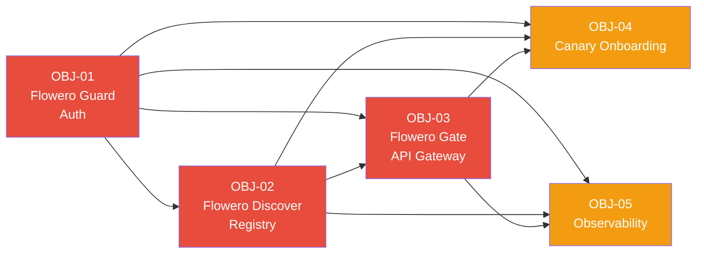

# Business Objectives

> **Project:** Panomete Platform
> **Version:** 0.1 | **Status:** Draft
> **Last Updated:** 2026-07-22

---

## Document Control

| Field | Value |
|-------|-------|
| Document Owner | PO (Product Owner) |
| Sponsor | Self |
| Business Analyst | PO (Product Owner) |

### Revision History

| Version | Date | Author | Change Description |
|---------|------|--------|--------------------|
| 0.1 | 2026-07-22 | PO | Initial draft — elicited from stakeholder interview |

### Approvals

| Role | Name | Signature | Date |
|------|------|-----------|------|
| Project Sponsor | Self | | |
| Business Owner | Self | | |
| Strategy Lead | Self | | |

---

## Table of Contents

1. [Executive Summary](#1-executive-summary)
2. [Strategic Alignment](#2-strategic-alignment)
3. [Business Objectives](#3-business-objectives)
4. [KPI Framework](#4-kpi-framework)
5. [Baseline & Target Measurements](#5-baseline--target-measurements)
6. [Objective Dependencies](#6-objective-dependencies)
7. [Risk to Objectives](#7-risk-to-objectives)
8. [Objective Tracking](#8-objective-tracking)
9. [Appendices](#9-appendices)

---

## 1. Executive Summary

> The Panomete Platform is a production-grade microservice platform for a personal homelab, designed to serve as both a functional self-hosted ecosystem and a portfolio demonstration of software engineering and architecture competency.

| Field | Detail |
|-------|--------|
| Purpose | Build a reusable microservice foundation (auth, discovery, API gateway) that any future business service can onboard to — eliminating redundant infrastructure code and demonstrating platform engineering skills. |
| Expected Outcome | A running platform with Flowero Guard (OAuth via Keycloak), Flowero Discover (service registry), and Flowero Gate (API gateway) serving traffic. At least one business microservice onboarded as a canary. |
| Number of Objectives | 5 |
| Strategic Theme | Platform Engineering & Architecture Portfolio |
| Target Completion | No hard deadline. Documentation-first approach; code to follow. Phase 1 (Foundation): TBD after estimation. |

---

## 2. Strategic Alignment

> Every objective must trace to the overarching strategy. Here, the "organization" is the individual engineer's career development and personal tooling ecosystem.

### 2.1 Organizational Strategy Map

```
Vision: Production-grade, self-hosted platform that replaces SaaS dependencies
        and demonstrates platform engineering competency
  └── Strategic Theme: Platform Engineering & Architecture Portfolio
        └── Strategic Goal: Build a reusable microservice foundation
              ├── Business Objective: OBJ-01 — Centralized Authentication
              ├── Business Objective: OBJ-02 — Service Discovery & Registration
              ├── Business Objective: OBJ-03 — API Gateway & Routing
              ├── Business Objective: OBJ-04 — Developer Onboarding Experience
              └── Business Objective: OBJ-05 — Observability & Operational Readiness
```

### 2.2 Strategy Traceability

| Strategic Theme | Strategic Goal | Business Objective | Contribution |
|----------------|---------------|-------------------|-------------|
| Platform Engineering | Reusable foundation | OBJ-01: Centralized Auth | Eliminates per-service auth implementation; single sign-on across all services |
| Platform Engineering | Reusable foundation | OBJ-02: Service Discovery | Enables dynamic service-to-service communication without hardcoded endpoints |
| Platform Engineering | Reusable foundation | OBJ-03: API Gateway | Single entry point for all traffic; unified routing, rate limiting, and security |
| Architecture Portfolio | Demonstrate competency | OBJ-04: Developer Onboarding | Proves the platform is genuinely reusable by onboarding a business service in <2 hours |
| Architecture Portfolio | Demonstrate competency | OBJ-05: Observability | Shows operational maturity — logs, metrics, health checks across all services |

### 2.3 Balanced Scorecard Perspective

> Categorize objectives by perspective to ensure balanced coverage.

| Perspective | Objective Count | Objectives |
|------------|----------------|-----------|
| 💰 **Financial** | 0 | (Personal project — not financially driven) |
| 👥 **Customer** | 1 | OBJ-04 (future service developers / self as consumer) |
| ⚙️ **Internal Process** | 3 | OBJ-01, OBJ-02, OBJ-03 |
| 📚 **Learning & Growth** | 1 | OBJ-05 |

---

## 3. Business Objectives

> Each objective must be **SMART**: Specific, Measurable, Achievable, Relevant, Time-bound.

### 3.1 Objective Register

| ID | Objective | Specific | Measurable | Achievable | Relevant | Time-Bound | Priority |
|----|-----------|----------|-----------|-----------|----------|-----------|----------|
| OBJ-01 | Centralized Authentication (Flowero Guard) | Deploy Keycloak as the platform's identity provider (Flowero Guard). Gate and business services validate JWT tokens locally against Keycloak's JWKS endpoint. | All foundation services + 1 canary business service issue and validate tokens through Guard. SSO works across all services. | Keycloak is the industry-standard OSS IAM. Spring Security OAuth2 Resource Server validates JWT locally — no network call per request. | Without this, every service implements its own auth — the core platform value prop | After Guard, Discover, Gate are all deployed and talking | 🔴 |
| OBJ-02 | Service Discovery & Registration (Flowero Discover) | Deploy a service registry where all microservices register on startup and discover each other dynamically | Services register within 30s of startup; discovery queries resolve in <100ms | Spring Cloud Netflix Eureka or Consul are well-established | Enables dynamic service mesh without hardcoded URLs | After Guard and Discover are both healthy | 🔴 |
| OBJ-03 | API Gateway & Routing (Flowero Gate) | Deploy a Spring Cloud Gateway that routes external traffic to internal services, enforces auth via Guard, and provides rate limiting | All external requests route through Gate with <50ms added latency at p95 | Spring Cloud Gateway is production-proven and integrates natively with Guard (Spring Security) and Discover | Single entry point; consistent security, logging, and routing | After all foundation services are registered in Discover | 🔴 |
| OBJ-04 | Developer Onboarding Experience | Onboard 1 business service (Fluffy Mouton — URL Shortener) to the platform, proving the foundation actually delivers on "reusable" | A new developer (or AI persona) can onboard a service in <2 hours using documented steps | Templates, conventions, and clear docs reduce friction; validated via canary service | The platform's only value is making service development faster — prove it | After foundation is stable and documented | 🟡 |
| OBJ-05 | Observability & Operational Readiness | All foundation services expose health endpoints, structured logs, and basic metrics. Centralized log viewing available. | Health endpoint returns 200 within 1s; logs are JSON-structured; metrics visible in a dashboard | Spring Boot Actuator provides health/metrics out of the box; Loki/Promtail for logs | Operational maturity is what separates a "hobby project" from a "portfolio piece" | After all foundation services are running | 🟡 |

### 3.2 Detailed Objective Cards

#### OBJ-01: Centralized Authentication (Flowero Guard)

| Field | Detail |
|-------|--------|
| **Statement** | Deploy Flowero Guard — a Keycloak instance that serves as the centralized identity provider for the Panomete Platform. Guard issues OAuth2/OIDC tokens. Gate and business services validate tokens locally against Guard's JWKS endpoint. |
| **Specific** | Deploy Keycloak as a Docker container using shared PostgreSQL 18. Configure a `panomete` realm with standard roles and OAuth2 clients. Expose Keycloak at `auth.panomete.com` through Nginx. Services validate JWT signatures locally — no network call to Guard per request. |
| **Measurable** | Guard issues valid JWT tokens with correct claims. Gate validates tokens locally against JWKS. Gate returns 401 for invalid/missing tokens and forwards user claims as headers for valid tokens. SSO works across all services. |
| **Achievable** | Keycloak is the industry-standard OSS IAM. Spring Security OAuth2 Resource Server validates JWT locally with zero network overhead per request. Configuration is well-documented. |
| **Relevant** | Centralized auth is the #1 value proposition of the platform. Without it, every service duplicates auth logic and the "platform" has no reason to exist. |
| **Time-Bound** | No hard deadline. Guard is the first foundation service to build; Gate depends on it for JWKS endpoint. |
| **Owner** | Dev persona (to be implemented by) |
| **Priority** | 🔴 Must Have |
| **Baseline** | No shared authentication exists. Current services (if any) handle auth independently or not at all. |
| **Target** | Single Sign-On across all platform services via Keycloak (Flowero Guard). Services validate JWT locally; no per-request dependency on Guard. |
| **Unit** | Boolean — all services use centralized auth (yes/no) |
| **Source** | Platform architect (Self) — identified as foundational requirement |

#### OBJ-02: Service Discovery & Registration (Flowero Discover)

| Field | Detail |
|--------|-------|
| **Statement** | Deploy Flowero Discover — a service registry (Spring Cloud Netflix Eureka or HashiCorp Consul) where all microservices register themselves on startup and resolve peer services dynamically at runtime. |
| **Specific** | Each service registers with Discover on boot (service name, host, port, health URL). Services query Discover to find peers instead of using hardcoded URLs. Spring Cloud Gateway uses Discover for route resolution. |
| **Measurable** | Services register within 30 seconds of startup. Service discovery queries resolve in <100ms at p95. Stale registrations are evicted within 90 seconds of a service going down. |
| **Achievable** | Spring Cloud Netflix Eureka provides out-of-the-box service registration and discovery with minimal configuration. Consul offers a richer feature set if needed. |
| **Relevant** | Dynamic service discovery is essential for a microservice platform. Without it, services must be hardcoded with peer addresses — brittle and not production-grade. |
| **Time-Bound** | Deploy after Guard is stable. All three foundation services must register with Discover. Discover dashboard accessible at `discovery.panomete.com` through Nginx. |
| **Owner** | Dev persona |
| **Priority** | 🔴 Must Have |
| **Baseline** | No service discovery exists. Services communicate via hardcoded URLs or not at all. |
| **Target** | All services discover peers dynamically through Discover. No hardcoded service URLs in any configuration. |
| **Unit** | Boolean + latency (ms) |
| **Source** | Platform architect (Self) |

#### OBJ-03: API Gateway & Routing (Flowero Gate)

| Field | Detail |
|--------|-------|
| **Statement** | Deploy Flowero Gate — a Spring Cloud Gateway on internal port 8000, exposed through Nginx at `api.panomete.com`. Gate routes business API traffic to internal services, validates JWT tokens locally, and enforces rate limiting backed by shared Valkey 9. |
| **Specific** | Gate listens on port 8000 (internal, behind Nginx). Routes defined for business APIs only: `/api/blog/**`, `/api/short/**`, `/api/todo/**`, etc. Gate validates JWT signatures against Keycloak's JWKS endpoint on startup. Rate limiting uses shared Valkey 9 instance for persistence. |
| **Measurable** | All business API traffic at `api.panomete.com` flows through Gate. P95 added latency <50ms. Gate correctly returns 401 for unauthenticated requests, 429 for rate-limited clients. |
| **Achievable** | Spring Cloud Gateway is the standard Spring ecosystem API gateway. JWT validation is local (no network call per request). Valkey integration via Spring Cloud Gateway RequestRateLimiter. |
| **Relevant** | Gate provides unified routing, security, and rate limiting for all business APIs. Foundation services (Guard, Discover) are routed directly by Nginx — Gate focuses on the API surface only. |
| **Time-Bound** | Deploy after Guard and Discover are stable. Must resolve routes through Discover for business services. |
| **Owner** | Dev persona |
| **Priority** | 🔴 Must Have |
| **Baseline** | No API gateway exists. Business services would be exposed directly on different ports with no unified routing or security. |
| **Target** | All business API traffic routed through `api.panomete.com`. Routes resolved dynamically through Discover. Valkey-backed rate limiting. |
| **Unit** | Boolean + latency (ms p95) |
| **Source** | Platform architect (Self) |

#### OBJ-04: Developer Onboarding Experience

| Field | Detail |
|--------|-------|
| **Statement** | Prove the platform is genuinely reusable by onboarding Fluffy Mouton (URL Shortener) as the first business service canary. Document the onboarding process so that any future service (or AI persona) can follow it. |
| **Specific** | Create a service template, onboarding guide, and conventions document. Onboard Fluffy Mouton end-to-end: it registers with Discover, routes through Gate, authenticates via Guard. |
| **Measurable** | A developer (or AI agent) can onboard a new service in <2 hours by following the documented steps. Fluffy Mouton is live and functional behind the platform. |
| **Achievable** | The foundation services provide the infrastructure. The missing piece is documentation + template. Fluffy Mouton is already spec'd (see `spec/fluffy_mouton/`). |
| **Relevant** | The platform's ROI is measured by how much faster service #2, #3, #N are to build versus service #1. OBJ-04 validates this. |
| **Time-Bound** | After foundation is stable and documented. Canary onboarding TBD. |
| **Owner** | Dev persona + PO (documentation) |
| **Priority** | 🟡 Should Have |
| **Baseline** | No standardized onboarding process. Each service starts from scratch. |
| **Target** | <2 hour onboarding time for a new service following documented steps. |
| **Unit** | Hours |
| **Source** | Platform architect (Self) |

#### OBJ-05: Observability & Operational Readiness

| Field | Detail |
|--------|-------|
| **Statement** | All foundation services expose health endpoints, emit structured (JSON) logs, and expose basic metrics. Centralized log aggregation is available for debugging across services. |
| **Specific** | Spring Boot Actuator health endpoints on all services. JSON log format via Logback configuration. Metrics via Micrometer (JVM metrics + custom). Loki + Promtail or Grafana for log aggregation and viewing. |
| **Measurable** | Health endpoint returns 200 with UP status for all components within 1 second. All log output is valid JSON with timestamp, level, service, and trace ID fields. At least CPU, memory, request count, and error rate metrics are visible. |
| **Achievable** | Spring Boot Actuator provides health/metrics with zero code. Logback JSON encoder is a dependency add. Loki/Promtail is a Docker Compose service add. |
| **Relevant** | Observability is the difference between a portfolio piece and a real production system. Shows operational maturity to reviewers. |
| **Time-Bound** | Phase 2 — after foundation services are stable. Observability can be added incrementally. Uptime Kuma handles basic infra monitoring in Phase 1. |
| **Owner** | Dev persona + DevOps persona |
| **Priority** | 🟡 Should Have |
| **Baseline** | No structured logging or health endpoints exist. Debugging requires SSH + tail -f. |
| **Target** | Health dashboard for all services. Structured logs searchable. Basic metrics visible. |
| **Unit** | Boolean (health endpoint), log format validation, metrics dashboard presence |
| **Source** | Platform architect (Self) — industry best practice |

---

## 4. KPI Framework

> Key Performance Indicators that measure objective achievement.

### 4.1 KPI Register

| ID | KPI | Description | Formula | Unit | Frequency | Data Source | Owner |
|----|-----|-------------|---------|------|-----------|-------------|-------|
| KPI-01 | Auth Coverage | % of platform services using centralized auth | (Services behind Guard / Total services) × 100 | % | Per release | Guard audit log | Dev |
| KPI-02 | Service Registration Time | Time from service boot to appearing in Discover | Registration timestamp - boot timestamp | Seconds | Per deployment | Discover API | Dev |
| KPI-03 | Gateway P95 Latency | Added latency from Gate routing | P95(response_time_with_gate - direct_response_time) | ms | Per hour | Gate metrics | Dev |
| KPI-04 | Onboarding Duration | Time to onboard a new service from zero to live | Clock time: start to first successful request | Hours | Per onboarding | Manual measurement | PO |
| KPI-05 | Health Check Uptime | % of time all foundation services report healthy | (Healthy checks / Total checks) × 100 | % | Per 5 min | Actuator health | DevOps |

### 4.2 KPI Dashboard Mockup

| KPI | Current | Target | Status | Trend |
|-----|---------|--------|--------|-------|
| KPI-01: Auth Coverage | 0% | 100% | ⬜ Not Started | — |
| KPI-02: Service Registration Time | N/A | <30s | ⬜ Not Started | — |
| KPI-03: Gateway P95 Latency | N/A | <50ms | ⬜ Not Started | — |
| KPI-04: Onboarding Duration | N/A | <2 hours | ⬜ Not Started | — |
| KPI-05: Health Check Uptime | N/A | >99.5% | ⬜ Not Started | — |

### 4.3 Leading vs Lagging Indicators

| Type | KPI | What It Predicts / Confirms |
|------|-----|----------------------------|
| **Leading** | KPI-01: Auth Coverage | Predicts platform adoption — if services don't use Guard, the platform isn't adding value |
| **Leading** | KPI-02: Registration Time | Predicts operational health — slow registration = configuration or network issues |
| **Lagging** | KPI-03: Gateway Latency | Confirms Gate is performant enough for production use |
| **Lagging** | KPI-04: Onboarding Duration | Confirms the platform genuinely accelerates service development |
| **Lagging** | KPI-05: Health Uptime | Confirms operational stability over time |

---

## 5. Baseline & Target Measurements

> Document current state (baseline) and desired state (targets) for each objective.

### 5.1 Baseline Measurements

| ID | Metric | Baseline Value | Measurement Date | Measurement Method | Confidence |
|----|--------|---------------|-----------------|-------------------|-----------|
| OBJ-01 | Services using centralized auth | 0 (no platform exists) | 2026-07-22 | N/A — greenfield | High |
| OBJ-02 | Services registered in discovery | 0 | 2026-07-22 | N/A — greenfield | High |
| OBJ-03 | Requests routed through gateway | 0 | 2026-07-22 | N/A — greenfield | High |
| OBJ-04 | Time to onboard a new service | Unknown (estimated days-to-weeks from scratch) | 2026-07-22 | Estimate based on Tiny Mchwa development | Low |
| OBJ-05 | Services with health endpoints and structured logs | 0 | 2026-07-22 | N/A — greenfield | High |

### 5.2 Target Measurements

| ID | Metric | Target Value | Target Date | Rationale | Stretch Goal |
|----|--------|-------------|-------------|-----------|-------------|
| OBJ-01 | Services using centralized auth | 100% (4 services: 3 foundation + 1 canary) | Phase 1 end | Platform's core value proposition | All 9 services (3 foundation + 6 business) |
| OBJ-02 | Service registration time | <30 seconds | Phase 1 end | Industry standard for containerized services | <10 seconds |
| OBJ-03 | Gateway P95 added latency | <50ms | Phase 1 end | Acceptable overhead for a homelab deployment | <20ms |
| OBJ-04 | Onboarding duration | <2 hours | After foundation stable | Must be demonstrably faster than from-scratch | <30 minutes with template |
| OBJ-05 | Health check uptime | >99.5% | Ongoing | Three nines is the standard for internal tools | >99.9% |

### 5.3 Measurement Plan

| ID | Metric | Data Collection Method | Tool / System | Responsible | Collection Frequency | Reporting Format |
|----|--------|----------------------|---------------|-------------|--------------------|--------------------|
| OBJ-01 | Auth coverage | Check service configuration / audit logs | Guard, Keycloak | Dev | Per deployment | Checklist |
| OBJ-02 | Registration time | Discover API + service logs | Eureka/Consul console | Dev | Per deployment | Timestamp delta |
| OBJ-03 | Gateway latency | Micrometer metrics from Gate | Prometheus / Grafana | DevOps | Continuous | Dashboard |
| OBJ-04 | Onboarding time | Manual stopwatch + documented process | Checklist | PO | Per onboarding | Report |
| OBJ-05 | Health uptime | Actuator health endpoint polling | Prometheus / Grafana | DevOps | Every 5 minutes | Dashboard |

---

## 6. Objective Dependencies

> Dependencies between objectives and external factors.

### 6.1 Inter-Objective Dependencies

| Dependent Objective | Depends On | Relationship | Impact if Blocked |
|--------------------|-----------|-------------|-------------------|
| OBJ-03 (Gate) | OBJ-01 (Guard), OBJ-02 (Discover) | Gate must validate tokens via Guard and resolve routes via Discover | Cannot route or secure traffic |
| OBJ-04 (Onboarding) | OBJ-01, OBJ-02, OBJ-03 | Canary service needs all foundation services operational | Cannot prove platform value |
| OBJ-05 (Observability) | OBJ-01, OBJ-02, OBJ-03 | Observability must be added to each service | Can add incrementally — non-blocking |
| OBJ-02 (Discover) | OBJ-01 (Guard) | Discover itself should be authenticated, though less critical than Gate | Can deploy without auth initially |

### 6.2 Dependency Diagram



### 6.3 External Dependencies

| ID | Dependency | Type | Affected Objectives | Mitigation |
|----|-----------|------|-------------------|-----------|
| DEP-01 | Keycloak Docker image availability | External | OBJ-01 | Use specific version tag; cache image locally |
| DEP-02 | Docker Compose environment (homelab machine) | Internal | OBJ-01 through OBJ-05 | Ensure Docker is installed and stable before development |
| DEP-03 | Spring Boot / Spring Cloud version compatibility | External | OBJ-01, OBJ-02, OBJ-03 | Pin versions in gradle/maven; use Spring Initializr to generate compatible BOM |
| DEP-04 | Learning curve for Spring Boot / Spring Cloud | Personal | All | Acknowledge as a learning objective — this is partly why the project exists |

---

## 7. Risk to Objectives

> Risks that could prevent objective achievement.

### 7.1 Objective Risk Matrix

| ID | Objective | Risk | Probability | Impact | Risk Level | Mitigation | Owner |
|----|-----------|------|------------|--------|-----------|-----------|-------|
| OR-01 | OBJ-01,02,03 | Spring Boot complexity — learning curve slows progress significantly | Medium | High | 🟠 | Start with Spring Initializr minimal project; add features incrementally. Use reference implementations. | Dev |
| OR-02 | OBJ-01 | Keycloak misconfiguration — auth blocks all services | Medium | High | 🟠 | Test Guard with a mock OAuth2 server before Keycloak integration. Document Keycloak realm config. | Dev |
| OR-03 | All | Homelab resource exhaustion — 3 JVM services + Keycloak + DB may exceed available RAM | Medium | Medium | 🟡 | Profile memory usage early. Set JVM heap limits (-Xmx). Consider GraalVM native images for smaller footprint. | Dev |
| OR-04 | OBJ-04 | Onboarding process too complex — fails the <2 hour test | Medium | Medium | 🟡 | Test onboarding with AI persona (simulate new developer). Iterate on docs. | PO |
| OR-05 | OBJ-05 | Observability adds significant overhead — bloats services | Low | Low | 🟢 | Spring Boot Actuator is negligible overhead. Loki is lightweight. | DevOps |

### 7.2 Risk Heat Map

| Impact \ Probability | Low | Medium | High |
|---------------------|-----|--------|------|
| **High** | | 🟠 OR-01, OR-02 | |
| **Medium** | | 🟡 OR-03, OR-04 | |
| **Low** | 🟢 OR-05 | | |

> **Legend:** 🔴 Critical — Immediate action required | 🟠 High — Mitigation plan required | 🟡 Medium — Monitor and manage | 🟢 Low — Accept and monitor

---

## 8. Objective Tracking

### 8.1 Objective Status Summary

| ID | Objective | Status | % Complete | Last Updated | Notes |
|----|-----------|--------|-----------|-------------|-------|
| OBJ-01 | Centralized Auth (Flowero Guard) | ⬜ Not Started | 0% | 2026-07-22 | Requirements documented; ready for Dev persona |
| OBJ-02 | Service Discovery (Flowero Discover) | ⬜ Not Started | 0% | 2026-07-22 | Requirements documented |
| OBJ-03 | API Gateway (Flowero Gate) | ⬜ Not Started | 0% | 2026-07-22 | Requirements documented |
| OBJ-04 | Onboarding Experience | ⬜ Not Started | 0% | 2026-07-22 | Depends on OBJ-01 through OBJ-03 |
| OBJ-05 | Observability | ⬜ Not Started | 0% | 2026-07-22 | Can be added incrementally |

### Status Legend

| Status | Meaning |
|--------|---------|
| ✅ Complete | Objective achieved, KPIs met |
| ⏳ In Progress | Work underway, on track |
| ⚠️ At Risk | Behind schedule or below target |
| 🔴 Blocked | Cannot proceed — escalation needed |
| ⬜ Not Started | Not yet begun |
| ❌ Cancelled | No longer pursuing |

### 8.2 Benefits Realization Tracker

| ID | Benefit | Expected Value | Actual Value | Realization % | Status | Review Date |
|----|---------|---------------|-------------|--------------|--------|------------|
| OBJ-01 | Eliminate per-service auth code | Auth implemented once, reused by all | — | 0% | ⬜ | TBD |
| OBJ-02 | Dynamic service communication | No hardcoded URLs, self-healing service mesh | — | 0% | ⬜ | TBD |
| OBJ-03 | Unified ingress with security | Single entry point, consistent routing | — | 0% | ⬜ | TBD |
| OBJ-04 | Faster service development | <2 hours to onboard vs days from scratch | — | 0% | ⬜ | TBD |
| OBJ-05 | Production-grade operations | Health dashboards, structured logs, metrics | — | 0% | ⬜ | TBD |

### 8.3 Review Cadence

| Review Type | Frequency | Participants | Purpose |
|------------|-----------|-------------|---------|
| KPI Review | Per milestone | PO, Dev | Track leading indicators as services go live |
| Objective Progress | Per phase completion | PO, Dev | Assess overall objective health |
| Benefits Realization | After canary onboarding | PO | Validate platform actually accelerates development |
| Strategic Alignment Check | Per quarter | Self | Confirm project still aligns with career goals |

---

## 9. Appendices

### Appendix A: Objective Elicitation Sources

| Source | Type | Date | Objectives Derived |
|--------|------|------|--------------------|
| Stakeholder interview (PO grilling session) | Interview | 2026-07-22 | OBJ-01 through OBJ-05 |
| README.md — Service catalog review | Document analysis | 2026-07-22 | Service scope and foundation identification |
| Tiny Mchwa spec review | Reference analysis | 2026-07-22 | Template validation, onboarding baseline estimation |

### Appendix B: Technology Decisions (preliminary)

| Decision | Choice | Rationale |
|----------|--------|-----------|
| Edge Proxy | Nginx | Subdomain-based routing to internal services. Already running in production. |
| TLS Termination | Cloudflare Tunnel | Handles HTTPS termination + DDoS protection at the edge. Already running in production. |
| Foundation language | Spring Boot (Java) | Portfolio piece — demonstrates enterprise Java ecosystem competency. Spring Cloud provides native Gateway, Security, Discovery integrations. |
| Authentication | Keycloak (Flowero Guard) | Production-grade open-source IAM. OAuth2/OIDC compliant. Uses shared PostgreSQL 18. Exposed at `auth.panomete.com` via Nginx. |
| Service Discovery | Spring Cloud Netflix Eureka | Simplest path with Spring Cloud. Standalone mode. Dashboard at `discovery.panomete.com` (:3999 FE, :8999 BE). |
| API Gateway | Spring Cloud Gateway | Reactive, non-blocking. Routes business APIs only at `api.panomete.com` (:8000 internal). JWT validation is local (JWKS). |
| Rate Limiting | Valkey 9 (shared instance) | Replaces in-memory rate limiting. Limits persist across Gate restarts. Already running in production. |
| Deployment | Docker Compose → Kubernetes (k3s) | Compose for simplicity now; design for K8s portability. |
| Observability | Phase 2: Actuator + Loki + Prometheus + Grafana | Deferred until foundation is stable. Uptime Kuma for infra-level monitoring in the interim. |

### Appendix C: Glossary

| Term | Definition |
|------|-----------|
| Panomete Platform | The overall microservice platform encompassing foundation services and business services |
| Flowero Guard | Keycloak IAM — issues OAuth2/OIDC tokens at `auth.panomete.com` |
| Flowero Discover | Service registry — enables dynamic service-to-service discovery |
| Flowero Gate | API Gateway — routes business APIs at `api.panomete.com`, validates JWT, enforces rate limits |
| Canary Service | The first business service onboarded to prove the platform works (Fluffy Mouton) |
| SMART | Specific, Measurable, Achievable, Relevant, Time-bound |
| KPI | Key Performance Indicator |
| JWT | JSON Web Token — used for OAuth2 stateless authentication |
| OAuth2 / OIDC | Open Authorization 2.0 / OpenID Connect — authentication and authorization protocols |

---

## Related Documents

| Document | Relationship |
|----------|-------------|
| [[012_user_stories]] | User stories derived from these objectives |
| [[013_acceptance_criteria]] | Acceptance criteria for each story |
| [[014_stakeholder_analysis]] | Stakeholder interests and influence |
| [[README]] | Service catalog and platform overview |

---

> **Template Standard:** Based on BABOK v3 (Strategy Analysis), PMBOK v8 (Initiating), ISO/IEC/IEEE 29148
> **Usage:** This document defines *what* the Panomete Platform aims to achieve. For *how*, see [[021_architecture_decision_records]] and [[025_software_architecture_document]].
