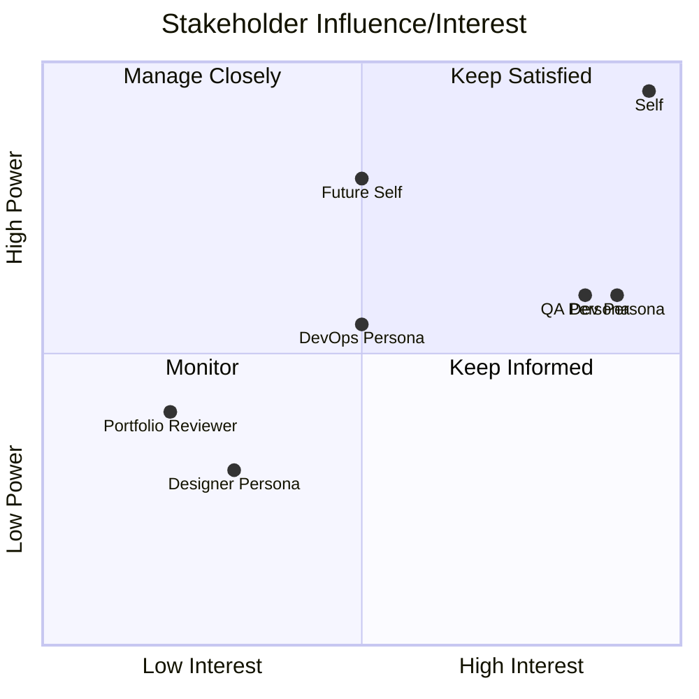

# Stakeholder Analysis — Panomete Platform

> **Platform:** Panomete Platform
> **Version:** 0.1 | **Status:** Draft
> **Last Updated:** 2026-07-22

---

## Document Control

| Field | Value |
|-------|-------|
| Document Owner | PO (Product Owner) |
| Business Analyst | PO (Product Owner) |

### Revision History

| Version | Date | Author | Change Description |
|---------|------|--------|--------------------|
| 0.1 | 2026-07-22 | PO | Initial analysis |

---

## 1. Purpose

> This document identifies and analyzes all stakeholders of the Panomete Platform — both human and AI personas — to inform engagement strategy and requirements prioritization.

## 2. Stakeholder Identification

### 2.1 Human Stakeholders

| Stakeholder | Role | Influence | Interest | Category |
|------------|------|----------|----------|----------|
| **Self (Platform Owner)** | Sole funder, architect, and end user. Makes all decisions. | High | High | Decision Maker |
| **Future Self (6 months)** | The person maintaining this platform after context has faded. Needs clear docs. | Medium | High | User |
| **Portfolio Reviewer** | Hypothetical hiring manager or peer reviewing this as a portfolio piece. | Low | Medium | External |

### 2.2 AI Personas (Internal Stakeholders)

> The platform is built with AI-assisted development in mind. These personas consume the spec documents and produce code, tests, and infrastructure.

| Stakeholder | Role | Influence | Interest | Category |
|------------|------|----------|----------|----------|
| **Dev Persona** | Implements services from specs. Needs unambiguous stories and ACs. | Medium | High | Implementer |
| **QA Persona** | Writes and executes tests from ACs. Needs testable, measurable criteria. | Medium | High | Verifier |
| **Designer Persona** | Produces wireframes and UI specs for business services. | Low | Medium | Designer |
| **DevOps Persona** | Handles Docker Compose, CI/CD, monitoring setup. | Medium | Medium | Operator |

---

## 3. Stakeholder Influence/Interest Map

## 4. Stakeholder Concerns

| Stakeholder | Primary Concern | Success Criteria | Fear |
|------------|----------------|-----------------|------|
| **Self** | Does this showcase real engineering skill? Is it maintainable? | Platform runs; services onboard in <2 hours; docs are clear | Over-engineered spaghetti that I can't understand in 6 months |
| **Dev Persona** | Are the specs unambiguous? Do I have everything I need to start coding? | Stories are clear; ACs are testable; dependencies are declared | Ambiguous requirements that lead to rework |
| **QA Persona** | Can I automate tests from these ACs? Are edge cases covered? | Every AC has a corresponding test case; all tests pass | Untestable criteria ("the system should be fast") |
| **Future Self** | Can I pick this up after months away and understand it? | README is the entry point; docs are up to date; `docker compose up` just works | Bitrot — docs and reality have diverged |
| **DevOps Persona** | Is deployment straightforward? Are logs and metrics accessible? | `docker compose up` brings everything up; health dashboard works | Snowflake configuration; fragile startup ordering |
| **Portfolio Reviewer** | Does this look production-grade? Is the architecture defensible? | Clean architecture diagram; clear technology rationale; real operational concerns addressed | "Just another hobby project" |

---

## 5. Communication Plan

| Stakeholder | Medium | Frequency | Content |
|------------|--------|-----------|---------|
| **Self** | Spec documents (this repo) | Per phase | All documents reviewed and approved before handoff to personas |
| **Dev Persona** | User stories + ACs + ADRs | Per sprint | Prioritized backlog, clear acceptance criteria |
| **QA Persona** | ACs + test plan template | Per sprint | BDD scenarios, edge cases, non-functional requirements |
| **DevOps Persona** | Deployment plan + CI/CD config | Per milestone | Docker Compose files, environment variables, monitoring setup |
| **Future Self** | README + architecture overview | Ongoing | Entry point that links to all other documents |

---

## 6. Requirements Influence

| Stakeholder | Requirements Influenced | Weight | Priority Impact |
|------------|------------------------|--------|----------------|
| **Self** | All strategic objectives, scope boundary, technology choices | High | Drives 🔴 priorities |
| **Dev Persona** | User story detail, AC precision, architecture decisions | High | Determines sprint feasibility |
| **QA Persona** | Acceptance criteria quality, edge case coverage, testability | Medium | Refines acceptance criteria |
| **Portfolio Reviewer** | Architecture quality, documentation completeness, operational maturity | Low | Influences OBJ-05 (Observability) priority |
| **Future Self** | Documentation standards, README quality, `docker compose up` simplicity | Medium | Drives OBJ-04 (Onboarding) quality bar |

---

## Related Documents

| Document | Relationship |
|----------|-------------|
| [[011_business_objective]] | Objectives driven by stakeholder needs |
| [[012_user_stories]] | Stories prioritized by stakeholder influence |
| [[flowero_guard/012_user_stories]] | Guard stories |
| [[flowero_discover/012_user_stories]] | Discover stories |
| [[flowero_gate/012_user_stories]] | Gate stories |

---

> **Template Standard:** Based on SWEBOK v4, ISO/IEC/IEEE 29148, BABOK v3
> **Usage:** This analysis drives requirements prioritization. AI personas are treated as first-class stakeholders because they consume these documents to produce working code.
