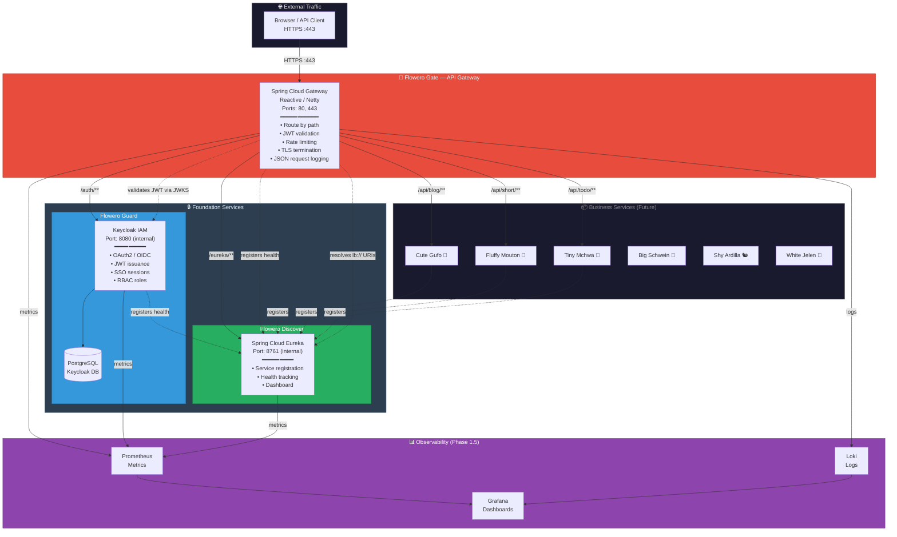
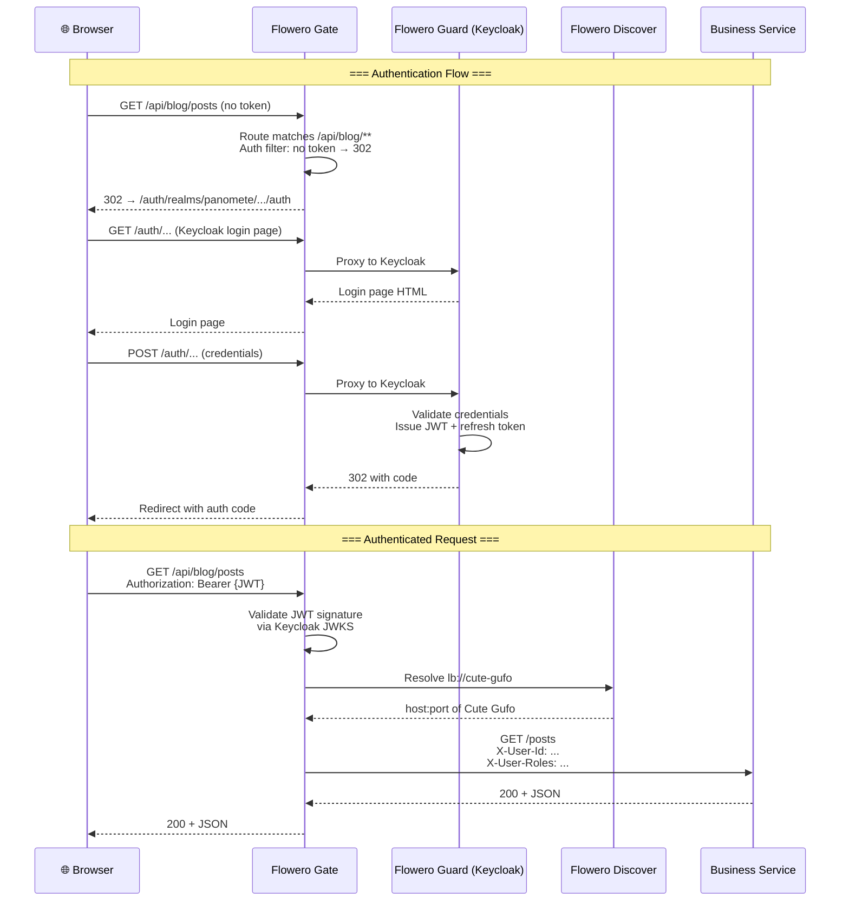
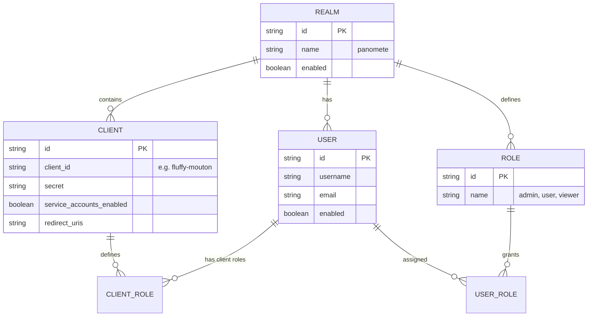
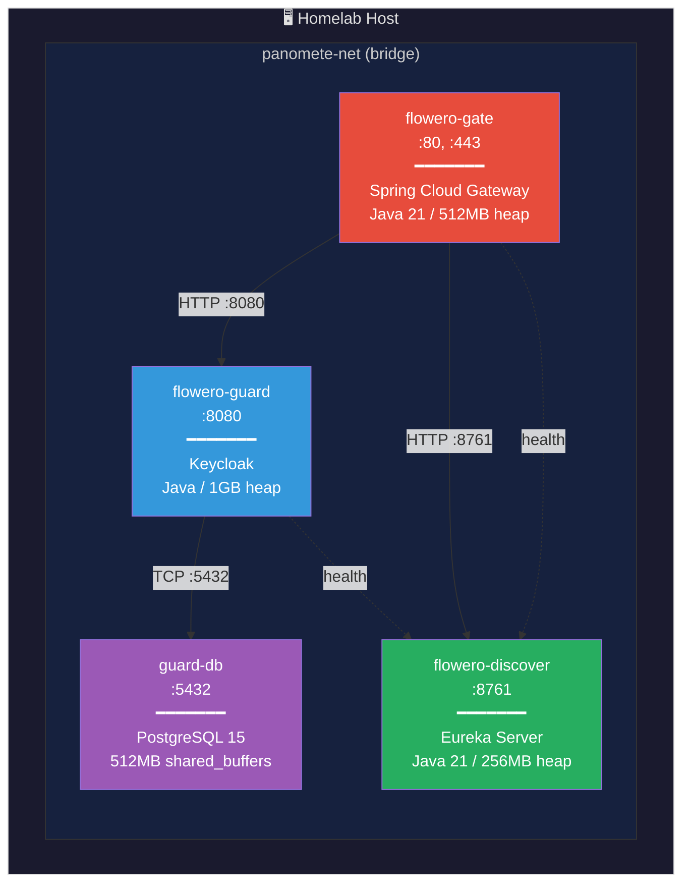

# Software Architecture Document (SAD) — Panomete Platform

> **Project:** Panomete Platform
> **Version:** 0.1 | **Status:** Draft
> **Last Updated:** 2026-07-22

---

## Document Control

| Field | Value |
|-------|-------|
| Document Owner | Dev / SA Persona |
| Solution Architect | Dev / SA Persona |
| Technical Lead | Dev / SA Persona |

### Revision History

| Version | Date | Author | Change Description |
|---------|------|--------|--------------------|
| 0.1 | 2026-07-22 | Dev / SA | Initial architecture — based on PO requirements and platform README |

---

## 1. Introduction

### 1.1 Purpose

> This document describes the software architecture of the Panomete Platform — the foundation microservice platform for a personal homelab. It defines the component decomposition, communication patterns, data architecture, security model, deployment topology, and quality attribute scenarios.

### 1.2 Scope

> Phase 1 (Foundation): Flowero Guard (Keycloak IAM), Flowero Discover (Eureka Service Registry), Flowero Gate (Spring Cloud Gateway). This document excludes business services (Cute Gufo, Fluffy Mouton, etc.) — those are Phase 2+.

### 1.3 References

| Document | Version |
|----------|---------|
| [[011_business_objective]] | 0.1 |
| [[012_user_stories]] | 0.1 |
| [[014_stakeholder_analysis]] | 0.1 |
| [[021_architecture_decision_records]] | 0.1 |
| [[README]] (platform overview) | — |

---

## 2. Architecture Overview

### 2.1 Architectural Style

| Aspect | Choice | Rationale |
|--------|-------|----------|
| **Overall Style** | Microservices + API Gateway | Each foundation concern (auth, discovery, routing) is an independent service; Gateway is the single entry point |
| **Communication** | REST (sync) over HTTP/1.1 | All inter-service communication is HTTP — no message queue needed for foundation services |
| **Service Discovery** | Server-side (Eureka) + Client-side (Spring Cloud LoadBalancer) | Gateway resolves routes via Eureka; services discover peers via `@LoadBalanced` clients |
| **Data Management** | Database-per-service (where applicable) | Guard uses its own PostgreSQL; Discover and Gate are stateless |
| **Deployment** | Containerized (Docker Compose → k3s) | Compose for simplicity now; design for Kubernetes portability |
| **Configuration** | Externalized (env vars + YAML files) | 12-Factor App — config lives outside the container image |

### 2.2 High-Level Architecture Diagram



### 2.3 Request Flow (Happy Path)



---

## 3. Component Design

### 3.1 Flowero Guard — Keycloak IAM

| Aspect | Detail |
|--------|--------|
| **Responsibility** | Identity provider. Issue, validate, and manage OAuth2/OIDC tokens. User management, SSO sessions, RBAC. |
| **Technology** | Keycloak (Docker container) |
| **Version** | Keycloak 25+ (latest stable) |
| **Language** | Java (Keycloak runtime) |
| **Database** | PostgreSQL — Keycloak's own schema (`keycloak` database) |
| **Port** | 8080 (internal Docker network only) |
| **External Access** | Via Flowero Gate at `/auth/**` |
| **Dependencies** | PostgreSQL (must be healthy before Keycloak starts) |
| **Health** | `GET /auth/health/ready` → 200 when ready |
| **Config** | Realm exported as JSON (`panomete-realm.json`), imported on startup via `--import-realm` |

**Out of Scope (MVP):**
- Social login (Google, GitHub)
- MFA (TOTP/SMS)
- LDAP/AD federation
- User self-registration

### 3.2 Flowero Discover — Eureka Service Registry

| Aspect | Detail |
|--------|--------|
| **Responsibility** | Service registry. Track which services are running, their locations, and their health status. Enable dynamic peer discovery. |
| **Technology** | Spring Cloud Netflix Eureka Server |
| **Language / Stack** | Java 21 / Spring Boot 3.x |
| **Database** | None — fully in-memory registry |
| **Port** | 8761 (internal Docker network only) |
| **External Access** | Via Flowero Gate at `/eureka/**` (dashboard) |
| **Dependencies** | None (standalone) |
| **Health** | `GET /actuator/health` → 200 |
| **Config** | Standalone mode: `eureka.client.register-with-eureka: false`, `fetch-registry: false` |

### 3.3 Flowero Gate — Spring Cloud Gateway

| Aspect | Detail |
|--------|--------|
| **Responsibility** | API Gateway. Single entry point for all external traffic. Route requests to internal services, enforce JWT authentication at the perimeter, rate limit, terminate TLS, emit structured request logs. |
| **Technology** | Spring Cloud Gateway (Reactive, Netty-based) |
| **Language / Stack** | Java 21 / Spring Boot 3.x / WebFlux |
| **Database** | None — fully stateless |
| **Ports** | 80 (HTTP), 443 (HTTPS) — the ONLY ports exposed to host |
| **Dependencies** | Flowero Guard (JWKS endpoint for token validation), Flowero Discover (for `lb://` route resolution) |
| **Health** | `GET /actuator/health` → 200 (includes Eureka composite health) |
| **Config** | Routes defined declaratively in `application.yml` under `spring.cloud.gateway.routes` |

**Gateway Routing Table:**

| Route ID | Path Pattern | Backend URI | Auth Required | Rate Limit |
|----------|-------------|-------------|:---:|:---:|
| `auth` | `/auth/**` | `lb://flowero-guard` | No (permit-all) | 20/min |
| `discover` | `/eureka/**` | `lb://flowero-discover` | Yes (admin role) | 100/min |
| `blog` | `/api/blog/**` | `lb://cute-gufo` | Yes | 100/min |
| `short` | `/api/short/**` | `lb://fluffy-mouton` | Yes | 100/min |
| `todo` | `/api/todo/**` | `lb://tiny-mchwa` | Yes | 100/min |

**Gateway Middleware Chain (per request):**

```
RateLimit → Auth (JWT validation) → Route → Log (JSON structured)
```

---

## 4. Data Architecture

### 4.1 Data Storage Strategy

| Service | Data Store | What It Stores | Backup Strategy |
|---------|-----------|---------------|-----------------|
| Flowero Guard | PostgreSQL (`keycloak` DB) | Realms, clients, users, roles, sessions, credentials | `pg_dump` daily; realm export JSON in version control as secondary backup |
| Flowero Discover | In-memory | Service registrations, health status | None — rebuilt on restart (services re-register) |
| Flowero Gate | None (stateless) | N/A | N/A — route config in `application.yml` (version controlled) |

### 4.2 Keycloak Realm Data Model (Logical)



> **Note:** Keycloak manages its own schema. We do NOT write DDL for Keycloak tables. The ERD above is the *logical* domain model of the `panomete` realm. The physical DDL is maintained by Keycloak's Liquibase migrations.

---

## 5. Security Architecture

### 5.1 Authentication Flow

| Layer | Mechanism | Implementation |
|-------|----------|---------------|
| **External Client → Gate** | HTTPS + JWT Bearer token in `Authorization` header | Gate validates JWT signature against Keycloak JWKS endpoint |
| **Gate → Internal Service** | HTTP (trusted Docker network) + forwarded claims headers | Gate adds `X-User-Id`, `X-User-Name`, `X-User-Roles` headers |
| **Internal Service → Keycloak** | Client credentials grant for S2S | Service uses its own client ID + secret to obtain service JWT |

### 5.2 Token Lifecycle

| Token Type | Lifetime | Refreshable | Notes |
|-----------|----------|:---:|-------|
| Access Token (JWT) | 5 minutes | No (stateless) | Short-lived — validated by signature, no introspection call needed |
| Refresh Token | 30 minutes | Yes | Used to silently obtain new access tokens |
| SSO Session | 30 minutes idle timeout | — | Keycloak session cookie; single sign-on across services |
| Client Credentials Token | 5 minutes | No | Used for service-to-service calls |

### 5.3 Security Controls

| Control | Implementation | Standard |
|---------|---------------|---------|
| **Encryption in Transit** | TLS 1.2+ at Gateway (self-signed for dev) | NIST SP 800-52 |
| **Internal Network** | Docker bridge network — no services exposed to host except Gate :80/:443 | Defense in depth |
| **Input Validation** | Gateway schema validation; Keycloak handles auth inputs | OWASP |
| **Rate Limiting** | 100 req/min per IP (default); 20/min for `/auth/**` | OWASP API |
| **Audit Logging** | Gateway logs every request as structured JSON; Keycloak has built-in event logging | ISO 27001 |
| **Secret Management** | Environment variables (Docker Compose `.env`); never committed to git | 12-Factor App |

---

## 6. Deployment Architecture

### 6.1 Docker Compose Topology (Phase 1)



### 6.2 Service Startup Order

| Order | Service | Depends On | Health Check |
|:-----:|---------|-----------|-------------|
| 1 | `guard-db` | — | `pg_isready -U keycloak` |
| 2 | `flowero-guard` | guard-db (healthy) | `GET :8080/auth/health/ready` |
| 3 | `flowero-discover` | — | `GET :8761/actuator/health` |
| 4 | `flowero-gate` | flowero-guard, flowero-discover | `GET :80/actuator/health` |

> **Note:** Gate starts last because it needs Guard's JWKS endpoint reachable and Discover available for route resolution. Compose `depends_on` with `condition: service_healthy` enforces this.

### 6.3 Resource Allocation

| Service | CPU | Memory (JVM Heap) | Disk | Rationale |
|---------|:---:|:---:|------|----------|
| flowero-gate | 0.5 vCPU | 512 MB (`-Xmx384m`) | Minimal | Reactive/Netty — very efficient |
| flowero-guard | 1.0 vCPU | 1 GB (`-Xmx768m`) | Realm export JSON | Keycloak is a large Java app |
| guard-db | 0.5 vCPU | 512 MB (shared_buffers) | 1 GB (data) | Single-realm, low traffic |
| flowero-discover | 0.25 vCPU | 256 MB (`-Xmx192m`) | Minimal | In-memory, lightweight |

> **Total:** ~2.25 vCPU, ~2.25 GB RAM — fits comfortably on a 4-core, 8 GB homelab machine.

---

## 7. Quality Attributes

| Attribute | Scenario | Architecture Response | Verification |
|-----------|---------|---------------------|-------------|
| **Performance** | Page load / API response < 200ms at p95 | Gateway is non-blocking (Netty); zero internal hops for static routes; Eureka cached | Load test with k6/Wrk |
| **Availability** | Any single service can restart without platform-wide outage | Gateway caches Eureka registry; Keycloak issues stateless JWTs (no validation call needed after issue) | Chaos testing: `docker compose restart` individual services |
| **Security** | OWASP Top 10 for APIs | Gateway validates JWT at perimeter; rate limiting; TLS termination; no internal ports exposed | OWASP ZAP scan |
| **Scalability** | Run multiple instances of business services behind Gateway | Eureka + client-side `@LoadBalanced` distributes traffic; Gateway itself could be replicated behind a load balancer | Scale service to 3 instances; verify round-robin |
| **Maintainability** | New service added in <2 hours | Declarative route config in Gateway `application.yml`; standard OAuth2 client template in Keycloak; service registers with Eureka automatically | OBJ-04: Onboard Fluffy Mouton canary |
| **Observability** | Debug a 500 error across services in <5 minutes | Structured JSON logs with trace IDs; Actuator health endpoints; Prometheus metrics | Trace a synthetic error through the stack |
| **Recoverability** | Host restart — platform returns to healthy state | Docker Compose `restart: unless-stopped`; PostgreSQL persists data; Eureka services re-register on boot | `docker compose down && docker compose up` |

---

## 8. Architecture Decision Summary

| # | Decision | Rationale | ADR |
|---|---------|----------|-----|
| 1 | Keycloak for Identity (not custom auth service) | Production-grade OSS IAM; OAuth2/OIDC compliant; eliminates auth code in every service | ADR-001 |
| 2 | Spring Cloud Gateway (not Kong/Traefik) | Native Spring ecosystem; integrates with Spring Security + Eureka; portfolio piece in Java | ADR-002 |
| 3 | Eureka for Service Discovery (not Consul/k8s DNS) | Simplest path with Spring Cloud; embeddable; no external binary dependency | ADR-003 |
| 4 | Spring Boot / Java 21 for Foundation | Mature ecosystem; Spring Cloud provides Gateway + Security + Discovery integrations out of the box | ADR-004 |
| 5 | PostgreSQL for Guard DB (not H2/in-memory) | Persistent state across restarts; production-grade; already in homelab stack | ADR-005 |
| 6 | Docker Compose → k3s (not direct K8s) | Compose for MVP simplicity; designed for K8s portability (health checks, env vars, stateless where possible) | ADR-006 |
| 7 | JWT (not opaque tokens) for service auth | Stateless validation at Gateway — no introspection call per request; faster, more resilient | ADR-007 |
| 8 | Gateway-side auth (not per-service) | Single choke point for security; business services receive already-validated claims as headers | ADR-008 |

---

## 9. Open Issues & Risks

| # | Issue / Risk | Impact | Owner | Status |
|---|-------------|--------|-------|--------|
| 1 | **RAM pressure**: 3 JVM services + PostgreSQL on a single host may push memory limits | Cannot run all services simultaneously | Dev | 🟡 — Profile early, set JVM heap limits. Consider GraalVM native images |
| 2 | **Keycloak learning curve**: Realm configuration, client setup, token flows are non-trivial | Delays Guard deployment | Dev | 🟡 — Use realm-as-code (JSON export); document step-by-step |
| 3 | **Spring Boot version compatibility**: Spring Cloud, Spring Security, Spring Boot must align | Dependency hell at project setup | Dev | 🟢 — Use Spring Initializr + BOM; pin versions |
| 4 | **TLS certificate**: Self-signed cert triggers browser warnings (acceptable for homelab, but ugly) | Cosmetic — no functional impact | DevOps | 🟢 — mkcert or Let's Encrypt later |

---

## Related Documents

| Document | Relationship |
|----------|-------------|
| [[021_architecture_decision_records]] | Detailed rationale for each architecture decision |
| [[029_architecture_overview]] | Simplified high-level architecture diagram |
| [[flowero_guard/021_architecture_decision_records]] | Guard-specific ADRs |
| [[flowero_discover/021_architecture_decision_records]] | Discover-specific ADRs |
| [[flowero_gate/021_architecture_decision_records]] | Gate-specific ADRs |
| [[011_business_objective]] | Platform objectives (OBJ-01 through OBJ-05) |
| [[012_user_stories]] | Stories driving these architecture decisions |

---

> **Template Standard:** Based on SWEBOK v4, ISO/IEC/IEEE 42010, 12-Factor App
> **Usage:** This document is the primary architectural reference for all developers working on the Panomete Platform. Read this before reading any service-level design docs.
