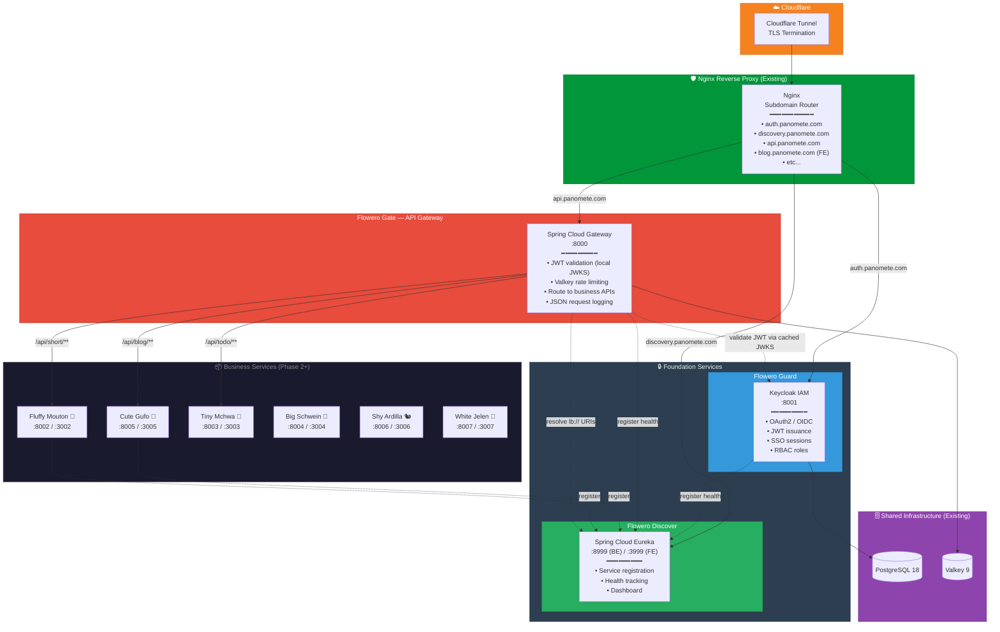
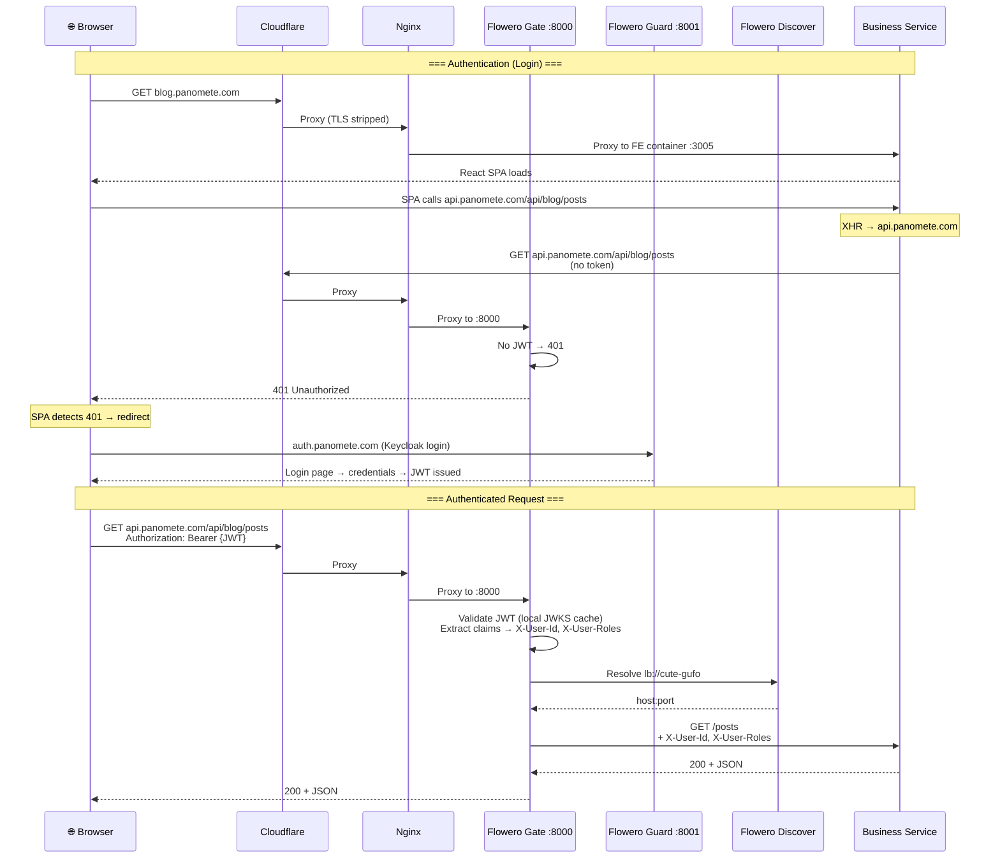
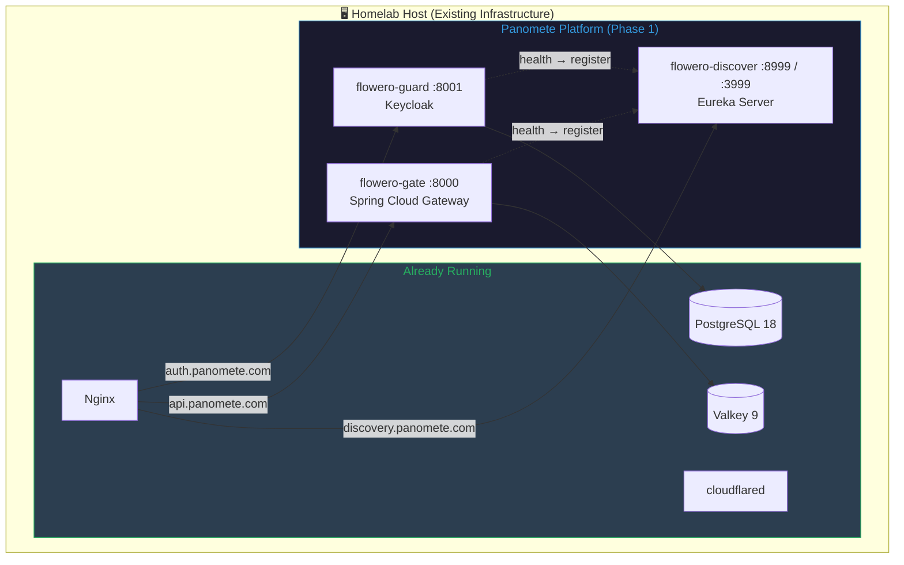

# Software Architecture Document (SAD) — Panomete Platform

> **Project:** Panomete Platform
> **Version:** 0.2 | **Status:** Draft — Updated per Design Review 2026-07-22
> **Last Updated:** 2026-07-22

---

## Document Control

| Field | Value |
|-------|-------|
| Document Owner | Dev / SA Persona |
| Solution Architect | Dev / SA Persona |
| Technical Lead | Dev / SA Persona |

### Revision History

| Version | Date | Author | Change Description |
|---------|------|--------|--------------------|
| 0.1 | 2026-07-22 | Dev / SA | Initial architecture |
| 0.2 | 2026-07-22 | Dev / SA | Rewritten for actual production infrastructure — Nginx edge, Cloudflare TLS, `*.panomete.com`, shared infra, Gate scoped to business APIs only |

---

## 1. Introduction

### 1.1 Purpose

> This document describes the software architecture of the Panomete Platform — the foundation microservice platform for a personal homelab. It defines the component decomposition, communication patterns, data architecture, security model, deployment topology, and quality attribute scenarios. It reflects the **actual production infrastructure** already running (Cloudflare Tunnel, Nginx, PostgreSQL 18, Valkey 9, Docker).

### 1.2 Scope

> Phase 1 (Foundation): Flowero Guard (Keycloak IAM), Flowero Discover (Eureka Service Registry), Flowero Gate (Spring Cloud Gateway — business APIs only). This document excludes business services (Cute Gufo, Fluffy Mouton, etc.) — those are Phase 2+.

### 1.3 References

| Document | Version |
|----------|---------|
| [[011_business_objective]] | 0.2 |
| [[012_user_stories]] | 0.2 |
| [[021_architecture_decision_records]] | 0.2 |
| [[README]] (platform overview) | 0.2 |
| Home Lab infrastructure | `F:\obsidian_note\oralita_md\Quick Note\Home Lab App.md` |

---

## 2. Architecture Overview

### 2.1 Architectural Style

| Aspect | Choice | Rationale |
|--------|-------|----------|
| **Overall Style** | Microservices + Edge Proxy + API Gateway | Cloudflare (TLS) → Nginx (subdomain router) → internal services. Gate routes business APIs only. |
| **Communication** | REST (sync) over HTTP/1.1 | All inter-service communication is HTTP. Internal Docker network is trusted — plain HTTP. |
| **Service Discovery** | Server-side (Eureka) + Client-side (Spring Cloud LoadBalancer) | Gateway resolves business service routes via Eureka; services discover peers via `@LoadBalanced` clients |
| **Data Management** | Shared PostgreSQL 18 (existing) + Database-per-service logically | Guard uses a `keycloak` database on the shared PostgreSQL. Discover and Gate are stateless. |
| **Deployment** | Docker Compose on existing infrastructure | All services run as containers alongside existing self-hosted apps (AdGuard, Portainer, etc.) |
| **Configuration** | Externalized (env vars + YAML files) | 12-Factor App — config lives outside the container image |

### 2.2 High-Level Architecture Diagram

### 2.3 Request Flow — Authenticated API Call

---

## 3. Component Design

### 3.1 Flowero Guard — Keycloak IAM

| Aspect | Detail |
|--------|--------|
| **Responsibility** | Identity provider. Issue, validate, and manage OAuth2/OIDC tokens. User management, SSO sessions, RBAC. |
| **Technology** | Keycloak (Docker container) |
| **Version** | Keycloak 25+ (latest stable) |
| **Port** | 8001 (internal Docker network) |
| **Domain** | `auth.panomete.com` (via Nginx) |
| **Database** | Shared PostgreSQL 18 — `keycloak` database |
| **Dependencies** | PostgreSQL (existing shared instance) |
| **Health** | `GET /health/ready` → 200 when ready |
| **Config** | Realm exported as JSON (`keycloak/panomete-realm.json`), imported on startup via `--import-realm` |
| **Note** | Flowero Guard IS Keycloak. No wrapper service. JWT validation is done locally at Gate (not by calling Guard per request). |

### 3.2 Flowero Discover — Eureka Service Registry

| Aspect | Detail |
|--------|--------|
| **Responsibility** | Service registry. Track which services are running, their locations, and their health status. Enable dynamic peer discovery. |
| **Technology** | Spring Cloud Netflix Eureka Server |
| **Language / Stack** | Java 25 / Spring Boot 4.1.x |
| **Ports** | 8999 (BE — registration API), 3999 (FE — dashboard) |
| **Domain** | `discovery.panomete.com` (via Nginx) |
| **Database** | None — fully in-memory |
| **Dependencies** | None (standalone) |
| **Health** | `GET /actuator/health` → 200 |
| **Config** | Standalone mode: `register-with-eureka: false`, `fetch-registry: false` |

### 3.3 Flowero Gate — Spring Cloud Gateway (Business APIs Only)

| Aspect | Detail |
|--------|--------|
| **Responsibility** | Internal API Gateway. Route business API traffic, validate JWT locally against Keycloak JWKS, enforce Valkey-backed rate limiting, emit structured JSON logs. |
| **Technology** | Spring Cloud Gateway (Reactive, Netty-based) |
| **Language / Stack** | Java 25 / Spring Boot 4.1.x / WebFlux |
| **Port** | 8000 (internal, behind Nginx) |
| **Domain** | `api.panomete.com` (via Nginx) |
| **Database** | None — fully stateless |
| **Dependencies** | Flowero Guard (JWKS endpoint for local JWT validation), Flowero Discover (`lb://` route resolution), Valkey 9 (rate limiting) |
| **Routes** | Business APIs only: `/api/blog/**`, `/api/short/**`, `/api/todo/**`, `/api/ledger/**`, `/api/recipe/**`, `/api/hora/**` |
| **Does NOT route** | `auth.panomete.com` (Guard) and `discovery.panomete.com` (Discover) — handled directly by Nginx |

### 3.4 Nginx — Edge Reverse Proxy (Existing)

| Aspect | Detail |
|--------|--------|
| **Responsibility** | Subdomain-based routing to all platform and self-hosted services |
| **Status** | ✅ Already running in production |
| **Routes** | `auth.panomete.com` → Guard :8001, `discovery.panomete.com` → Discover :3999, `api.panomete.com` → Gate :8000, `blog.panomete.com` → Cute Gufo FE :3005, etc. |
| **Config** | Per-subdomain `server` blocks. Static files served by each FE container, not Nginx directly. |

---

## 4. Data Architecture

### 4.1 Data Storage Strategy

| Service | Data Store | What It Stores | Backup Strategy |
|---------|-----------|---------------|-----------------|
| Flowero Guard | Shared PostgreSQL 18 (`keycloak` DB) | Realms, clients, users, roles, sessions, credentials | `pg_dump` daily; realm export JSON in version control |
| Flowero Discover | In-memory | Service registrations, health status | None — rebuilt on restart (services re-register) |
| Flowero Gate | None (stateless) | N/A | N/A — route config in `application.yml` (version controlled) |
| Rate Limiting | Shared Valkey 9 | Per-IP request counters | None — limits reset when counters expire (acceptable) |

### 4.2 PostgreSQL — Shared Instance

> The existing PostgreSQL 18 instance serves multiple purposes:

| Database | Used By | Purpose |
|----------|---------|---------|
| `keycloak` | Flowero Guard | Keycloak's internal schema (managed by Keycloak's Liquibase migrations) |
| `tiny-mchwa` | Tiny Mchwa (business service) | Todolists + tasks |
| `fluffy-mouton` | Fluffy Mouton (future) | URL mappings |
| *(per-service)* | Future business services | Each service gets its own database |

---

## 5. Security Architecture

### 5.1 Authentication Flow

| Layer | Mechanism | Implementation |
|-------|----------|---------------|
| **External Client → Cloudflare** | HTTPS (TLS 1.3) | Cloudflare terminates TLS |
| **Cloudflare → Nginx** | cloudflared tunnel (encrypted) | Cloudflare Tunnel handles this |
| **Nginx → Services** | Plain HTTP | Trusted Docker network |
| **Client → API** | JWT Bearer token in `Authorization` header | Gate validates JWT locally against Keycloak JWKS (cached) |
| **Gate → Business Service** | Forwarded claims headers (`X-User-Id`, `X-User-Roles`) | Services trust these on the internal network |
| **Service → Service** | Client Credentials grant (future) | Service uses its own client ID + secret for S2S JWT |

### 5.2 Token Lifecycle

| Token Type | Lifetime | Refreshable | Notes |
|-----------|----------|:---:|-------|
| Access Token (JWT) | 5 minutes | No (stateless) | Validated locally at Gate — zero network call |
| Refresh Token | 30 minutes | Yes | Used for silent token renewal |
| SSO Session | 30 minutes idle | — | Keycloak cookie; single sign-on across services |

### 5.3 Security Controls

| Control | Implementation |
|---------|---------------|
| **TLS** | Cloudflare handles external. Internal plain HTTP on trusted Docker network. |
| **JWT Validation** | Gate caches Keycloak JWKS on startup. Local validation — no per-request call to Guard. |
| **Rate Limiting** | Valkey-backed. 100 req/min default. Survives Gate restarts. |
| **Audit Logging** | Gate logs every request as structured JSON (`timestamp`, `method`, `path`, `status`, `latency_ms`, `route_id`, `client_ip`, `user_id`) |
| **Secret Management** | Environment variables (Docker Compose `.env`); never committed to git |
| **Network Security** | UFW firewall + Fail2ban (existing). Only Nginx and Cloudflare tunnel ports exposed. |

---

## 6. Deployment Architecture

### 6.1 Docker Compose Topology (Phase 1)

### 6.2 Service Startup Order

| Order | Service | Depends On | Health Check |
|:-----:|---------|-----------|-------------|
| 1 | *(PostgreSQL already running)* | — | — |
| 2 | *(Valkey already running)* | — | — |
| 3 | `flowero-guard` | PostgreSQL (healthy) | `GET :8001/health/ready` |
| 4 | `flowero-discover` | — | `GET :8999/actuator/health` |
| 5 | `flowero-gate` | Guard (healthy), Discover (healthy), Valkey (healthy) | `GET :8000/actuator/health` |

### 6.3 Resource Allocation

| Service | CPU | Memory (JVM Heap) | Notes |
|---------|:---:|:---:|-------|
| flowero-gate | 0.5 vCPU | 512 MB (`-Xmx384m`) | Reactive/Netty — efficient |
| flowero-guard | 1.0 vCPU | 1 GB (`-Xmx768m`) | Keycloak is resource-heavy |
| flowero-discover | 0.25 vCPU | 256 MB (`-Xmx192m`) | In-memory, lightweight |

---

## 7. Quality Attributes

| Attribute | Scenario | Architecture Response |
|-----------|---------|---------------------|
| **Performance** | API response < 200ms at p95 | Gate is non-blocking (Netty). JWT validation is local (no network call). Eureka resolution is cached. |
| **Availability** | Any single service restart doesn't take down the platform | Gate caches Eureka registry. Keycloak issues stateless JWTs. Nginx health checks bypass dead backends. |
| **Security** | OWASP Top 10 for APIs | JWT validated at Gate perimeter. Rate limiting at Gate. Internal network is trusted. |
| **Scalability** | Run multiple instances of business services | Eureka + `@LoadBalanced` distributes traffic. Valkey rate limits are shared. |
| **Maintainability** | New service onboarded in <2 hours | Declarative route in Gate `application.yml`. Standard OAuth2 client template in Keycloak. Auto-registration with Eureka. |
| **Observability** | Debug a 500 error across services (Phase 2) | Structured JSON logs with trace IDs. Actuator health endpoints. Prometheus metrics. |

---

## 8. Architecture Decision Summary

| # | Decision | Rationale | ADR |
|---|---------|----------|-----|
| 1 | Keycloak for Identity | Production-grade OSS IAM. No auth code in services. | ADR-001 |
| 2 | Spring Cloud Gateway (internal) | Business API routing + JWT validation. Behind existing Nginx. | ADR-002 |
| 3 | Eureka for Discovery | Simplest path with Spring Cloud. Auto-registration. | ADR-003 |
| 4 | Java 25 / Spring Boot 4.1 for Foundation | Spring Cloud 2025.1 provides Gateway + Security + Discovery integrations. Latest LTS Java. | ADR-004 |
| 5 | Shared PostgreSQL 18 | Uses existing infrastructure. No dedicated DB container needed. | ADR-005 |
| 6 | Nginx edge + Cloudflare TLS | Already running. TLS is Cloudflare's concern. | ADR-006 |
| 7 | JWT local validation at Gate | Zero-latency auth. No per-request call to Guard. | ADR-007 |
| 8 | Valkey rate limiting | Survives Gate restarts. Uses existing shared Valkey 9. | ADR-008 |
| 9 | Subdomain routing (Nginx) + Path routing (Gate) | Foundation services = subdomains. Business APIs = paths through Gate. | ADR-009 |

---

## 9. Open Issues & Risks

| # | Issue / Risk | Impact | Owner | Status |
|---|-------------|--------|-------|--------|
| 1 | RAM pressure: 3 JVM services + PostgreSQL on host | Cannot run all simultaneously | Dev | 🟡 — Profile early, set explicit heap limits |
| 2 | Keycloak learning curve | Delays Guard deployment | Dev | 🟡 — Realm-as-code (JSON export) |
| 3 | Nginx config must coexist with existing services | Routing conflicts possible | DevOps | 🟢 — Add server blocks, don't touch existing ones |
| 4 | Cloudflare Tunnel must be configured for new subdomains | Requires Cloudflare DNS + tunnel config | DevOps | 🟢 — Follow existing pattern from other services |

---

## Related Documents

| Document | Relationship |
|----------|-------------|
| [[021_architecture_decision_records]] | Detailed rationale for each architecture decision |
| [[029_architecture_overview]] | Simplified one-page architecture diagram |
| [[flowero_guard/021_architecture_decision_records]] | Guard-specific ADRs |
| [[flowero_discover/021_architecture_decision_records]] | Discover-specific ADRs |
| [[flowero_gate/021_architecture_decision_records]] | Gate-specific ADRs |
| [[011_business_objective]] | Platform objectives (OBJ-01 through OBJ-05) |
| [[012_user_stories]] | Stories driving these architecture decisions |

---

> **Template Standard:** Based on SWEBOK v4, ISO/IEC/IEEE 42010, 12-Factor App
> **Usage:** Primary architectural reference for all developers. Read this before any service-level design docs.
