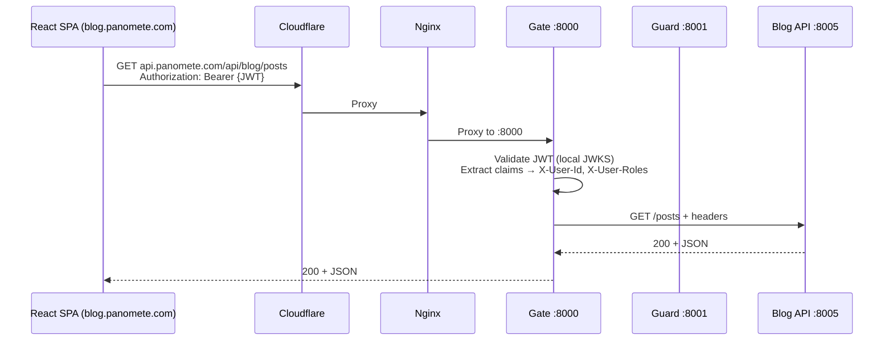

# Architecture Overview — Panomete Platform

> **Project:** Panomete Platform
> **Version:** 0.2 | **Status:** Draft
> **Last Updated:** 2026-07-22

---

## 1. Purpose

> A one-page architecture map. Start here. For detail, see the [[025_software_architecture_document|SAD]] and [[021_architecture_decision_records|ADRs]].

---

## 2. The Big Picture

```
                    ┌─ auth.panomete.com ───────→ Flowero Guard (Keycloak) :8001
                    │
Cloudflare → Nginx ─┼─ discovery.panomete.com ───→ Flowero Discover (Eureka) :3999 / :8999
 (TLS)      (edge)  │
                    ├─ api.panomete.com ─────────→ Flowero Gate :8000
                    │                                ├─ /api/blog/**  → Cute Gufo :8005
                    │                                ├─ /api/todo/**  → Tiny Mchwa :8003
                    │                                └─ /api/short/** → Fluffy Mouton :8002
                    │
                    ├─ blog.panomete.com ─────────→ Cute Gufo FE :3005
                    ├─ todo.panomete.com ─────────→ Tiny Mchwa FE :3003
                    └─ ... (existing services: AdGuard, Portainer, etc.)
```

---

## 3. Key Architecture Rules

1. **Nginx is the edge.** All external traffic hits Nginx first. Cloudflare handles TLS.
2. **Foundation services have subdomains.** `auth`, `discovery` — direct Nginx proxy.
3. **Gate = business APIs only.** `api.panomete.com` → Gate :8000 → `/api/{service}/**`.
4. **Gate validates JWT locally.** Caches JWKS from Guard. Zero per-request calls.
5. **Internal = plain HTTP.** Trusted Docker network. Cloudflare handles external TLS.
6. **Rate limiting is Valkey-backed.** Shared Valkey 9. Survives Gate restarts.
7. **Shared infrastructure.** PostgreSQL 18 (Guard DB). Valkey 9 (rate limiting).
8. **Observability = Phase 2.** Loki + Prometheus + Grafana. Actuator health endpoints in Phase 1.
9. **FE = self-contained containers.** Each service owns its entire stack.

---

## 4. Port Map

| Service | BE Port | FE Port | Domain |
|---------|:---:|:---:|--------|
| Flowero Gate | 8000 | — | `api.panomete.com` |
| Flowero Guard | 8001 | — | `auth.panomete.com` |
| Flowero Discover | 8999 | 3999 | `discovery.panomete.com` |
| Cute Gufo (Blog) | 8005 | 3005 | `blog.panomete.com` |
| Fluffy Mouton (URL) | 8002 | 3002 | `short.panomete.com` |
| Tiny Mchwa (Todo) | 8003 | 3003 | `todo.panomete.com` |

---

## 5. Request Flow (Authenticated API Call)



---

## 6. Technology Stack

| Layer | Technology | Why |
|-------|-----------|-----|
| **Edge / TLS** | Cloudflare Tunnel + Nginx | Already running. TLS, DDoS, subdomain routing. |
| **Identity** | Keycloak | OAuth2/OIDC. Realm-as-code. SSO. |
| **API Gateway** | Spring Cloud Gateway | Reactive. JWT validation. Eureka `lb://` resolution. |
| **Service Discovery** | Eureka | Auto-registration. Dashboard. Spring ecosystem. |
| **Foundation Runtime** | Java 21 / Spring Boot 3.x | Spring Cloud provides full microservice stack. |
| **Database** | PostgreSQL 18 (shared) | Existing. ACID. Keycloak's recommended backend. |
| **Cache / Rate Limit** | Valkey 9 (shared) | Existing. Survives restarts. |
| **Deployment** | Docker Compose | Alongside existing services. Design for k3s later. |

---

## Related Documents

| Document | Relationship |
|----------|-------------|
| [[025_software_architecture_document]] | Full architecture detail |
| [[021_architecture_decision_records]] | Why we made each decision |
| [[README]] | Platform overview and service catalog |
| [[flowero_gate/022_API_specification]] | Gateway routing table |
