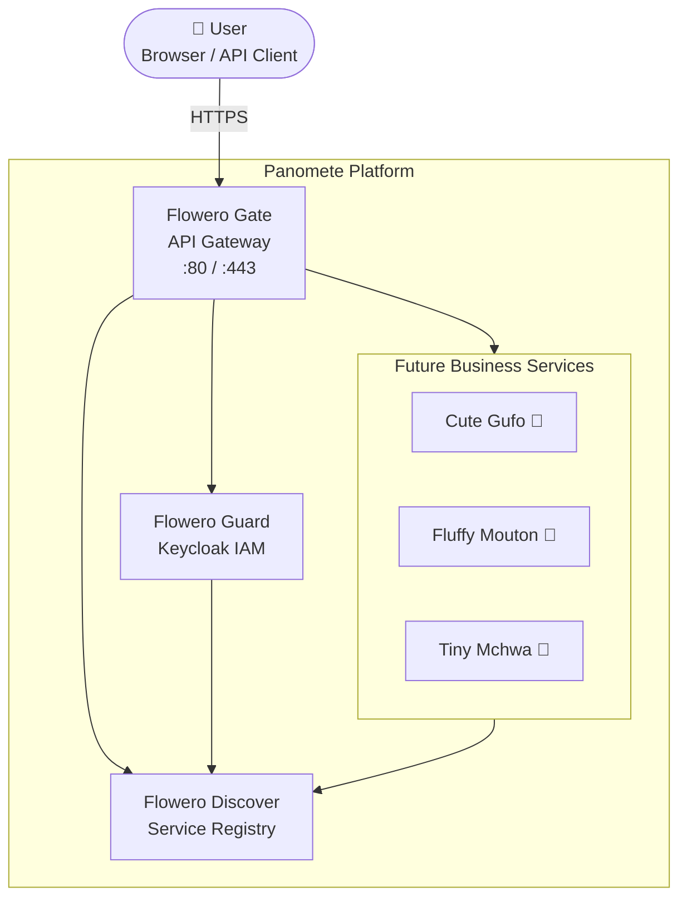
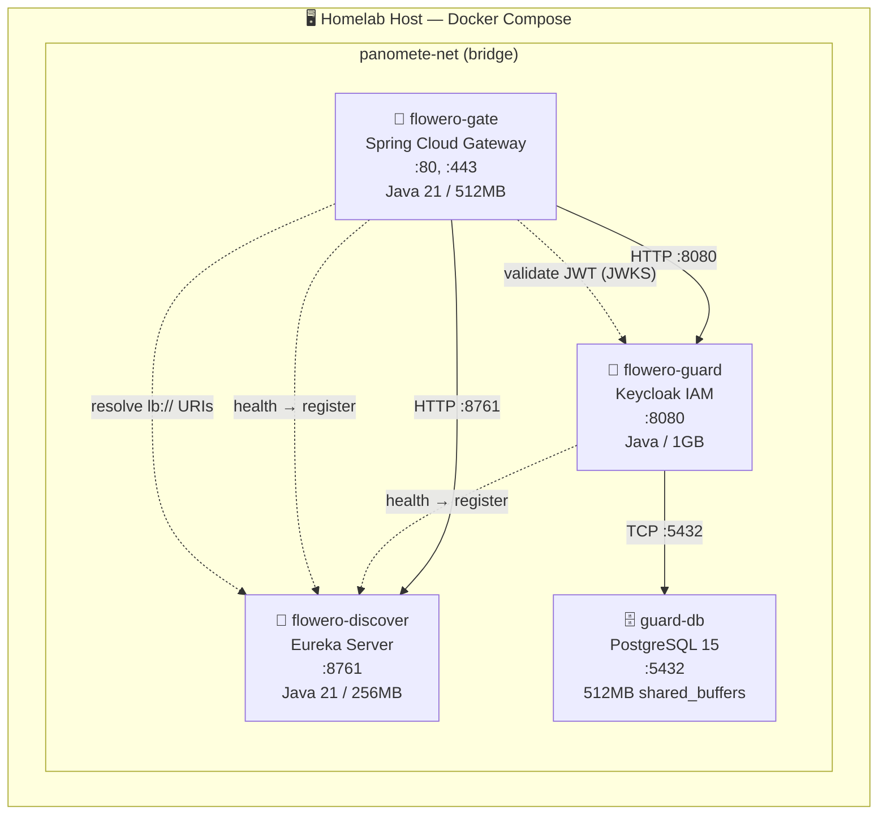
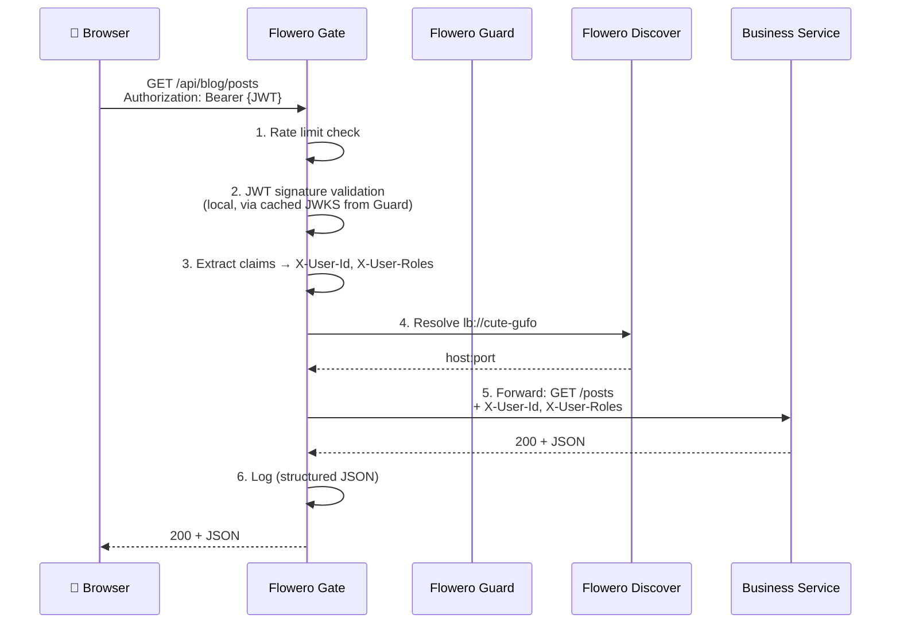

# Architecture Overview — Panomete Platform

> **Project:** Panomete Platform
> **Version:** 0.1 | **Status:** Draft
> **Last Updated:** 2026-07-22

---

## 1. Purpose

> A single-page overview of the Panomete Platform architecture. This is the "map" — point new developers and portfolio reviewers here first. For detailed decisions, see the [[025_software_architecture_document|SAD]] and [[021_architecture_decision_records|ADRs]].

---

## 2. System Context (C4 — Level 1)



---

## 3. Container View (C4 — Level 2)



---

## 4. Request Flow — Authenticated API Call



---

## 5. Technology Stack (At a Glance)

| Layer | Technology | Why |
|-------|-----------|-----|
| **API Gateway** | Spring Cloud Gateway | Reactive, Netty-based. Native Spring Security + Eureka integration. |
| **Identity Provider** | Keycloak | Production-grade OSS IAM. OAuth2/OIDC. Realm-as-code (JSON). |
| **Service Discovery** | Spring Cloud Netflix Eureka | Simplest path with Spring Boot. Auto-registration. Dashboard. |
| **Foundation Runtime** | Java 21 / Spring Boot 3.x | Mature ecosystem. Spring Cloud provides GW + Security + Discovery out of the box. |
| **Database** | PostgreSQL 15 | Keycloak's recommended production DB. ACID. Already in homelab stack. |
| **Deployment** | Docker Compose | One command: `docker compose up`. Design for k3s portability. |
| **Observability** | Spring Boot Actuator + Loki + Prometheus + Grafana | Built-in health/metrics. Lightweight log aggregation. |

---

## 6. Key Architecture Decisions

| # | Decision | Why (one sentence) |
|---|---------|-------------------|
| 1 | Keycloak, not custom auth | Eliminates auth code from every service; industry standard OAuth2/OIDC |
| 2 | Spring Cloud Gateway | Native Spring ecosystem integration; reactive and efficient |
| 3 | Eureka discovery | Services auto-register on boot; Gateway resolves routes dynamically |
| 4 | JWT + local validation | Zero-latency auth — no network call per request |
| 5 | Gateway-side auth | Services receive validated claims as headers; zero auth code |
| 6 | Docker Compose → k3s | Compose for MVP speed; designed for K8s from day one |

> Full rationale: [[021_architecture_decision_records]]

---

## 7. Security Model

```
🌐 External: HTTPS + JWT Bearer token → Gate
🔒 Perimeter: Gate validates JWT (local JWKS), enforces rate limits
🔑 Internal: Trusted Docker network. Gate forwards claims as headers.
🗄️ Guard DB: PostgreSQL on private network, no external port.
```

| Concern | Where | How |
|---------|-------|-----|
| Authentication | Gate | JWT signature validation (cached JWKS from Guard) |
| Authorization | Gate + Service | Gate: route-level (hasRole). Service: `@PreAuthorize` on endpoints |
| Rate Limiting | Gate | Per-IP, per-route (100 req/min default) |
| TLS | Gate | Terminates TLS 1.2+ at :443; internal HTTP |
| Secrets | Docker Compose `.env` | Never committed to git |

---

## 8. Startup Sequence

```
1. guard-db      (PostgreSQL)         ─── health: pg_isready
2. flowero-guard  (Keycloak)           ─── depends: guard-db healthy
3. flowero-discover (Eureka)           ─── standalone, no dependencies
4. flowero-gate   (Spring Cloud GW)    ─── depends: Guard + Discover healthy
```

---

## 9. Port Map

| Service | Internal Port | External Access | Notes |
|---------|:---:|---|-------|
| flowero-gate | 80, 443 | ✅ `https://panomete.local` | Only ports exposed to host |
| flowero-guard | 8080 | Via Gate: `/auth/**` | Internal Docker network only |
| guard-db | 5432 | None | Internal only |
| flowero-discover | 8761 | Via Gate: `/eureka/**` | Internal only |

---

## 10. What's NOT Shown Here

- **Observability stack** (Loki + Prometheus + Grafana) — Phase 1.5, see SAD §2.2
- **Business services** (Cute Gufo, Fluffy Mouton, etc.) — Phase 2+
- **CI/CD pipeline** — See DevOps persona docs (05_devops)
- **Multi-node / K8s deployment** — Future phase, see ADR-006

---

## Related Documents

| Document | Relationship |
|----------|-------------|
| [[025_software_architecture_document]] | Full architecture detail — component design, quality attributes, deployment |
| [[021_architecture_decision_records]] | Why we made each decision |
| [[README]] | Platform overview and service catalog |
| [[flowero_gate/022_API_specification]] | Gateway routing table (the platform's "API") |

---

> **Template Standard:** Based on SWEBOK v4, ISO/IEC/IEEE 42010
> **Usage:** Print this. Tape it to the wall. It's the map. When lost, return here.
