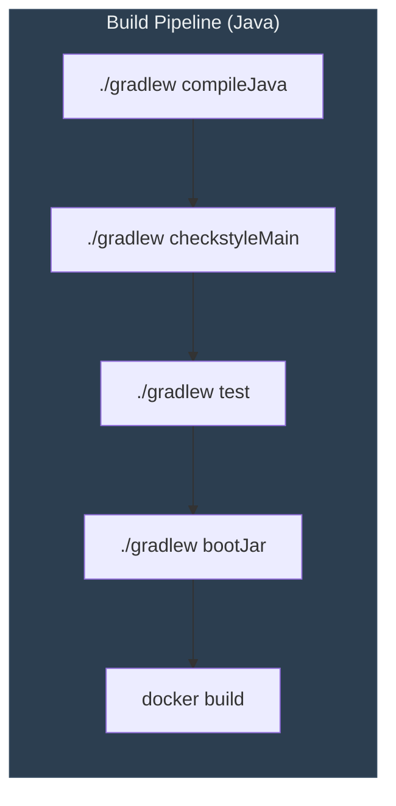
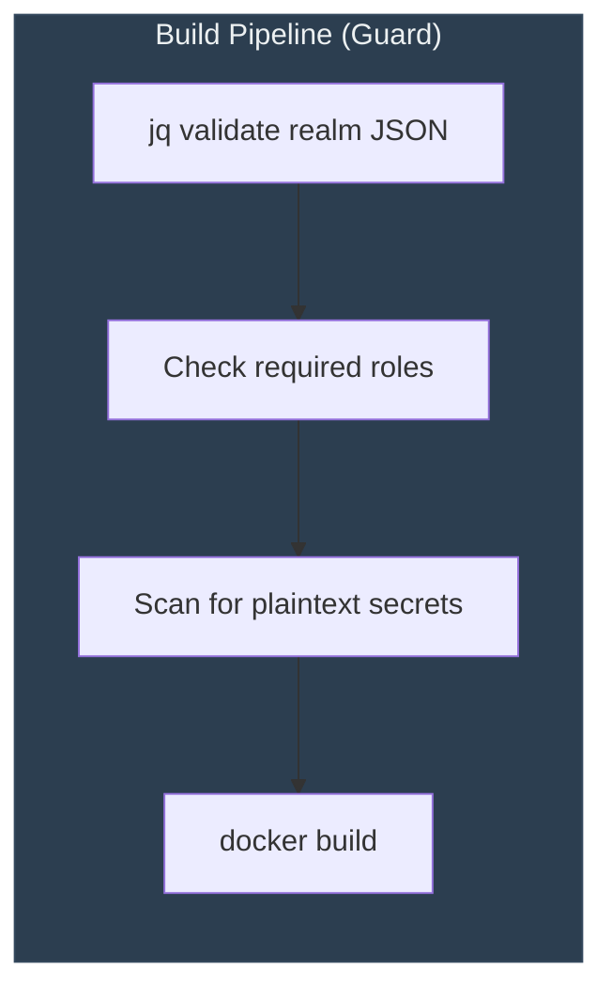

# Construction Overview — Panomete Platform

> **Platform:** Panomete Platform
> **Version:** 0.1 | **Status:** Draft
> **Last Updated:** 2026-07-24
>
> ⚠️ This is a platform-level overview. Detailed construction docs live in each service's `03_construction/` directory.

---

## 1. Purpose

> The front door for any developer (or AI persona) working on the Panomete Platform. This document answers: "What do I need to know to build, run, and deploy a service on this platform?" Each service has its own `03_construction/` folder with detailed guides — this ties them together.

---

## 2. Platform at a Glance

| Aspect | Detail |
|--------|--------|
| **Foundation** | Spring Boot 4.1.x / Java 25 / Gradle 9.5+ |
| **Business services** | Polyglot — Go, TypeScript, Node.js |
| **Identity** | Keycloak (Flowero Guard) — `auth.panomete.com` |
| **Discovery** | Spring Cloud Netflix Eureka — `discovery.panomete.com` |
| **Gateway** | Spring Cloud Gateway — `api.panomete.com` |
| **Databases** | PostgreSQL 18 (shared), Valkey 9 (shared), MongoDB 8 |
| **Edge** | Cloudflare Tunnel → Nginx reverse proxy |
| **Deployment** | Docker Compose (Phase 1-2) → k3s (Phase 3+) |
| **CI/CD** | GitHub Actions + GHCR (Phase 2) |

---

## 3. Service Inventory

### Foundation Services (Phase 1 — ✅ Deployed)


### Business Services (Phase 3+ — Planned)


---

## 4. Repository Structure (Monorepo)

> The Panomete Platform uses a monorepo approach. All services live in a single repository. Each service has its own subdirectory with self-contained build configs.

```
panomete-platform/
├── .github/
│   └── workflows/           # CI/CD pipelines (per-service)
│       ├── guard-ci.yml
│       ├── guard-deploy.yml
│       ├── discover-ci.yml
│       ├── discover-deploy.yml
│       ├── gate-ci.yml
│       └── gate-deploy.yml
├── flowero-guard/           # Keycloak IAM
│   ├── panomete-realm.json  # Version-controlled realm config
│   ├── Dockerfile
│   └── docker-compose.guard.yml
├── flowero-discover/        # Eureka Registry
│   ├── src/
│   ├── build.gradle
│   ├── Dockerfile
│   └── docker-compose.discover.yml
├── flowero-gate/            # Spring Cloud Gateway
│   ├── src/
│   ├── build.gradle
│   ├── Dockerfile
│   └── docker-compose.gate.yml
├── docker-compose.platform.yml  # Master compose — all services
├── nginx/                   # Nginx config (subdomain routing)
└── .env                     # Secrets (never committed)
```

---

## 5. Development Workflow

### 5.1 Local Development

```bash
# Clone the monorepo
git clone git@github.com:oat431/panomete-platform.git
cd panomete-platform

# Start foundation services (Guard + Discover + Gate)
docker compose -f docker-compose.platform.yml up -d

# Verify health
curl http://localhost:8001/health/ready        # Guard
curl http://localhost:8999/actuator/health     # Discover
curl http://localhost:8000/actuator/health     # Gate
```

### 5.2 Per-Service Development

| If working on... | Start with | Build command | Run command |
|------------------|-----------|---------------|-------------|
| **Flowero Guard** | `03_construction/031_README_developer_guide.md` | `docker build -t flowero-guard .` | `docker run ... start --import-realm` |
| **Flowero Discover** | `03_construction/031_README_developer_guide.md` | `./gradlew build` | `./gradlew bootRun` |
| **Flowero Gate** | `03_construction/031_README_developer_guide.md` | `./gradlew build` | `./gradlew bootRun` |
| **Business service** | TBD (Phase 3) | Language-specific | Language-specific |

### 5.3 Deployment Workflow (Phase 2 — CI/CD)

```
Developer writes code
  → Push to main branch
  → GitHub Actions CI triggers:
    ├── Compile / validate
    ├── Lint (Checkstyle / ESLint)
    ├── Unit tests
    ├── Build Docker image
    └── Push to GHCR (tagged with commit SHA + latest)
  → [MANUAL APPROVAL] PO clicks "Run deploy workflow"
  → Deploy workflow triggers:
    ├── SSH to homelab
    ├── docker compose pull <service>
    ├── docker compose up -d <service>
    ├── Smoke test (health + service-specific check)
    └── Auto-rollback if smoke test fails
```

---

## 6. Build Profiles

### Foundation Services (Java 25 / Spring Boot 4.1.x)



| Stage | Command | Fail Action |
|-------|---------|-------------|
| Compile | `./gradlew compileJava` | Block merge |
| Lint | `./gradlew checkstyleMain` | Block merge |
| Unit Test | `./gradlew test` | Block merge |
| Package | `./gradlew bootJar` | Block deploy |
| Docker Build | `docker build` (multi-stage) | Block deploy |

### Guard (Special Case — Config-Only)



> Guard has no compiled code. CI validates the `panomete-realm.json`, checks for required roles (`admin`, `user`, `viewer`), scans for secrets, then builds the Docker image.

---

## 7. Technology Stack Summary

| Layer | Technology | Version | Purpose |
|-------|-----------|---------|---------|
| Language | Java | 25 | Foundation services |
| Framework | Spring Boot | 4.1.x | Guard (Keycloak), Discover, Gate |
| Build Tool | Gradle | 9.5+ | Compile, test, package |
| Gateway | Spring Cloud Gateway | 2025.1.x | Reactive API gateway |
| Discovery | Spring Cloud Netflix Eureka | latest | Service registry |
| Identity | Keycloak | latest | OAuth2/OIDC IAM |
| Database | PostgreSQL | 18 | Guard persistence + business services |
| Cache | Valkey | 9 | Gate rate limiting |
| Object Storage | SeaweedFS | — | File storage (future) |
| Edge Proxy | Nginx | — | Subdomain routing |
| TLS | Cloudflare Tunnel | — | External TLS termination |
| CI/CD | GitHub Actions + GHCR | — | Build, test, deploy |
| Deployment | Docker Compose | — | Container orchestration |

---

## 8. Shared Resources

| Resource | Port | Used By |
|----------|------|---------|
| PostgreSQL 18 | 5432 | Guard (keycloak DB), future business services |
| Valkey 9 | 6379 | Gate (rate limiting) |
| MongoDB 8 | 27017 | Reserved for document-oriented business services |
| SeaweedFS S3 | 8333 | Reserved for file storage |
| Docker network `db-network` | — | Guard, Gate, databases |

---

## 9. Coding Standards

> Detailed standards are in each service's `035_coding_standards_development.md`. Platform-wide conventions:

| Standard | Rule |
|----------|------|
| **Repository** | Monorepo — all services in one repo |
| **Branching** | `main` is production-ready. Feature branches → PR → merge. |
| **Commits** | Conventional Commits (`feat:`, `fix:`, `chore:`, `docs:`, `refactor:`) |
| **Code style** | Java: Google Java Style Guide (enforced by Checkstyle). Go: `gofmt`. TypeScript: ESLint + Prettier. |
| **Testing** | Unit tests required for all new logic. CI blocks merge on test failure. |
| **Secrets** | NEVER in code. Use environment variables + `~/platform/.env`. |
| **Docker** | Multi-stage builds. Pin base image versions. Non-root user where possible. |
| **Logging** | JSON structured logs. No `System.out.println`. Use SLF4J (Java) or equivalent. |

---

## 10. Service Construction Documents

| Service | Construction Docs | Status |
|---------|------------------|--------|
| **Flowero Guard** | `flowero_guard/03_construction/031-036` | ✅ Complete |
| **Flowero Discover** | `flowero_discover/03_construction/031-036` | ✅ Complete |
| **Flowero Gate** | `flowero_gate/03_construction/031-036` | ✅ Complete |
| **Business services** | TBD (Phase 3) | ⬜ Not started |

### What's in each service's `03_construction/`:

| File | Purpose |
|------|---------|
| `031_README_developer_guide.md` | Clone → build → run in <5 minutes |
| `032_build_scripts.md` | Build commands, Dockerfiles, Gradle tasks |
| `033_dependency_manifest.md` | All dependencies with versions and purposes |
| `034_commit_messages_changelog.md` | Conventional commits format, changelog |
| `035_coding_standards_development.md` | Code style, naming, project structure |
| `036_code_review_records.md` | Review checklist, PR template |

---

## Related Documents

| Document | Relationship |
|---|---|
| [[../plan/phase2-foundation-hardening]] | Phase 2 plan (CI/CD, observability, alerting) |
| [[../spec/panomete_platform/README]] | Platform architecture overview |
| [[../spec/flowero_guard/03_construction/031_README_developer_guide]] | Guard dev guide |
| [[../spec/flowero_discover/03_construction/031_README_developer_guide]] | Discover dev guide |
| [[../spec/flowero_gate/03_construction/031_README_developer_guide]] | Gate dev guide |

---

> **Template Standard:** Based on SWEBOK v4, 12-Factor App
> **Usage:** This is the platform-level construction overview. For service-specific details, open the service's `03_construction/` folder.
