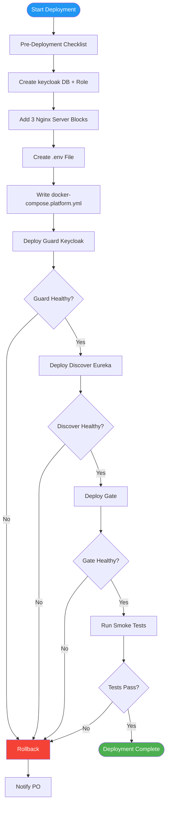

# Deployment Plan — Panomete Platform

> **Project:** Panomete Platform
> **Version:** 0.1 | **Status:** Draft — Awaiting PO Review
> **Last Updated:** 2026-07-23
> **Scope:** Phase 1 — Guard + Discover + Gate initial deployment

---

## 1. Purpose

> Step-by-step procedure for deploying the Panomete Platform foundation services to the homelab server. Covers pre-deployment prep, deployment sequence, verification, and rollback.

---

## 2. Deployment Overview

| Field | Detail |
|-------|--------|
| Release Version | v0.1.0 (Phase 1 — Sprint 1) |
| Deployment Target | `remote.panomete.com` (homelab server) |
| Deployment Window | Anytime (zero-downtime for existing services) |
| Downtime | Zero for existing services. New services start fresh. |
| Deployment Method | Docker Compose rolling deploy (Guard → Discover → Gate) |
| Responsible | DevOps Persona |

---

## 3. Target Environment (Verified 2026-07-23)

| Component | Detail |
|-----------|--------|
| Server | `remote.panomete.com` (SSH: `flowero@remote.panomete.com`) |
| OS | Ubuntu, kernel 7.0.0 |
| Resources | 8 CPU / 34 GB RAM / 79 GB disk free |
| Docker | 29.6.2 + Compose v5.3.1 |
| PostgreSQL | `local-postgres` (18) — `127.0.0.1:5432` — on `db-network` |
| Valkey | `local-valkey` (9.1.0) — `127.0.0.1:6379` — on `db-network` — password-protected |
| Nginx | Host-level process, `:80`, routes by `Host` header |
| Cloudflare | Tunnel active, `*.panomete.com` wildcard → `localhost:80` |

---

## 4. Pre-Deployment Checklist

| # | Check | Owner | Status |
|---|-------|-------|--------|
| 1 | PostgreSQL `keycloak` database + role created | DevOps | ☐ |
| 2 | Nginx server blocks for `auth`, `api`, `discovery` created | DevOps | ☐ |
| 3 | Stale `gateway.panomete.com` Nginx config removed | DevOps | ☐ |
| 4 | `.env` file created at `~/platform/.env` with all secrets | DevOps | ☐ |
| 5 | `docker-compose.platform.yml` written | DevOps | ☐ |
| 6 | Docker images built and available (GHCR or local build) | Dev | ☐ |
| 7 | Keycloak realm JSON validated | Dev | ☐ |
| 8 | Design doc discrepancies fixed (DEC-001, DEC-002, DEC-003) | Dev/SA | ☐ |
| 9 | `nginx -t` passes | DevOps | ☐ |
| 10 | Ports 8000, 8001, 8999, 3999 confirmed free | DevOps | ✅ Verified |

---

## 5. Deployment Steps



### Step 1: Create `keycloak` database + role

```bash
# SSH into server
ssh flowero@remote.panomete.com

# Create role and database
docker exec -it local-postgres psql -U postgres << 'SQL'
CREATE ROLE keycloak WITH LOGIN PASSWORD '<KEYCLOAK_DB_PASSWORD>';
CREATE DATABASE keycloak
    WITH ENCODING 'UTF8'
    LC_COLLATE = 'en_US.UTF-8'
    LC_CTYPE = 'en_US.UTF-8'
    OWNER keycloak;
GRANT ALL PRIVILEGES ON DATABASE keycloak TO keycloak;
GRANT ALL ON SCHEMA public TO keycloak;
SQL

# Verify
docker exec local-postgres psql -U postgres -c "\l keycloak"
```

### Step 2: Create Nginx server blocks

```bash
# --- auth.panomete.com ---
sudo tee /etc/nginx/sites-available/auth.panomete.com > /dev/null << 'NGINX'
server {
    server_name auth.panomete.com;
    client_max_body_size 10M;

    location / {
        proxy_pass http://127.0.0.1:8001;
        proxy_set_header Host $host;
        proxy_set_header X-Real-IP $remote_addr;
        proxy_set_header X-Forwarded-For $proxy_add_x_forwarded_for;
        proxy_set_header X-Forwarded-Proto $scheme;
    }
}
NGINX

# --- api.panomete.com ---
sudo tee /etc/nginx/sites-available/api.panomete.com > /dev/null << 'NGINX'
server {
    server_name api.panomete.com;

    location / {
        proxy_pass http://127.0.0.1:8000;
        proxy_set_header Host $host;
        proxy_set_header X-Real-IP $remote_addr;
        proxy_set_header X-Forwarded-For $proxy_add_x_forwarded_for;
        proxy_set_header X-Forwarded-Proto $scheme;
    }
}
NGINX

# --- discovery.panomete.com ---
sudo tee /etc/nginx/sites-available/discovery.panomete.com > /dev/null << 'NGINX'
server {
    server_name discovery.panomete.com;

    location / {
        proxy_pass http://127.0.0.1:3999;
        proxy_set_header Host $host;
        proxy_set_header X-Real-IP $remote_addr;
        proxy_set_header X-Forwarded-For $proxy_add_x_forwarded_for;
        proxy_set_header X-Forwarded-Proto $scheme;
    }
}
NGINX

# Enable sites
sudo ln -s /etc/nginx/sites-available/auth.panomete.com /etc/nginx/sites-enabled/
sudo ln -s /etc/nginx/sites-available/api.panomete.com /etc/nginx/sites-enabled/
sudo ln -s /etc/nginx/sites-available/discovery.panomete.com /etc/nginx/sites-enabled/

# Remove stale config
sudo rm /etc/nginx/sites-enabled/gateway.panomete.com
sudo rm /etc/nginx/sites-available/gateway.panomete.com

# Test and reload
sudo nginx -t && sudo systemctl reload nginx
```

### Step 3: Create `.env` file

```bash
mkdir -p ~/platform
cat > ~/platform/.env << 'ENV'
# PostgreSQL
POSTGRES_USER=postgres
POSTGRES_PASSWORD=<existing-postgres-password>

# Keycloak / Guard
KEYCLOAK_ADMIN=admin
KEYCLOAK_ADMIN_PASSWORD=<secure-admin-password>
KC_DB=keycloak
KC_DB_USERNAME=keycloak
KC_DB_PASSWORD=<keycloak-db-password>

# Valkey / Gate
VALKEY_HOST=local-valkey
VALKEY_PORT=6379
VALKEY_PASSWORD=<existing-valkey-password>
ENV

chmod 600 ~/platform/.env
```

### Step 4: Write `docker-compose.platform.yml`

```yaml
# ~/platform/docker-compose.platform.yml
services:
  flowero-guard:
    image: quay.io/keycloak/keycloak:latest
    container_name: flowero-guard
    ports:
      - "127.0.0.1:8001:8080"       # Keycloak internal :8080 → host :8001
    environment:
      KC_DB: postgres
      KC_DB_URL: jdbc:postgresql://local-postgres:5432/keycloak
      KC_DB_USERNAME: ${KC_DB_USERNAME}
      KC_DB_PASSWORD: ${KC_DB_PASSWORD}
      KEYCLOAK_ADMIN: ${KEYCLOAK_ADMIN}
      KEYCLOAK_ADMIN_PASSWORD: ${KEYCLOAK_ADMIN_PASSWORD}
      KC_HOSTNAME: auth.panomete.com
      KC_PROXY: edge
      KC_HTTP_ENABLED: "true"
    command: ["start", "--import-realm"]
    volumes:
      - ./flowero-guard/panomete-realm.json:/opt/keycloak/data/import/panomete-realm.json:ro
    networks:
      - shared-network
    depends_on: []
    restart: unless-stopped
    deploy:
      resources:
        limits:
          memory: 1G

  flowero-discover:
    image: ghcr.io/panomete/flowero-discover:latest
    container_name: flowero-discover
    ports:
      - "127.0.0.1:8999:8999"
      - "127.0.0.1:3999:3999"
    environment:
      SERVER_PORT: "8999"
    networks:
      - shared-network
    restart: unless-stopped
    deploy:
      resources:
        limits:
          memory: 384M

  flowero-gate:
    image: ghcr.io/panomete/flowero-gate:latest
    container_name: flowero-gate
    ports:
      - "127.0.0.1:8000:8000"
    environment:
      SPRING_DATA_REDIS_HOST: ${VALKEY_HOST}
      SPRING_DATA_REDIS_PORT: ${VALKEY_PORT}
      SPRING_DATA_REDIS_PASSWORD: ${VALKEY_PASSWORD}
      SPRING_SECURITY_OAUTH2_RESOURCESERVER_JWT_ISSUER_URI: https://auth.panomete.com/realms/panomete
      SPRING_SECURITY_OAUTH2_RESOURCESERVER_JWT_JWK_SET_URI: https://auth.panomete.com/realms/panomete/protocol/openid-connect/certs
    networks:
      - shared-network
    depends_on:
      - flowero-discover
    restart: unless-stopped
    deploy:
      resources:
        limits:
          memory: 512M

networks:
  shared-network:
    external: true
    name: db-network
```

### Step 5: Deploy services (rolling order)

```bash
cd ~/platform

# Deploy in dependency order: Guard → Discover → Gate
docker compose -f docker-compose.platform.yml up -d flowero-guard
echo "Waiting for Guard to be healthy..."
sleep 15

docker compose -f docker-compose.platform.yml up -d flowero-discover
echo "Waiting for Discover to be healthy..."
sleep 10

docker compose -f docker-compose.platform.yml up -d flowero-gate
echo "Waiting for Gate to be healthy..."
sleep 10
```

---

## 6. Post-Deployment Verification

| # | Check | Command | Expected | Status |
|---|-------|---------|----------|--------|
| 1 | Guard health | `curl -sf http://localhost:8001/health/ready` | 200 OK | ☐ |
| 2 | Guard OIDC discovery | `curl -sf https://auth.panomete.com/realms/panomete/.well-known/openid-configuration \| jq .issuer` | `"https://auth.panomete.com/realms/panomete"` | ☐ |
| 3 | Discover health | `curl -sf http://localhost:8999/actuator/health` | `{"status":"UP"}` | ☐ |
| 4 | Discover dashboard | `curl -sf https://discovery.panomete.com/ \| grep -c "Spring"` | > 0 | ☐ |
| 5 | Gate health | `curl -sf http://localhost:8000/actuator/health` | `{"status":"UP"}` | ☐ |
| 6 | Gate rejects no-token | `curl -sf -o /dev/null -w '%{http_code}' https://api.panomete.com/api/blog/posts` | 401 | ☐ |
| 7 | Gate JWKS reachable | `curl -sf https://auth.panomete.com/realms/panomete/protocol/openid-connect/certs \| jq .keys[0].kty` | `"RSA"` | ☐ |
| 8 | PostgreSQL keycloak DB | `docker exec local-postgres psql -U postgres -c "\dt keycloak"` | Tables present | ☐ |
| 9 | Valkey from Gate | Check Gate health actuator `redisReactiveHealthIndicator` | `UP` | ☐ |
| 10 | Existing services OK | `curl -sf -o /dev/null -w '%{http_code}' https://adguard.panomete.com/` | 200/302 | ☐ |

---

## 7. Rollback Procedure

> Every deployment must be reversible.

### Rollback to previous image

```bash
cd ~/platform

# Stop new services
docker compose -f docker-compose.platform.yml down

# Revert to previous image tag (if using GHCR)
# Replace <previous-sha> with the last known good commit SHA
docker compose -f docker-compose.platform.yml pull
# Edit image tags in compose to <previous-sha> if needed
docker compose -f docker-compose.platform.yml up -d
```

### Rollback Nginx changes

```bash
# Remove new server blocks
sudo rm /etc/nginx/sites-enabled/auth.panomete.com
sudo rm /etc/nginx/sites-enabled/api.panomete.com
sudo rm /etc/nginx/sites-enabled/discovery.panomete.com

# Restore old gateway config if needed
# (Only if api.panomete.com caused issues with existing routing)
sudo nginx -t && sudo systemctl reload nginx
```

### Rollback PostgreSQL (if migration failed)

```bash
# Keycloak manages its own schema. If first boot fails:
docker exec local-postgres psql -U postgres -c "DROP DATABASE IF EXISTS keycloak;"
# Then redeploy — Keycloak will re-run Liquibase migrations
```

---

## 8. Communication Plan

| When | Who | Channel | Message |
|------|-----|---------|---------|
| Before deployment | PO | Chat | "Starting Phase 1 deployment to homelab" |
| Guard deployed | PO | Chat | "Guard (Keycloak) deployed and healthy" |
| Discover deployed | PO | Chat | "Discover (Eureka) deployed and healthy" |
| Gate deployed | PO | Chat | "Gate (Gateway) deployed and healthy" |
| All verified | PO | Chat | "Phase 1 deployment complete. All services operational." |
| Rollback needed | PO | Chat | "Deployment failed. Rolling back. Investigating." |

---

## Related Documents

| Document | Relationship |
|----------|-------------|
| [[051_CICD_pipeline_configuration]] | Pipeline that triggers this deployment |
| [[053_release_notes]] | What's in this release |
| [[054_operations_manual_runbook]] | Day-2 operations |
| `panomete_platform/02_design/025_software_architecture_document` | SAD §6 — deployment topology |
| [[MM04_devops-infra-audit_20260723]] | Audit that produced this plan |

---

> **Template Standard:** Based on SWEBOK v4, SEBoK v2
> **Usage:** Never deploy without a rollback plan. Test the rollback plan before the deployment window.
