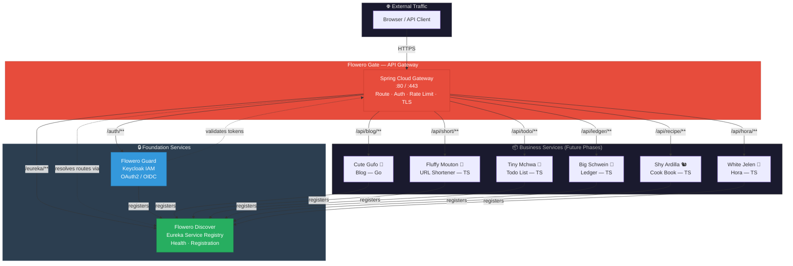

# Panomete Platform

> Production-grade microservice platform for a personal homelab. Built to showcase platform engineering and software architecture skills.

## Platform Overview



## Foundation Services (Phase 1 MVP)

| Service | Code Name | Technology | Role | Status |
|---------|-----------|-----------|------|--------|
| **Flowero Guard** | — | Keycloak + PostgreSQL | Identity & Access Management (OAuth2/OIDC) | 📋 Spec Ready |
| **Flowero Discover** | — | Spring Cloud Eureka | Service Registry & Discovery | 📋 Spec Ready |
| **Flowero Gate** | — | Spring Cloud Gateway | API Gateway (Routing, Auth, Rate Limiting) | 📋 Spec Ready |

## Business Services (Future Phases)

| Focus | Code Name | Animal | Language | Auth | Status |
|-------|-----------|--------|----------|------|--------|
| Blog | Cute Gufo | Owl | Go | OAuth (Guard) | 📋 Spec Ready |
| URL Shortener | Fluffy Mouton | Sheep | TypeScript | OAuth (Guard) | 📋 Spec Ready |
| Todo List | Tiny Mchwa | Ant | TypeScript | OAuth (Guard) | ✅ Spec Complete |
| Ledger | Big Schwein | Pig | TypeScript | OAuth (Guard) | ❌ Not Started |
| Cook Book | Shy Ardilla | Squirrel | TypeScript | OAuth (Guard) | ❌ Not Started |
| Hora | White Jelen | Deer | TypeScript | OAuth (Guard) | ❌ Not Started |

## Tech Stack

| Layer | Choice | Rationale |
|-------|--------|-----------|
| **Foundation Language** | Java 21 / Spring Boot 3.x | Spring ecosystem provides native Gateway, Security, and Discovery integrations |
| **Identity** | Keycloak | Production-grade OSS IAM with full OAuth2/OIDC support |
| **API Gateway** | Spring Cloud Gateway | Reactive, non-blocking, integrates with Spring Security and Eureka |
| **Service Discovery** | Spring Cloud Netflix Eureka | Simplest path with Spring Boot; embeddable, no external dependency |
| **Deployment** | Docker Compose → Kubernetes (k3s) | Compose for homelab simplicity; K8s for portfolio growth |
| **Observability** | Actuator + Loki + Prometheus + Grafana | Standard Spring Boot stack, lightweight enough for homelab |

## Project Structure

```
spec/
├── panomete_platform/       ← Platform-level docs (objectives, stakeholders, architecture)
│   └── 01_requirement/
│       ├── 011_business_objective.md
│       ├── 012_user_stories.md          ← Umbrella linking to service docs
│       └── 014_stakeholder_analysis.md
│
├── flowero_guard/           ← Keycloak IAM (deep dive)
│   └── 01_requirement/
│       ├── 011_business_objective.md
│       ├── 012_user_stories.md
│       └── 013_acceptance_criteria.md
│
├── flowero_discover/        ← Eureka Service Registry (deep dive)
│   └── 01_requirement/
│       ├── 011_business_objective.md
│       ├── 012_user_stories.md
│       └── 013_acceptance_criteria.md
│
├── flowero_gate/            ← Spring Cloud Gateway (deep dive)
│   └── 01_requirement/
│       ├── 011_business_objective.md
│       ├── 012_user_stories.md
│       └── 013_acceptance_criteria.md
│
├── tiny_mchwa/              ← Example: complete 7-phase spec
├── fluffy_mouton/           ← Migration notes
├── cute_gufo/               ← TBD
└── big_schwein/             ← TBD
```

## Development Status

| Icon | Meaning |
|------|---------|
| ❌ | Not started / not deployed |
| 📋 | Spec document ready |
| 🛠️ | In progress |
| ✅ | Completed / deployed |

## Quick Links

- [[panomete_platform/011_business_objective | Platform Business Objectives]]
- [[panomete_platform/014_stakeholder_analysis | Stakeholder Analysis]]
- [[flowero_guard/012_user_stories | Flowero Guard Stories]]
- [[flowero_discover/012_user_stories | Flowero Discover Stories]]
- [[flowero_gate/012_user_stories | Flowero Gate Stories]]

---

> **Built for:** Portfolio demonstration | **Architecture:** Microservices with centralized auth, discovery, and gateway | **Phase 1:** Foundation services only | **Approach:** Documentation-first, AI-persona-driven implementation
