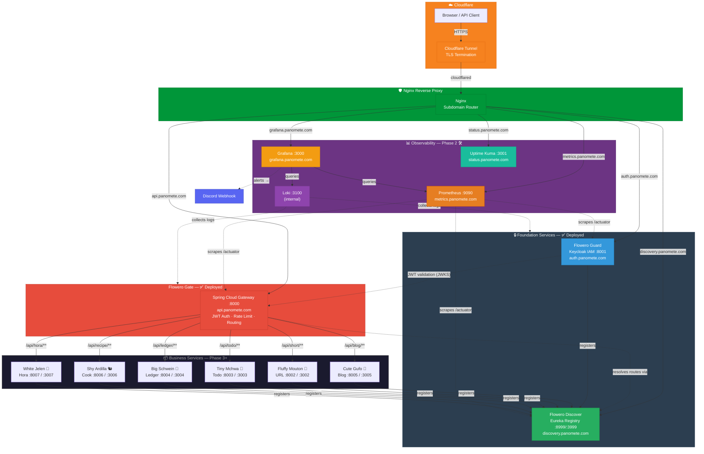

# Panomete Platform

> Production-grade microservice platform for a personal homelab. Built to showcase platform engineering and software architecture skills.

## Platform Overview

## Foundation Services (Phase 1 MVP)

| Service | Code Name | Technology | Port | Domain | Role | Status |
|---------|-----------|-----------|------|--------|------|--------|
| **Flowero Guard** | — | Keycloak (uses shared PostgreSQL 18) | 8001 | `auth.panomete.com` | Identity & Access Management — issues OAuth2/OIDC tokens | ✅ Deployed |
| **Flowero Discover** | — | Spring Cloud Eureka | 8999 (BE) / 3999 (FE) | `discovery.panomete.com` | Service Registry & Discovery | ✅ Deployed |
| **Flowero Gate** | — | Spring Cloud Gateway | 8000 | `api.panomete.com` | API Gateway — JWT validation, Valkey-backed rate limiting, route to business services | ✅ Deployed |

## Business Services (Future Phases)

| Focus | Code Name | Animal | Language | Subdomain | Port BE | Port FE | Status |
|-------|-----------|--------|----------|-----------|---------|---------|--------|
| Blog | Cute Gufo | Owl | Go | `blog.panomete.com` | 8005 | 3005 | 📋 Spec Ready |
| URL Shortener | Fluffy Mouton | Sheep | TypeScript | `short.panomete.com` | 8002 | 3002 | 📋 Spec Ready |
| Todo List | Tiny Mchwa | Ant | TypeScript | `todo.panomete.com` | 8003 | 3003 | ✅ Spec Complete |
| Ledger | Big Schwein | Pig | TypeScript | `ledger.panomete.com` | 8004 | 3004 | ❌ Not Started |
| Cook Book | Shy Ardilla | Squirrel | TypeScript | `recipe.panomete.com` | 8006 | 3006 | ❌ Not Started |
| Hora | White Jelen | Deer | TypeScript | `hora.panomete.com` | 8007 | 3007 | ❌ Not Started |

## Tech Stack

| Layer | Choice | Rationale |
|-------|--------|-----------|
| **Edge / TLS** | Cloudflare Tunnel + Nginx | Cloudflare handles TLS termination + DDoS protection. Nginx does subdomain-based routing to internal services. Both already running in production. |
| **Foundation Language** | Java 25 / Spring Boot 4.1.x | Latest LTS Java. Spring ecosystem provides native Gateway (Spring Cloud Gateway), Security (OAuth2 Resource Server), and Discovery (Eureka) integrations |
| **Identity** | Keycloak | Production-grade OSS IAM with full OAuth2/OIDC support. Uses shared PostgreSQL 18 for persistence. |
| **API Gateway** | Spring Cloud Gateway | Reactive, non-blocking. Routes business APIs only (`api.panomete.com`). Validates JWT against Keycloak JWKS. |
| **Service Discovery** | Spring Cloud Netflix Eureka | Simplest path with Spring Boot; embeddable, no external dependency |
| **Rate Limiting** | Valkey 9 (shared instance) | Replaces in-memory rate limiting. Limits persist across Gate restarts. Already running in production. |
| **Deployment** | Docker Compose → Kubernetes (k3s) | Compose for homelab simplicity; K8s for portfolio growth |
| **CI/CD** | GitHub Actions + GHCR | Per-service pipelines: lint → test → build → push to GHCR. Manual deploy approval via `workflow_dispatch`. Phase 2. |
| **Observability** | Phase 2: Actuator + Prometheus + Grafana + Loki | In progress. Prometheus scrapes `/actuator/prometheus`, Grafana visualizes, Loki aggregates logs. Discord webhook for alerts. |

## Existing Infrastructure (Already Live)

| Component | Status | Notes |
|-----------|--------|-------|
| Docker + Compose | ✅ | All services run as containers |
| Cloudflare Tunnel | ✅ | TLS termination + external ingress |
| Nginx Reverse Proxy | ✅ | Subdomain-based routing |
| PostgreSQL 18 | ✅ | Shared database for Guard + business services |
| Valkey 9 | ✅ | Shared cache for Gate rate limiting |
| MongoDB 8 | ✅ | Available for document-oriented services |
| SeaweedFS S3 | ✅ | Object storage |
| Tailscale | ✅ | Secure remote access |
| UFW + Fail2ban | ✅ | Host-level security |

## Project Structure

## Development Status

| Icon | Meaning |
|------|---------|
| ❌ | Not started / not deployed |
| 📋 | Spec document ready |
| 🛠️ | In progress |
| ✅ | Completed / deployed |

## Quick Links

**Platform:**
- [[panomete_platform/011_business_objective | Platform Business Objectives]]
- [[panomete_platform/014_stakeholder_analysis | Stakeholder Analysis]]
- [[panomete_platform/03_construction/031_README_developer_guide | Platform Developer Guide]]

**Foundation Services (✅ Deployed):**
- [[flowero_guard/03_construction/031_README_developer_guide | Flowero Guard — Dev Guide]]
- [[flowero_discover/03_construction/031_README_developer_guide | Flowero Discover — Dev Guide]]
- [[flowero_gate/03_construction/031_README_developer_guide | Flowero Gate — Dev Guide]]

**Phase 2 Planning:**
- [[../../plan/phase2-foundation-hardening | Phase 2 — Foundation Hardening Plan]]

**Meeting Minutes:**
- [[../meeting-minute/MM07_phase2-planning_20260724 | Phase 2 Proposal (DevOps → PO)]]
- [[../meeting-minute/po-update-2026-07-22 | PO Requirements Update]]

---

> **Phase 1:** ✅ Foundation deployed (Guard, Discover, Gate) | **Phase 2:** 🛠️ Foundation Hardening (CI/CD, Observability, Alerting, Backup, Uptime) | **Phase 3:** 📋 Business Service Onboarding | **Architecture:** Cloudflare → Nginx → centralized auth, discovery, and API gateway | **Domain:** `*.panomete.com`
