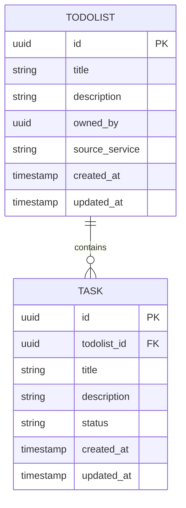

# ERD (Entity-Relationship Diagram)

> **Project:** tiny mchwa 🐜
> **Version:** 1.0 | **Status:** Approved
> **Last Updated:** 2026-07-04

---

## 1. ERD Diagram



---

## 2. Entity Definitions

### 2.1 Todolist

| Attribute | Type | Constraints | Description |
|-----------|------|-----------|-------------|
| id | UUID | PK, auto-generated | Unique identifier |
| title | VARCHAR(255) | NOT NULL | Todolist title |
| description | VARCHAR(1000) | NULLABLE | Todolist description |
| owned_by | UUID | NOT NULL | Keycloak user UUID |
| source_service | VARCHAR(100) | NOT NULL | Origin service (todolist, blog, cookbook) |
| created_at | TIMESTAMPTZ | DEFAULT NOW() | Creation time |
| updated_at | TIMESTAMPTZ | DEFAULT NOW() | Last update time |

**Note:** `status` is NOT stored — computed from tasks.

### 2.2 Task

| Attribute | Type | Constraints | Description |
|-----------|------|-----------|-------------|
| id | UUID | PK, auto-generated | Unique identifier |
| todolist_id | UUID | FK → todolists.id, NOT NULL | Parent todolist |
| title | VARCHAR(255) | NOT NULL | Task title |
| description | VARCHAR(1000) | NULLABLE | Task description |
| status | VARCHAR(20) | NOT NULL, DEFAULT 'pending' | pending, inprogress, done |
| created_at | TIMESTAMPTZ | DEFAULT NOW() | Creation time |
| updated_at | TIMESTAMPTZ | DEFAULT NOW() | Last update time |

---

## 3. Relationship Rules

| Relationship | Cardinality | Delete Rule | Description |
|-------------|-----------|------------|-------------|
| Todolist → Task | 1:N | CASCADE | Delete tasks when todolist deleted |

---

## 4. Status Computation (Pseudocode)

```go
func computeTodolistStatus(tasks []Task) string {
    if len(tasks) == 0 {
        return "pending"
    }
    
    hasInProgress := false
    allDone := true
    
    for _, task := range tasks {
        if task.Status == "inprogress" {
            hasInProgress = true
        }
        if task.Status != "done" {
            allDone = false
        }
    }
    
    if allDone {
        return "done"
    }
    if hasInProgress {
        return "inprogress"
    }
    return "pending"
}
```

---

## Related Documents

| Document | Relationship |
|----------|-------------|
| [[023_database_schema_DDL]] | Physical schema from this ERD |
| [[022_API_specification]] | API using this data model |
