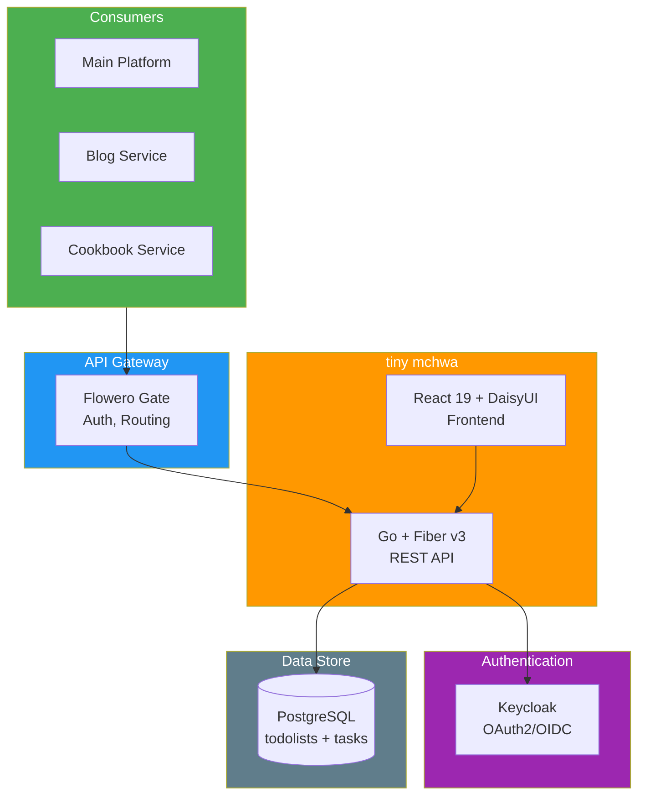

# Software Architecture Document

> **Project:** tiny mchwa 🐜
> **Version:** 1.1 | **Status:** Approved
> **Last Updated:** 2026-07-05

---

## 1. Architecture Overview

| Aspect | Choice | Rationale |
|--------|-------|----------|
| Overall Style | Microservice | Shared service across homelab |
| Communication | REST | KISS — one protocol |
| Data Management | PostgreSQL | ACID, team familiarity |
| Deployment | Docker behind gateway | Homelab standard |

---

## 2. High-Level Architecture



---

## 3. Component Design

### 3.1 API Service (tiny-mchwa-api)

| Aspect         | Detail                                       |
| -------------- | -------------------------------------------- |
| Responsibility | Todolist CRUD, Task CRUD, Status computation |
| Technology     | Go 1.25.3 + Fiber v3.4.0                     |
| Module         | `oat431/tiny-mchawa-api`                     |
| Database       | PostgreSQL via sqlx + lib/pq                 |
| API            | REST — `/api/v1/todolists`, `/api/v1/tasks`  |
| Auth           | Hardcoded UUID for MVP (Keycloak later)      |
| Validation     | go-playground/validator/v10                  |
| Testing        | testify                                      |

### 3.2 Web Service (tiny-mchwa-web)

| Aspect | Detail |
|--------|--------|
| Responsibility | User interface for todo management |
| Technology | React 19.2.7 + TypeScript 6.0.3 |
| UI Framework | DaisyUI 5.6.13 + Tailwind CSS 4.3.2 |
| Data Fetching | TanStack React Query 5.101.2 |
| Routing | React Router DOM 7.18.1 |
| Build Tool | Vite 8.1.3 |
| Package Manager | Bun |

### 3.3 App Structure (API)

```
tiny-mchwa-api/
├── cmd/
│   └── server/
│       └── main.go          ← Entry point
├── internal/
│   ├── app/                  ← App wiring
│   ├── config/               ← Config loading
│   ├── database/             ← DB connection
│   ├── handler/              ← HTTP handlers
│   ├── middleware/            ← Custom middleware
│   ├── model/                ← Domain types, DTOs
│   ├── repository/           ← Data access
│   ├── service/              ← Business logic
│   └── testutil/             ← Test helpers
├── .air.toml                 ← Hot reload config
├── .golangci.yml             ← Linter config
├── .env.example              ← Environment template
└── Makefile                  ← Build commands
```

### 3.4 App Structure (Web)

```
tiny-mchwa-web/
├── src/
│   ├── api/                  ← API client (fetch wrapper)
│   ├── components/           ← Reusable UI components
│   ├── hooks/                ← Custom React hooks
│   ├── pages/                ← Route pages
│   │   ├── TodolistsPage.tsx
│   │   ├── TodolistDetailPage.tsx
│   │   └── NotFoundPage.tsx
│   ├── types/                ← TypeScript types
│   ├── App.tsx               ← Root component
│   ├── main.tsx              ← Entry point
│   └── index.css             ← Global styles
├── index.html                ← HTML template
├── vite.config.ts            ← Vite config
├── tsconfig.json             ← TypeScript config
└── package.json              ← Dependencies
```

---

## 4. Tech Stack (Actual)

### API

| Layer | Choice | Version |
|-------|--------|---------|
| Language | Go | 1.25.3 |
| Framework | Fiber | v3.4.0 |
| Database | PostgreSQL | 15+ |
| Driver | sqlx + lib/pq | 1.4.0 / 1.12.3 |
| Validation | go-playground/validator | v10.30.3 |
| Testing | testify | 1.11.1 |
| Hot Reload | Air | latest |
| Linting | golangci-lint | latest |

### Web

| Layer | Choice | Version |
|-------|--------|---------|
| Framework | React | 19.2.7 |
| Language | TypeScript | 6.0.3 |
| UI | DaisyUI + Tailwind | 5.6.13 / 4.3.2 |
| Data Fetching | TanStack Query | 5.101.2 |
| Routing | React Router | 7.18.1 |
| Build | Vite | 8.1.3 |
| Package Manager | Bun | latest |

---

## 5. Middleware Chain

```
RequestID → Recover → Helmet → CORS → Logger → Routes
```

---

## 6. Data Model (Go Structs)

### Todolist

```go
type Todolist struct {
    ID            string    `json:"id" db:"id"`
    Title         string    `json:"title" db:"title"`
    Description   *string   `json:"description" db:"description"`
    Status        string    `json:"status" db:"-"` // computed, not stored
    CreatedAt     time.Time `json:"createdAt" db:"created_at"`
    UpdatedAt     time.Time `json:"updatedAt" db:"updated_at"`
    OwnedBy       string    `json:"ownedBy" db:"owned_by"`
    SourceService string    `json:"sourceService" db:"source_service"`
}
```

### Task

```go
type Task struct {
    ID          string    `json:"id" db:"id"`
    TodolistID  string    `json:"todolistId" db:"todolist_id"`
    Title       string    `json:"title" db:"title"`
    Description *string   `json:"description" db:"description"`
    Status      string    `json:"status" db:"status"`
    CreatedAt   time.Time `json:"createdAt" db:"created_at"`
    UpdatedAt   time.Time `json:"updatedAt" db:"updated_at"`
}
```

---

## 7. Quality Attributes

| Attribute | Target | Verification |
|-----------|--------|-------------|
| Performance | <100ms response time | Load test |
| Availability | 99% (homelab) | Health check |
| Security | OWASP basics | Code review |
| Testability | 100% handler coverage | Unit tests |

---

## 8. Repositories

| Repo | URL | Purpose |
|------|-----|---------|
| tiny-mchwa-api | https://github.com/oat431/tiny-mchwa-api | Backend API |
| tiny-mchwa-web | https://github.com/oat431/tiny-mchwa-web | Frontend UI |

---

## Related Documents

| Document | Relationship |
|----------|-------------|
| [[021_architecture_decision_records]] | Decision rationale |
| [[022_API_specification]] | API contract |
| [[023_database_schema_DDL]] | Database schema |
