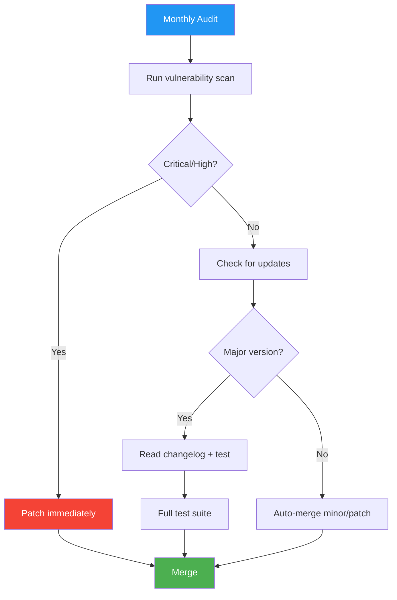

# Dependency Manifest

> **Project:** [Project Name]
> **Version:** [X.Y] | **Status:** [Active]
> **Last Updated:** [YYYY-MM-DD]

---

## 1. Purpose

> Documents all project dependencies — direct and transitive — with versions, licenses, and security status. Know what you depend on. Audit regularly. Never ship with known vulnerabilities.

## 2. Dependency Overview

| Metric | Count |
|--------|-------|
| Direct Dependencies | [X] |
| Dev/Test Dependencies | [X] |
| Total (with transitive) | [X] |
| Known Vulnerabilities | [0] |
| License Issues | [0] |

## 3. Tech-Stack Variants

### 3.1 Java / Gradle — `build.gradle`

```groovy
plugins {
    id 'java'
    id 'org.springframework.boot' version '4.1.0'
    id 'io.spring.dependency-management' version '1.1.7'
}

java {
    toolchain {
        languageVersion = JavaLanguageVersion.of(25)
    }
}

ext {
    set('springCloudVersion', "2025.1.2")  // BOM version pin
}

dependencies {
    // Framework
    implementation 'org.springframework.cloud:spring-cloud-starter-netflix-eureka-server'

    // Observability
    implementation 'org.springframework.boot:spring-boot-starter-actuator'

    // Testing
    testImplementation 'org.springframework.boot:spring-boot-starter-test'
    testRuntimeOnly 'org.junit.platform:junit-platform-launcher'
}

dependencyManagement {
    imports {
        // BOM ensures all Spring Cloud deps are compatible versions
        mavenBom "org.springframework.cloud:spring-cloud-dependencies:${springCloudVersion}"
    }
}
```

**Dependency Table:**

| Dependency | Group:Artifact | Version | License | Purpose |
|-----------|---------------|---------|---------|---------|
| Eureka Server | `spring-cloud-starter-netflix-eureka-server` | 4.2.0 | Apache-2.0 | Service registry |
| Actuator | `spring-boot-starter-actuator` | 4.1.0 | Apache-2.0 | Health checks |
| JUnit 5 | `junit-platform-launcher` | 1.11.x | EPL-2.0 | Test framework |

**Spring Cloud BOM Pattern:**
The BOM (`spring-cloud-dependencies`) manages transitive versions — you declare the top-level starter and the BOM ensures all sub-dependencies (Netflix Eureka, Spring Web, Jackson) are compatible. Never pin individual Spring Cloud library versions; let the BOM handle it.

### 3.2 Node.js / TypeScript — `package.json`

```json
{
  "dependencies": {
    "express": "^4.18.2",
    "pg": "^8.11.3",
    "jsonwebtoken": "^9.0.2",
    "zod": "^3.22.4",
    "winston": "^3.11.0"
  },
  "devDependencies": {
    "typescript": "^5.3.2",
    "jest": "^29.7.0",
    "eslint": "^8.55.0",
    "prettier": "^3.1.0"
  }
}
```

**Dependency Table:**

| Package | Version | License | Purpose | Security |
|---------|---------|---------|---------|:---:|
| express | ^4.18.2 | MIT | Web framework | ✅ |
| pg | ^8.11.3 | MIT | PostgreSQL client | ✅ |
| jsonwebtoken | ^9.0.2 | MIT | JWT handling | ✅ |
| zod | ^3.22.4 | MIT | Schema validation | ✅ |

### 3.3 Go — `go.mod`

```go
module github.com/panomete/cute-gufo

go 1.23

require (
    github.com/gin-gonic/gin v1.9.1
    github.com/lib/pq v1.10.9
    github.com/golang-jwt/jwt/v5 v5.2.0
)
```

**Dependency Table:**

| Module | Version | License | Purpose |
|--------|---------|---------|---------|
| gin | v1.9.1 | MIT | HTTP framework |
| lib/pq | v1.10.9 | MIT | PostgreSQL driver |
| golang-jwt | v5.2.0 | MIT | JWT handling |

## 4. Dependency Policy

| Rule | Enforcement | Tool |
|------|-----------|------|
| No known vulnerabilities (Critical/High) | CI blocks merge | `./gradlew dependencyCheckAnalyze` / `npm audit` / `govulncheck` |
| Lock file committed | Required | `build.gradle` + `settings.gradle` / `package-lock.json` / `go.sum` |
| License compliance | Checked in CI | OWASP Dependency-Check / license-checker |
| Major version updates | Manual review + tested | Dependabot / Renovate |
| Transitive dependency overrides | Explicit in manifest | Gradle `constraints` / npm `overrides` / Go `replace` |
| Monthly audit | Scheduled job | CI cron job |

## 5. Dependency Update Process



## 6. Platform-Level Shared Dependencies

For projects under the Panomete Platform (or any multi-service platform), prefer shared infrastructure over duplicated dependencies:

| Dependency | Shared? | Where |
|-----------|:---:|-------|
| PostgreSQL | ✅ Shared | Host-level PostgreSQL 18, per-service databases |
| Valkey (Redis) | ✅ Shared | Host-level Valkey 9 |
| Eureka Client | ✅ Shared | Auto-registration via Spring Cloud |
| Keycloak | ✅ Shared | Centralized IAM, no per-service auth code |
| MongoDB | ✅ Shared | Available for document-oriented services |

---

## Related Documents

| Document | Relationship |
|----------|-------------|
| [[032_build_scripts]] | Build pipeline that consumes these deps |
| [[SBOM]] | Software bill of materials |
| [[062_coding_standards_security]] | Security scanning standards |

---

> **Template Standard:** Based on SWEBOK v4, OWASP Top 10 (A06:2021)
> **Usage:** Pick the tech-stack variant. Lock versions. Audit regularly. Never ship with known vulnerabilities. Shared infrastructure beats duplicated dependencies.
