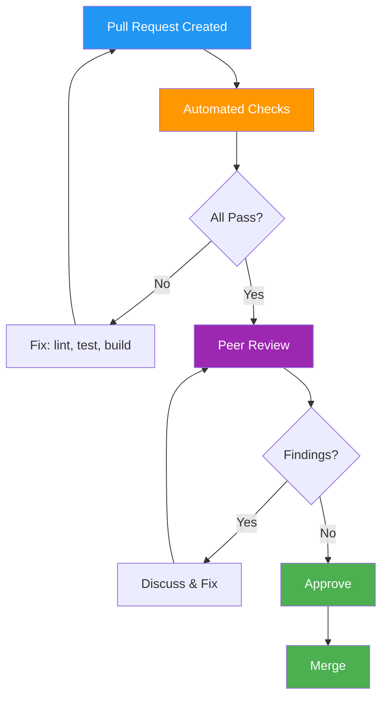

# Code Review Records

> **Project:** [Project Name]
> **Version:** [X.Y] | **Status:** [Active]
> **Last Updated:** [YYYY-MM-DD]

---

## 1. Purpose

> Records of code reviews — findings, patterns, and metrics. Code review is **quality gate #1**. Every PR gets reviewed. Track metrics to improve the process over time.

## 2. Code Review Process



## 3. Review Standards

| Aspect | Standard |
|--------|---------|
| PR Size | < 400 lines changed (smaller = faster review) |
| Reviewers | Minimum 1 approval |
| Response Time | < 24 hours |
| Tests | Required for all feature/fix changes |
| Documentation | Required for public APIs and config changes |
| Automated Checks | Must pass: lint, test, build |
| Commit Hygiene | Squash-merge to main, clean commit messages per [[034_commit_messages_changelog]] |

## 4. Review Checklist (Stack-Agnostic)

| # | Check | Category |
|---|-------|---------|
| 1 | Code follows [[035_coding_standards_development]] for the target language | Style |
| 2 | No hardcoded secrets, credentials, or tokens | Security |
| 3 | Error handling is comprehensive — not swallowing exceptions | Reliability |
| 4 | Tests cover happy path + edge cases + error paths | Testing |
| 5 | No dead code, commented-out blocks, or TODO without ticket | Maintainability |
| 6 | Performance implications considered (N+1 queries, large allocations) | Performance |
| 7 | API changes are reflected in the API spec (if applicable) | Documentation |
| 8 | Configuration changes are documented with rationale | Documentation |
| 9 | No breaking changes without `BREAKING CHANGE:` footer or version bump | Compatibility |
| 10 | Dependencies are pinned and audited (no `*` or `latest` versions) | Security |

## 5. Review Metrics

| Metric | Target | Current | Status |
|--------|--------|---------|:---:|
| PRs reviewed per sprint | > 5 | [X] | 🟢🟡🔴 |
| Avg time to first review | < 24h | [X]h | 🟢🟡🔴 |
| Findings per PR | < 5 | [X] | 🟢🟡🔴 |
| Critical/blocking findings | 0 | [X] | 🟢🟡🔴 |
| Review coverage (% of PRs reviewed) | 100% | [X]% | 🟢🟡🔴 |
| Rework rate (PRs needing > 2 rounds) | < 20% | [X]% | 🟢🟡🔴 |

## 6. Common Findings

| Finding | Frequency | Prevention |
|---------|:---:|-----------|
| Missing error handling | High | Checklist #3 |
| No tests for edge cases | Medium | Checklist #4 |
| Hardcoded configuration values | Medium | Extract to env vars / config files |
| Inconsistent naming with project standards | Low | Checklist #1 + linter |
| Missing documentation for new API endpoints | Medium | Checklist #7 |
| Large PRs (> 500 lines) | Medium | Encourage smaller, incremental PRs |
| Untracked TODO comments without ticket references | Low | Require `TODO(#issue): ...` format |

## 7. Review Record Template

Capture significant reviews for traceability:

```markdown
### Review #001 — [Feature / Fix Summary]

| Field | Detail |
|-------|--------|
| **PR** | [#N](link) |
| **Author** | [Name / Persona] |
| **Reviewer** | [Name / Persona] |
| **Date** | [YYYY-MM-DD] |
| **Service** | [flowero-discover / gate / guard / etc.] |
| **Type** | [feat / fix / refactor / chore] |
| **Lines Changed** | [+XX / -YY] |

**Findings:**

| # | Severity | Category | Description | Resolution |
|---|:---:|---------|-------------|-----------|
| 1 | 🔴 | Security | Hardcoded JWT secret in application.yml | Extracted to env var |
| 2 | 🟡 | Testing | Missing test for empty-registry edge case | Added test |
| 3 | 🟢 | Style | Variable name too short (`r` → `restTemplate`) | Renamed |

**Outcome:** [✅ Approved / 🔄 Changes Requested / ❌ Rejected]

**Lessons Learned:** [One takeaway to prevent recurrence]
```

### Severity Legend

| Level | Meaning | Example |
|:---:|---------|---------|
| 🔴 | **Critical** — blocks merge | Security vulnerability, data loss risk, breaking change without notice |
| 🟡 | **Important** — should fix before merge | Missing tests, unclear error handling, missing docs |
| 🟢 | **Nit** — nice to have, non-blocking | Variable naming preference, minor style, optional refactor |

---

## Related Documents

| Document | Relationship |
|----------|-------------|
| [[035_coding_standards_development]] | Standards being enforced |
| [[034_commit_messages_changelog]] | Commit standards for PRs |
| [[031_README_developer_guide]] | Developer onboarding |

---

> **Template Standard:** Based on SWEBOK v4, ISO/IEC 20246
> **Usage:** Code review is **quality gate #1**. Every PR gets reviewed. Use the checklist. Track metrics. The review record template captures significant decisions for traceability.
